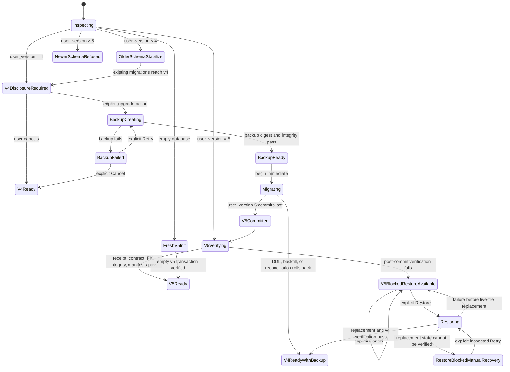

# 13 Phase 3C Schema v5 Migration And Cutover Plan

## Purpose And Authority

This document records the Founder-approved exact schema v5 migration, cutover, recovery, and implementation sequence for the Founder-approved Phase 3C lifecycle foundation.

It is a **Founder-approved authorization gate whose Slice 0, Slice 1A, Slice 1B-1, Slice 1B-2, Slice 2A, Slice 2B-1, Slice 2B-2, bounded Slice 2B-3, disposable Slice 3A, disposable Slice 3B, disposable Slice 4A, and disposable Slice 4B-1 authorities have been exercised and promoted**. All sixteen decisions were explicitly approved on 2026/07/17. Decision 16B authorized fixed contracts, synthetic fixtures, test-only DDL execution, invariant tests, and synchronized verified documentation after this document was promoted to clean `develop`. Slice 0 was subsequently promoted through feature commit `431c3e7e81b2dcefca873ad3ec1d73680c96d60c` and non-fast-forward merge commit `7921affde544a5852aa58782a1acb0a4f189520e`. On 2026/07/18, the founder separately resolved `PHASE3C-SLICE1A-001` with Option A and authorized the bounded Slice 1A startup-safety foundation. Slice 1A was promoted through feature commit `d4f86d72350c7068db76a6706ad7e5ff10ee67b5` and non-fast-forward merge commit `6e9dd6615cb7f99556d258080f6a45140fd55b68`. On 2026/07/19, the founder resolved `PHASE3C-SLICE1B-001` with Option B and authorized only Slice 1B-1 typed Experience create, update, delete, and atomic import parity. Slice 1B-1 was promoted through feature commit `cc82658ee6c551e46548a764ea83c4895ea59ebb` and non-fast-forward merge commit `1ef3aa0acd57756f7593e3fa792c321f0e164dcc`. The founder then resolved `PHASE3C-SLICE1B2-001` as Option A and authorized the bounded completion of schema-v4 typed artifact and historical mutation parity. Slice 1B-2 was promoted through feature commit `93fcc2bae358da21b857153757dbd143024598bd` and non-fast-forward merge commit `3c84d4660d425a65f1173f3f8501a76ba2b3262a`. The founder then resolved `PHASE3C-SLICE2A-001` as Option A and authorized only a path-injected, integration-test-local schema-v4 backup creation and verification harness against synthetic/disposable fixtures. Slice 2A was promoted through feature commit `a5ba00650f396470b3a7ac265701d8ce3d90d35e` and non-fast-forward merge commit `9e0ff74f3fcdbe64d060e40d800078d90d4d9dc6`. On 2026/07/24, the founder resolved `PHASE3C-SLICE2B1-001` as Option A and authorized only the fixture-local verified restore and test-injected replacement simulation described below. Slice 2B-1 was promoted through feature commit `5b9d4613c6fa4bb86c8fdfd9009a8a7bbed710bd` and non-fast-forward merge commit `a476c38ba5c4a9b19a81fbb14973aacc4adf25bd`. On 2026/07/25, the founder resolved `PHASE3C-SLICE2B2-001` as Option A and authorized only the unregistered, path-injected production-quality filesystem safety primitive described below, exercised exclusively against synthetic/disposable app-like directories. Slice 2B-2 was promoted through feature commit `a27faec856b2b1d628e87a1c8df1d13279668e14` and non-fast-forward merge commit `277c4b5b2031d5bf88dc2a33b03765c103c62629`. On 2026/07/26, bounded Slice 2B-3 was promoted through feature commit `61518c7d92b88b9b7d40f2229a30ba9d8370b880` and non-fast-forward merge commit `e932ead6da3346d3783da22dc1d1295c31cdc979`. Disposable Slice 3A was promoted through feature commit `3947b1862c177aabc95dc1d1796a4e1ccbc3ade2` and non-fast-forward merge commit `7e0e5c44e03e58769f834243477c901cb01771ab`. Disposable Slice 3B was promoted through feature commit `b96bc84eae0b1d019cce761564c2689d92482705` and non-fast-forward merge commit `5714b3eeeeb4c9612e445dbd78e4f606df41fa27`. Disposable Slice 4A was Founder-reviewed and promoted through feature commit `2928be119084fc552b6ffb02d9451e79d74a997d` and non-fast-forward merge commit `c7fc0c7a61d3b4f44237a83bf8288d1a7d8ae4ca`. Disposable Slice 4B-1 was Founder-reviewed and promoted through feature commit `76b0715722d9431a04a3ca41f947bc60892b5dae` and non-fast-forward merge commit `bb7ef2a6b37f8b4c7fdeab6ee0063d469dd8f011`. On 2026/07/31, the founder separately resolved `PHASE3C-SLICE4B2-001` as Option A and authorized only the private disposable Reflection boundary recorded below; it remains an unpromoted working tree pending Founder diff review.

On 2026/07/26, the founder resolved `PHASE3C-SLICE3A-001` with Option A and separately authorized only a private, unregistered, path/connection-injected schema-v4-to-v5 migration core exercised against synthetic/disposable exact-v4 fixtures. That authority permits the fixed DDL, honest baseline backfill, reconciliation, receipt, compatibility guards, `user_version = 5` last inside disposable test databases, failure injection, logical exact-v4 rollback evidence, and read-only post-commit verification. It does not authorize production-path DDL execution, a production `SCHEMA_VERSION` change, real user databases or app-data, startup/Tauri/renderer/UI activation, production backup/restore/replacement, lifecycle writes, export v2, later slices, Phase 4, provider or ContextPacket changes, Git promotion, PR, or deployment.

The founder then resolved `PHASE3C-SLICE3B-001` with Option A and authorized only a private, unregistered, disposable migration restart/orchestration layer extending the existing owned-operation state. It may integrate the verified exact-v4 backup with Slice 3A, classify explicit migration states from read-only durable evidence, conservatively treat generic COMMIT errors as outcome-unknown, preserve the backup, and exercise deterministic synthetic/disposable restart and failure cases. It may not select, retry, replay, roll back, repair, restore, or clean up autonomously, and it does not activate migration for production or real user data.

On 2026/07/30, the founder resolved `PHASE3C-SLICE4A-001` with Option A and
authorized only the private, unregistered, path/connection-injected Experience
write boundary described below. Its create, exact-current-revision correction,
parent delete, and atomic duplicate-skipping import execute only against
synthetic/disposable exact-v5 fixtures produced by the promoted migration core.
This is implementation evidence for current-state write parity, not production
schema-v5 or real-user activation.

ADR-0011 is Accepted and `architecture/12` is Founder-approved. Their original migration hold remains the default boundary; the exact `PHASE3C-SLICE3A-001`, `PHASE3C-SLICE3B-001`, and `PHASE3C-SLICE4A-001` resolutions grant only the disposable-fixture exceptions above. The Phase 3 exit remains blocked. Promoted retrieval R1 closes only the explicit saved-date-range portion; emotion, relationship, value-conflict, and the broader structured-retrieval capability remain separate blockers.

**We Build Mirrors, Not Oracles.** A migration may preserve history and user decisions. It may not manufacture missing history, elevate AI content, or make deleted content silently reappear.

## Inspected Production Baseline

The proposal is based on the current repository, not an assumed storage layer.

### SQLite and Rust

- `src-tauri/src/sqlite.rs` sets `SCHEMA_VERSION` to `4`.
- Promoted Slice 1A adds read-only presence/version inspection before writable initialization. `initialize_sqlite_database` rechecks the same path and refuses `user_version > 4` before directory creation, writable connection, or migration DDL.
- Schema v3 introduced `persisted_artifacts`; schema v4 added the four `historical_*` tables, two indexes, and deletion triggers.
- DDL and `PRAGMA user_version` changes run in one SQLx transaction, with an injected-failure test.
- Named typed Rust commands own all current schema-v4 Experience, artifact,
  historical consent/transmission, Historical Question, and audit-cleanup
  mutations. Renderer code supplies typed data rather than mutation SQL or
  arbitrary statement arrays.
- Historical Question persistence revalidates Experience timestamps, artifact
  timestamps and eligibility, consumed consent, successful transmission,
  packet digest, provider, and model before persistence.

### TypeScript storage and mutation

- `LocalEvidenceStore` exposes current-state Experience CRUD, whole-bundle artifact replacement, Phase 3B audit/artifact operations, and startup audit cleanup.
- Promoted Slice 1A defers `sqliteLocalEvidenceStore` construction until Rust inspection and initialization succeed; an incompatible database exposes no cleanup, read, or write-capable store.
- Promoted Slice 1B-1 routes Experience create,
  expected-revision update, delete, and atomic duplicate-skipping import through
  typed Rust commands using `BEGIN IMMEDIATE`; renderer code supplies typed data
  rather than SQL for those four paths.
- Promoted Slice 1B-2 replaces the remaining
  artifact, consent, transmission, Historical Question, and audit-cleanup
  mutation statements with named typed Rust commands. Renderer mutation
  adapters no longer supply SQL or arbitrary statement arrays; read-only SQL
  plugin queries remain outside this slice.
- Promoted Slice 2A is confined to an integration-test-local,
  path-injected backup harness over disposable schema-v4 fixtures. It is not a
  production module or Tauri command and is not connected to startup, renderer,
  UI, app-data paths, restore, retention cleanup, or a real user database.
- Promoted Slice 2B-1 remains in that private integration-test module. It adds
  verified restore and test-injected logical replacement against disposable
  fixtures only; it does not provide a production filesystem primitive,
  operating-system atomicity, crash durability, SQLite sidecar recovery, or a
  real-user restore path.
- Founder-authorized Slice 2B-2 adds a private compile-time Rust filesystem
  safety module with no Tauri registration or product caller. Its path,
  quiescence, sidecar, ownership, durability, replacement-outcome, exact
  validation, cleanup, and restart contracts are exercised only in disposable
  app-like directories. This is reusable implementation evidence, not
  production backup/restore activation or real-user recovery evidence.
- Founder-authorized Slice 2B-3 integrates the existing Slice 2A `VACUUM INTO`
  creation path with the private Slice 2B-2 ownership boundary. A unique
  operation directory and content-free state claim the exact backup child path
  while leaving it absent for SQLite, then require exact pre-creation and
  post-close identity and validity checks. A private Windows `ReplaceFileW`
  adapter supplies conservative outcome classification, while the normal
  Windows path still refuses replacement when required parent-directory
  durability cannot be established. All evidence remains confined to
  synthetic/disposable app-like directories.
- Promoted disposable Slice 3B extends that same
  content-free owned-operation state to record explicit migration phases and
  exact verified-backup/receipt-manifest evidence. A private orchestration seam
  invokes Slice 3A once, closes the writable connection, and classifies v4/v5
  outcomes from read-only durable evidence. Missing, malformed, contradictory,
  altered, incomplete, or multiple-candidate evidence fails closed; there is no
  candidate discovery, retry, replay, rollback, repair, restore, or cleanup.
  Feature commit `b96bc84eae0b1d019cce761564c2689d92482705` was
  promoted through non-fast-forward merge commit
  `5714b3eeeeb4c9612e445dbd78e4f606df41fa27`. This remains
  disposable-fixture evidence only and does not authorize production migration
  or real-user recovery.
- Founder-authorized Slice 4A adds one private nested Rust module for
  Experience create, exact-current-revision correction, parent delete, and
  atomic duplicate-skipping import. It is unregistered and receives only
  caller-injected disposable paths, canonical test timestamps, guard tokens,
  failure points, commit outcomes, and expected manifests. Tests first use the
  promoted migration core to create exact-v5 fixtures; no production database,
  app-data path, startup, Tauri, renderer, or UI caller can reach the module.
- `saveArtifacts` deletes all source-scoped `persisted_artifacts` and reinserts the validated current bundle. It also deletes dependent Historical Questions.
- `createArtifactMutationRunner` serializes mutations in one renderer queue, re-reads durable state, checks generation snapshots, and delegates the durable transaction to the store.
- Domain objects combine current content, review status, timestamps, and provenance in JSON payloads. Reflection prompt and user response provenance are distinct fields inside one record.
- Rejected Evidence and Pattern payloads are filtered out rather than retained.

### Startup and export

- Promoted Slice 1A exposes an explicit local startup state. `App` waits for `ready` before startup audit cleanup or timeline reads and renders a calm fail-closed state for newer, unreadable, or initialization-failed databases.
- Slice 1A does not add a migration authorization screen, backup disclosure, automatic repair, downgrade, or schema-v5 activation.
- Current JSON/Markdown export is Experience-only format `0.1` and writes directly to the selected destination. It is not the founder-approved `life-os-export-v2` graph and is not atomic through a temporary file.
- Promoted Slice 1A synchronizes application versions in `package.json`, `src-tauri/Cargo.toml`, and `src-tauri/tauri.conf.json` to `0.2.0`. This version synchronization does not assert schema-v5 compatibility or activate schema v5.

## Non-Negotiable Cutover Rules

1. Schema v5 becomes authoritative only after one verified transaction commits.
2. No pre-v5 revision or rejection history is invented.
3. Every live v4 record receives exactly one honest `legacy_v4_baseline` revision.
4. Revision metadata is immutable; content is separately purgeable.
5. New review events represent explicit user actions. Imported status is visibly `legacy_v4_baseline`, not rewritten as a newly observed click.
6. v4 tables remain a current-state compatibility projection; they are not a second authority.
7. All writes after cutover go through typed Rust commands and update v5 plus the v4 projection in one transaction.
8. Older binaries must be prevented from mutating a v5 database even though the current v4 binary does not understand a maximum schema version.
9. Phase 3B packet, consent, transmission, actual-use, and deletion guarantees remain authoritative under ADR-0009.
10. No automatic down migration or schema decrement exists.

## Proposed Exact Schema v5 DDL

The SQL below is the proposed **candidate** schema contract for Slice 0 fixtures and invariant verification. Naming and constraints are part of the authorization question. It is not executed by this document, and approval of this candidate does not authorize production DDL execution.

All timestamps are UTC ISO-8601 strings produced by the application. All digests are lowercase SHA-256 hex over explicitly versioned canonical bytes. SQLite checks validate shape; Rust computes and verifies content digests.

```sql
PRAGMA foreign_keys = ON;
PRAGMA defer_foreign_keys = ON;

CREATE TABLE schema_migration_receipts (
  migration_id TEXT PRIMARY KEY NOT NULL,
  from_version INTEGER NOT NULL,
  to_version INTEGER NOT NULL,
  state TEXT NOT NULL CHECK(state = 'committed'),
  application_version TEXT NOT NULL,
  backup_id TEXT,
  source_manifest_digest TEXT NOT NULL
    CHECK(length(source_manifest_digest) = 64
      AND source_manifest_digest NOT GLOB '*[^0-9a-f]*'),
  target_manifest_digest TEXT NOT NULL
    CHECK(length(target_manifest_digest) = 64
      AND target_manifest_digest NOT GLOB '*[^0-9a-f]*'),
  started_at TEXT NOT NULL,
  committed_at TEXT NOT NULL,
  CHECK(from_version = 4 AND to_version = 5)
);

CREATE TABLE database_contract (
  singleton INTEGER PRIMARY KEY NOT NULL CHECK(singleton = 1),
  authoritative_schema INTEGER NOT NULL CHECK(authoritative_schema = 5),
  minimum_application_version TEXT NOT NULL,
  compatibility_projection TEXT NOT NULL
    CHECK(compatibility_projection IN ('enabled','disabled')),
  lifecycle_writes TEXT NOT NULL
    CHECK(lifecycle_writes IN ('disabled','enabled')),
  export_v2 TEXT NOT NULL
    CHECK(export_v2 IN ('disabled','enabled')),
  updated_at TEXT NOT NULL
);

-- This is a transaction-scoped compatibility guard, not a security boundary.
-- A typed Rust write inserts one unpredictable token, performs the v5 and v4
-- projection writes on the same connection, deletes the token, then commits.
CREATE TABLE v5_compatibility_write_guard (
  token TEXT PRIMARY KEY NOT NULL,
  created_at TEXT NOT NULL
);

CREATE TABLE provenance_records (
  id TEXT PRIMARY KEY NOT NULL,
  fingerprint TEXT NOT NULL UNIQUE
    CHECK(length(fingerprint) = 64
      AND fingerprint NOT GLOB '*[^0-9a-f]*'),
  origin TEXT NOT NULL
    CHECK(origin IN ('user','ai','local_mock','legacy_unknown')),
  provider TEXT
    CHECK(provider IS NULL OR provider IN ('openai','gemini','mock','legacy_unknown')),
  model TEXT,
  harness_version TEXT,
  prompt_version TEXT,
  generated_at TEXT,
  canonical_payload TEXT NOT NULL CHECK(json_valid(canonical_payload)),
  created_at TEXT NOT NULL
);

-- Created before source_heads intentionally. SQLite resolves the deferred
-- cyclic relationship after both tables exist and the transaction commits.
CREATE TABLE source_revisions (
  id TEXT PRIMARY KEY NOT NULL,
  source_id TEXT NOT NULL,
  revision_number INTEGER NOT NULL CHECK(revision_number >= 1),
  predecessor_revision_id TEXT,
  authorship TEXT NOT NULL
    CHECK(authorship IN ('user','legacy_unknown')),
  revision_reason TEXT NOT NULL
    CHECK(revision_reason IN ('created','corrected','legacy_v4_baseline')),
  serialization_version TEXT NOT NULL
    CHECK(serialization_version IN ('utf8-text-v1','legacy-v4-raw')),
  content_digest TEXT NOT NULL
    CHECK(length(content_digest) = 64
      AND content_digest NOT GLOB '*[^0-9a-f]*'),
  created_at TEXT NOT NULL,
  UNIQUE(source_id, revision_number),
  UNIQUE(source_id, id),
  FOREIGN KEY(source_id) REFERENCES source_heads(id)
    ON DELETE CASCADE DEFERRABLE INITIALLY DEFERRED,
  FOREIGN KEY(source_id, predecessor_revision_id)
    REFERENCES source_revisions(source_id, id)
    DEFERRABLE INITIALLY DEFERRED,
  CHECK((revision_number = 1 AND predecessor_revision_id IS NULL)
     OR (revision_number > 1 AND predecessor_revision_id IS NOT NULL))
);

CREATE TABLE source_heads (
  id TEXT PRIMARY KEY NOT NULL,
  current_revision_id TEXT,
  lifecycle_state TEXT NOT NULL
    CHECK(lifecycle_state IN ('active','deleted')),
  created_at TEXT NOT NULL,
  updated_at TEXT NOT NULL,
  FOREIGN KEY(id, current_revision_id)
    REFERENCES source_revisions(source_id, id)
    DEFERRABLE INITIALLY DEFERRED,
  CHECK((lifecycle_state = 'active' AND current_revision_id IS NOT NULL)
     OR (lifecycle_state = 'deleted' AND current_revision_id IS NULL))
);

CREATE TABLE source_revision_content (
  revision_id TEXT PRIMARY KEY NOT NULL,
  content TEXT NOT NULL,
  byte_length INTEGER NOT NULL CHECK(byte_length >= 0),
  FOREIGN KEY(revision_id) REFERENCES source_revisions(id) ON DELETE CASCADE
);

CREATE TABLE source_revision_provenance (
  source_revision_id TEXT NOT NULL,
  role TEXT NOT NULL CHECK(role = 'content'),
  provenance_id TEXT NOT NULL,
  PRIMARY KEY(source_revision_id, role),
  FOREIGN KEY(source_revision_id) REFERENCES source_revisions(id) ON DELETE CASCADE,
  FOREIGN KEY(provenance_id) REFERENCES provenance_records(id)
);

CREATE TABLE artifact_revisions (
  id TEXT PRIMARY KEY NOT NULL,
  artifact_id TEXT NOT NULL,
  source_id TEXT NOT NULL,
  revision_number INTEGER NOT NULL CHECK(revision_number >= 1),
  predecessor_revision_id TEXT,
  authorship TEXT NOT NULL
    CHECK(authorship IN ('user','ai','local_mock','legacy_unknown','mixed')),
  revision_reason TEXT NOT NULL
    CHECK(revision_reason IN (
      'created','corrected','answered','legacy_v4_baseline'
    )),
  serialization_version TEXT NOT NULL
    CHECK(serialization_version IN ('canonical-json-v1','legacy-v4-raw')),
  content_digest TEXT NOT NULL
    CHECK(length(content_digest) = 64
      AND content_digest NOT GLOB '*[^0-9a-f]*'),
  created_at TEXT NOT NULL,
  UNIQUE(artifact_id, revision_number),
  UNIQUE(artifact_id, id),
  FOREIGN KEY(artifact_id) REFERENCES artifact_heads(id)
    ON DELETE CASCADE DEFERRABLE INITIALLY DEFERRED,
  FOREIGN KEY(source_id) REFERENCES source_heads(id) ON DELETE CASCADE,
  FOREIGN KEY(artifact_id, predecessor_revision_id)
    REFERENCES artifact_revisions(artifact_id, id)
    DEFERRABLE INITIALLY DEFERRED,
  CHECK((revision_number = 1 AND predecessor_revision_id IS NULL)
     OR (revision_number > 1 AND predecessor_revision_id IS NOT NULL))
);

CREATE TABLE artifact_heads (
  id TEXT PRIMARY KEY NOT NULL,
  source_id TEXT NOT NULL,
  artifact_kind TEXT NOT NULL CHECK(artifact_kind IN (
    'evidence','reflection','pattern','recovery_turn','historical_question'
  )),
  current_revision_id TEXT,
  review_state TEXT NOT NULL CHECK(review_state IN (
    'pending','confirmed','rejected','skipped','not_applicable'
  )),
  lifecycle_state TEXT NOT NULL CHECK(lifecycle_state IN (
    'active','invalidated','content_purged','deleted'
  )),
  eligibility_state TEXT NOT NULL
    CHECK(eligibility_state IN ('eligible','ineligible')),
  eligibility_reason TEXT NOT NULL,
  created_at TEXT NOT NULL,
  updated_at TEXT NOT NULL,
  UNIQUE(id, source_id),
  FOREIGN KEY(source_id) REFERENCES source_heads(id) ON DELETE CASCADE,
  FOREIGN KEY(id, current_revision_id)
    REFERENCES artifact_revisions(artifact_id, id)
    DEFERRABLE INITIALLY DEFERRED,
  CHECK((lifecycle_state IN ('active','invalidated') AND current_revision_id IS NOT NULL)
     OR (lifecycle_state IN ('content_purged','deleted') AND current_revision_id IS NULL)),
  CHECK(lifecycle_state = 'active' OR eligibility_state = 'ineligible')
);

CREATE TABLE artifact_revision_content (
  revision_id TEXT PRIMARY KEY NOT NULL,
  payload TEXT NOT NULL CHECK(json_valid(payload)),
  byte_length INTEGER NOT NULL CHECK(byte_length >= 0),
  FOREIGN KEY(revision_id) REFERENCES artifact_revisions(id) ON DELETE CASCADE
);

CREATE TABLE artifact_revision_provenance (
  artifact_revision_id TEXT NOT NULL,
  role TEXT NOT NULL CHECK(role IN ('content','prompt','response')),
  provenance_id TEXT NOT NULL,
  PRIMARY KEY(artifact_revision_id, role),
  FOREIGN KEY(artifact_revision_id) REFERENCES artifact_revisions(id) ON DELETE CASCADE,
  FOREIGN KEY(provenance_id) REFERENCES provenance_records(id)
);

CREATE TABLE artifact_review_events (
  id TEXT PRIMARY KEY NOT NULL,
  artifact_id TEXT NOT NULL,
  subject_revision_id TEXT NOT NULL,
  decision TEXT NOT NULL CHECK(decision IN ('confirmed','rejected','skipped')),
  actor TEXT NOT NULL CHECK(actor IN ('user','legacy_import')),
  event_origin TEXT NOT NULL
    CHECK(event_origin IN ('explicit_user_action','legacy_v4_baseline')),
  occurred_at TEXT NOT NULL,
  timestamp_quality TEXT NOT NULL CHECK(timestamp_quality IN (
    'exact_action_time','record_updated_at_not_decision_time'
  )),
  UNIQUE(artifact_id, subject_revision_id),
  FOREIGN KEY(artifact_id, subject_revision_id)
    REFERENCES artifact_revisions(artifact_id, id) ON DELETE CASCADE,
  CHECK((actor = 'user'
      AND event_origin = 'explicit_user_action'
      AND timestamp_quality = 'exact_action_time')
     OR (actor = 'legacy_import'
      AND event_origin = 'legacy_v4_baseline'
      AND timestamp_quality = 'record_updated_at_not_decision_time'))
);

CREATE TABLE artifact_lifecycle_events (
  id TEXT PRIMARY KEY NOT NULL,
  artifact_id TEXT NOT NULL,
  subject_revision_id TEXT,
  related_revision_id TEXT,
  dependency_id TEXT,
  event_type TEXT NOT NULL CHECK(event_type IN (
    'baseline_imported','created','corrected','superseded',
    'invalidated','deleted','content_purged'
  )),
  actor TEXT NOT NULL CHECK(actor IN ('user','system','legacy_import')),
  reason_code TEXT NOT NULL,
  occurred_at TEXT NOT NULL,
  FOREIGN KEY(artifact_id) REFERENCES artifact_heads(id) ON DELETE CASCADE,
  FOREIGN KEY(artifact_id, subject_revision_id)
    REFERENCES artifact_revisions(artifact_id, id) ON DELETE CASCADE,
  FOREIGN KEY(artifact_id, related_revision_id)
    REFERENCES artifact_revisions(artifact_id, id) ON DELETE CASCADE,
  FOREIGN KEY(dependency_id) REFERENCES artifact_dependencies(id)
    DEFERRABLE INITIALLY DEFERRED,
  CHECK(event_type NOT IN ('corrected','superseded')
     OR (subject_revision_id IS NOT NULL AND related_revision_id IS NOT NULL)),
  CHECK(event_type <> 'content_purged' OR subject_revision_id IS NOT NULL),
  CHECK(event_type <> 'invalidated' OR dependency_id IS NOT NULL)
);

CREATE TABLE artifact_dependencies (
  id TEXT PRIMARY KEY NOT NULL,
  dependent_artifact_id TEXT NOT NULL,
  dependent_revision_id TEXT NOT NULL,
  relationship_type TEXT NOT NULL CHECK(relationship_type IN (
    'derived_from_experience','uses_evidence','answers_prompt',
    'uses_reflection_response','historical_current_experience',
    'historical_packet_item'
  )),
  source_revision_id TEXT,
  source_artifact_id TEXT,
  source_artifact_revision_id TEXT,
  created_at TEXT NOT NULL,
  FOREIGN KEY(dependent_artifact_id, dependent_revision_id)
    REFERENCES artifact_revisions(artifact_id, id) ON DELETE CASCADE,
  FOREIGN KEY(source_revision_id) REFERENCES source_revisions(id),
  FOREIGN KEY(source_artifact_id, source_artifact_revision_id)
    REFERENCES artifact_revisions(artifact_id, id),
  CHECK((source_revision_id IS NOT NULL
      AND source_artifact_id IS NULL
      AND source_artifact_revision_id IS NULL)
     OR (source_revision_id IS NULL
      AND source_artifact_id IS NOT NULL
      AND source_artifact_revision_id IS NOT NULL))
);

CREATE TABLE content_tombstones (
  id TEXT PRIMARY KEY NOT NULL,
  subject_type TEXT NOT NULL CHECK(subject_type IN (
    'source_revision','artifact_revision','artifact'
  )),
  source_id TEXT,
  source_revision_id TEXT,
  artifact_id TEXT,
  artifact_revision_id TEXT,
  content_digest TEXT
    CHECK(content_digest IS NULL OR (
      length(content_digest) = 64
      AND content_digest NOT GLOB '*[^0-9a-f]*'
    )),
  reason_code TEXT NOT NULL CHECK(reason_code IN (
    'user_purged_revision','user_deleted_artifact','rejected_content_purged'
  )),
  purged_at TEXT NOT NULL,
  CHECK((subject_type = 'source_revision'
      AND source_id IS NOT NULL AND source_revision_id IS NOT NULL
      AND artifact_id IS NULL AND artifact_revision_id IS NULL)
     OR (subject_type = 'artifact_revision'
      AND source_id IS NULL AND source_revision_id IS NULL
      AND artifact_id IS NOT NULL AND artifact_revision_id IS NOT NULL)
     OR (subject_type = 'artifact'
      AND source_id IS NULL AND source_revision_id IS NULL
      AND artifact_id IS NOT NULL AND artifact_revision_id IS NULL)),
  FOREIGN KEY(source_id, source_revision_id)
    REFERENCES source_revisions(source_id, id) ON DELETE CASCADE,
  FOREIGN KEY(artifact_id) REFERENCES artifact_heads(id) ON DELETE CASCADE,
  FOREIGN KEY(artifact_id, artifact_revision_id)
    REFERENCES artifact_revisions(artifact_id, id) ON DELETE CASCADE
);

CREATE TABLE historical_question_lifecycle_links (
  historical_artifact_id TEXT PRIMARY KEY NOT NULL,
  artifact_id TEXT NOT NULL UNIQUE,
  FOREIGN KEY(historical_artifact_id)
    REFERENCES historical_question_artifacts(id) ON DELETE CASCADE,
  FOREIGN KEY(artifact_id) REFERENCES artifact_heads(id) ON DELETE CASCADE
);

CREATE INDEX idx_source_revisions_source
  ON source_revisions(source_id, revision_number DESC);
CREATE INDEX idx_artifact_heads_source_kind
  ON artifact_heads(source_id, artifact_kind, created_at);
CREATE INDEX idx_artifact_heads_current_state
  ON artifact_heads(lifecycle_state, review_state, eligibility_state);
CREATE INDEX idx_artifact_revisions_artifact
  ON artifact_revisions(artifact_id, revision_number DESC);
CREATE INDEX idx_review_events_artifact_time
  ON artifact_review_events(artifact_id, occurred_at);
CREATE INDEX idx_lifecycle_events_artifact_time
  ON artifact_lifecycle_events(artifact_id, occurred_at);
CREATE INDEX idx_dependencies_dependent
  ON artifact_dependencies(dependent_artifact_id, dependent_revision_id);
CREATE INDEX idx_dependencies_source_revision
  ON artifact_dependencies(source_revision_id)
  WHERE source_revision_id IS NOT NULL;
CREATE INDEX idx_dependencies_source_artifact_revision
  ON artifact_dependencies(source_artifact_id, source_artifact_revision_id)
  WHERE source_artifact_revision_id IS NOT NULL;
CREATE UNIQUE INDEX uq_dependencies_source_revision
  ON artifact_dependencies(
    dependent_revision_id, relationship_type, source_revision_id
  ) WHERE source_revision_id IS NOT NULL;
CREATE UNIQUE INDEX uq_dependencies_source_artifact_revision
  ON artifact_dependencies(
    dependent_revision_id, relationship_type,
    source_artifact_id, source_artifact_revision_id
  ) WHERE source_artifact_revision_id IS NOT NULL;
CREATE INDEX idx_tombstones_artifact
  ON content_tombstones(artifact_id, purged_at)
  WHERE artifact_id IS NOT NULL;

CREATE TRIGGER source_revisions_immutable_update
BEFORE UPDATE ON source_revisions
BEGIN
  SELECT RAISE(ABORT, 'source_revision_immutable');
END;

CREATE TRIGGER artifact_revisions_immutable_update
BEFORE UPDATE ON artifact_revisions
BEGIN
  SELECT RAISE(ABORT, 'artifact_revision_immutable');
END;

CREATE TRIGGER provenance_records_immutable_update
BEFORE UPDATE ON provenance_records
BEGIN
  SELECT RAISE(ABORT, 'provenance_immutable');
END;

CREATE TRIGGER review_events_immutable_update
BEFORE UPDATE ON artifact_review_events
BEGIN
  SELECT RAISE(ABORT, 'review_event_immutable');
END;

CREATE TRIGGER lifecycle_events_immutable_update
BEFORE UPDATE ON artifact_lifecycle_events
BEGIN
  SELECT RAISE(ABORT, 'lifecycle_event_immutable');
END;

CREATE TRIGGER dependencies_immutable_update
BEFORE UPDATE ON artifact_dependencies
BEGIN
  SELECT RAISE(ABORT, 'dependency_immutable');
END;

CREATE TRIGGER source_revision_content_immutable_update
BEFORE UPDATE ON source_revision_content
BEGIN
  SELECT RAISE(ABORT, 'source_revision_content_immutable');
END;

CREATE TRIGGER artifact_revision_content_immutable_update
BEFORE UPDATE ON artifact_revision_content
BEGIN
  SELECT RAISE(ABORT, 'artifact_revision_content_immutable');
END;

CREATE TRIGGER tombstones_immutable_update
BEFORE UPDATE ON content_tombstones
BEGIN
  SELECT RAISE(ABORT, 'content_tombstone_immutable');
END;

CREATE TRIGGER migration_receipts_immutable_update
BEFORE UPDATE ON schema_migration_receipts
BEGIN
  SELECT RAISE(ABORT, 'schema_migration_receipt_immutable');
END;

CREATE TRIGGER migration_receipts_immutable_delete
BEFORE DELETE ON schema_migration_receipts
BEGIN
  SELECT RAISE(ABORT, 'schema_migration_receipt_immutable');
END;

CREATE TRIGGER source_revision_provenance_immutable_update
BEFORE UPDATE ON source_revision_provenance
BEGIN
  SELECT RAISE(ABORT, 'source_revision_provenance_immutable');
END;

CREATE TRIGGER artifact_revision_provenance_immutable_update
BEFORE UPDATE ON artifact_revision_provenance
BEGIN
  SELECT RAISE(ABORT, 'artifact_revision_provenance_immutable');
END;

CREATE TRIGGER historical_lifecycle_links_immutable_update
BEFORE UPDATE ON historical_question_lifecycle_links
BEGIN
  SELECT RAISE(ABORT, 'historical_lifecycle_link_immutable');
END;

-- database_contract is intentionally a mutable operational projection. Only a
-- typed transaction holding the compatibility token may create or change it.
CREATE TRIGGER database_contract_insert_requires_guard
BEFORE INSERT ON database_contract
WHEN NOT EXISTS (SELECT 1 FROM v5_compatibility_write_guard)
BEGIN
  SELECT RAISE(ABORT, 'database_contract_requires_lifecycle_transaction');
END;

CREATE TRIGGER database_contract_update_requires_guard
BEFORE UPDATE ON database_contract
WHEN NOT EXISTS (SELECT 1 FROM v5_compatibility_write_guard)
BEGIN
  SELECT RAISE(ABORT, 'database_contract_requires_lifecycle_transaction');
END;

CREATE TRIGGER database_contract_delete_requires_guard
BEFORE DELETE ON database_contract
WHEN NOT EXISTS (SELECT 1 FROM v5_compatibility_write_guard)
BEGIN
  SELECT RAISE(ABORT, 'database_contract_requires_lifecycle_transaction');
END;

-- Guard rows are intentionally ephemeral transaction-local capability records:
-- INSERT and DELETE are required, but rewriting a token in place is forbidden.
CREATE TRIGGER compatibility_guard_immutable_update
BEFORE UPDATE ON v5_compatibility_write_guard
BEGIN
  SELECT RAISE(ABORT, 'compatibility_guard_token_immutable');
END;

CREATE TRIGGER source_revisions_delete_requires_guard
BEFORE DELETE ON source_revisions
WHEN NOT EXISTS (SELECT 1 FROM v5_compatibility_write_guard)
BEGIN
  SELECT RAISE(ABORT, 'source_revision_delete_requires_lifecycle_transaction');
END;

CREATE TRIGGER artifact_revisions_delete_requires_guard
BEFORE DELETE ON artifact_revisions
WHEN NOT EXISTS (SELECT 1 FROM v5_compatibility_write_guard)
BEGIN
  SELECT RAISE(ABORT, 'artifact_revision_delete_requires_lifecycle_transaction');
END;

CREATE TRIGGER provenance_delete_requires_guard
BEFORE DELETE ON provenance_records
WHEN NOT EXISTS (SELECT 1 FROM v5_compatibility_write_guard)
BEGIN
  SELECT RAISE(ABORT, 'provenance_delete_requires_lifecycle_transaction');
END;

CREATE TRIGGER review_event_delete_requires_guard
BEFORE DELETE ON artifact_review_events
WHEN NOT EXISTS (SELECT 1 FROM v5_compatibility_write_guard)
BEGIN
  SELECT RAISE(ABORT, 'review_event_delete_requires_lifecycle_transaction');
END;

CREATE TRIGGER lifecycle_event_delete_requires_guard
BEFORE DELETE ON artifact_lifecycle_events
WHEN NOT EXISTS (SELECT 1 FROM v5_compatibility_write_guard)
BEGIN
  SELECT RAISE(ABORT, 'lifecycle_event_delete_requires_lifecycle_transaction');
END;

CREATE TRIGGER dependency_delete_requires_guard
BEFORE DELETE ON artifact_dependencies
WHEN NOT EXISTS (SELECT 1 FROM v5_compatibility_write_guard)
BEGIN
  SELECT RAISE(ABORT, 'dependency_delete_requires_lifecycle_transaction');
END;

CREATE TRIGGER tombstone_delete_requires_guard
BEFORE DELETE ON content_tombstones
WHEN NOT EXISTS (SELECT 1 FROM v5_compatibility_write_guard)
BEGIN
  SELECT RAISE(ABORT, 'tombstone_delete_requires_lifecycle_transaction');
END;

CREATE TRIGGER source_revision_content_delete_requires_guard
BEFORE DELETE ON source_revision_content
WHEN NOT EXISTS (SELECT 1 FROM v5_compatibility_write_guard)
BEGIN
  SELECT RAISE(ABORT, 'source_content_delete_requires_lifecycle_transaction');
END;

CREATE TRIGGER artifact_revision_content_delete_requires_guard
BEFORE DELETE ON artifact_revision_content
WHEN NOT EXISTS (SELECT 1 FROM v5_compatibility_write_guard)
BEGIN
  SELECT RAISE(ABORT, 'artifact_content_delete_requires_lifecycle_transaction');
END;

CREATE TRIGGER source_revision_provenance_delete_requires_guard
BEFORE DELETE ON source_revision_provenance
WHEN NOT EXISTS (SELECT 1 FROM v5_compatibility_write_guard)
BEGIN
  SELECT RAISE(ABORT, 'source_revision_provenance_delete_requires_lifecycle_transaction');
END;

CREATE TRIGGER artifact_revision_provenance_delete_requires_guard
BEFORE DELETE ON artifact_revision_provenance
WHEN NOT EXISTS (SELECT 1 FROM v5_compatibility_write_guard)
BEGIN
  SELECT RAISE(ABORT, 'artifact_revision_provenance_delete_requires_lifecycle_transaction');
END;

CREATE TRIGGER historical_lifecycle_link_delete_requires_guard
BEFORE DELETE ON historical_question_lifecycle_links
WHEN NOT EXISTS (SELECT 1 FROM v5_compatibility_write_guard)
BEGIN
  SELECT RAISE(ABORT, 'historical_lifecycle_link_delete_requires_lifecycle_transaction');
END;

CREATE TRIGGER source_head_insert_requires_content
BEFORE INSERT ON source_heads
WHEN NEW.current_revision_id IS NOT NULL
 AND NOT EXISTS (
   SELECT 1 FROM source_revision_content
   WHERE revision_id = NEW.current_revision_id
 )
BEGIN
  SELECT RAISE(ABORT, 'current_source_revision_content_missing');
END;

CREATE TRIGGER source_head_current_requires_content
BEFORE UPDATE ON source_heads
WHEN NEW.current_revision_id IS NOT NULL
 AND NOT EXISTS (
   SELECT 1 FROM source_revision_content
   WHERE revision_id = NEW.current_revision_id
 )
BEGIN
  SELECT RAISE(ABORT, 'current_source_revision_content_missing');
END;

CREATE TRIGGER artifact_head_insert_requires_content
BEFORE INSERT ON artifact_heads
WHEN NEW.current_revision_id IS NOT NULL
 AND NOT EXISTS (
   SELECT 1 FROM artifact_revision_content
   WHERE revision_id = NEW.current_revision_id
 )
BEGIN
  SELECT RAISE(ABORT, 'current_artifact_revision_content_missing');
END;

CREATE TRIGGER artifact_head_current_requires_content
BEFORE UPDATE ON artifact_heads
WHEN NEW.current_revision_id IS NOT NULL
 AND NOT EXISTS (
   SELECT 1 FROM artifact_revision_content
   WHERE revision_id = NEW.current_revision_id
 )
BEGIN
  SELECT RAISE(ABORT, 'current_artifact_revision_content_missing');
END;

CREATE TRIGGER current_source_content_cannot_be_purged
BEFORE DELETE ON source_revision_content
WHEN EXISTS (
  SELECT 1 FROM source_heads
  WHERE current_revision_id = OLD.revision_id
)
BEGIN
  SELECT RAISE(ABORT, 'cannot_purge_current_source_revision');
END;

CREATE TRIGGER current_artifact_content_cannot_be_purged
BEFORE DELETE ON artifact_revision_content
WHEN EXISTS (
  SELECT 1 FROM artifact_heads
  WHERE current_revision_id = OLD.revision_id
)
BEGIN
  SELECT RAISE(ABORT, 'cannot_purge_current_artifact_revision');
END;

-- Existing v4/current-state tables become guarded compatibility projections.
CREATE TRIGGER guard_experience_entries_insert
BEFORE INSERT ON experience_entries
WHEN NOT EXISTS (SELECT 1 FROM v5_compatibility_write_guard)
BEGIN
  SELECT RAISE(ABORT, 'schema_v5_requires_compatible_application');
END;
CREATE TRIGGER guard_experience_entries_update
BEFORE UPDATE ON experience_entries
WHEN NOT EXISTS (SELECT 1 FROM v5_compatibility_write_guard)
BEGIN
  SELECT RAISE(ABORT, 'schema_v5_requires_compatible_application');
END;
CREATE TRIGGER guard_experience_entries_delete
BEFORE DELETE ON experience_entries
WHEN NOT EXISTS (SELECT 1 FROM v5_compatibility_write_guard)
BEGIN
  SELECT RAISE(ABORT, 'schema_v5_requires_compatible_application');
END;

CREATE TRIGGER guard_persisted_artifacts_insert
BEFORE INSERT ON persisted_artifacts
WHEN NOT EXISTS (SELECT 1 FROM v5_compatibility_write_guard)
BEGIN
  SELECT RAISE(ABORT, 'schema_v5_requires_compatible_application');
END;
CREATE TRIGGER guard_persisted_artifacts_update
BEFORE UPDATE ON persisted_artifacts
WHEN NOT EXISTS (SELECT 1 FROM v5_compatibility_write_guard)
BEGIN
  SELECT RAISE(ABORT, 'schema_v5_requires_compatible_application');
END;
CREATE TRIGGER guard_persisted_artifacts_delete
BEFORE DELETE ON persisted_artifacts
WHEN NOT EXISTS (SELECT 1 FROM v5_compatibility_write_guard)
BEGIN
  SELECT RAISE(ABORT, 'schema_v5_requires_compatible_application');
END;

CREATE TRIGGER guard_historical_consent_events_insert
BEFORE INSERT ON historical_consent_events
WHEN NOT EXISTS (SELECT 1 FROM v5_compatibility_write_guard)
BEGIN
  SELECT RAISE(ABORT, 'schema_v5_requires_compatible_application');
END;
CREATE TRIGGER guard_historical_consent_events_update
BEFORE UPDATE ON historical_consent_events
WHEN NOT EXISTS (SELECT 1 FROM v5_compatibility_write_guard)
BEGIN
  SELECT RAISE(ABORT, 'schema_v5_requires_compatible_application');
END;
CREATE TRIGGER guard_historical_consent_events_delete
BEFORE DELETE ON historical_consent_events
WHEN NOT EXISTS (SELECT 1 FROM v5_compatibility_write_guard)
BEGIN
  SELECT RAISE(ABORT, 'schema_v5_requires_compatible_application');
END;

CREATE TRIGGER guard_historical_transmission_events_insert
BEFORE INSERT ON historical_transmission_events
WHEN NOT EXISTS (SELECT 1 FROM v5_compatibility_write_guard)
BEGIN
  SELECT RAISE(ABORT, 'schema_v5_requires_compatible_application');
END;
CREATE TRIGGER guard_historical_transmission_events_update
BEFORE UPDATE ON historical_transmission_events
WHEN NOT EXISTS (SELECT 1 FROM v5_compatibility_write_guard)
BEGIN
  SELECT RAISE(ABORT, 'schema_v5_requires_compatible_application');
END;
CREATE TRIGGER guard_historical_transmission_events_delete
BEFORE DELETE ON historical_transmission_events
WHEN NOT EXISTS (SELECT 1 FROM v5_compatibility_write_guard)
BEGIN
  SELECT RAISE(ABORT, 'schema_v5_requires_compatible_application');
END;

CREATE TRIGGER guard_historical_question_artifacts_insert
BEFORE INSERT ON historical_question_artifacts
WHEN NOT EXISTS (SELECT 1 FROM v5_compatibility_write_guard)
BEGIN
  SELECT RAISE(ABORT, 'schema_v5_requires_compatible_application');
END;
CREATE TRIGGER guard_historical_question_artifacts_update
BEFORE UPDATE ON historical_question_artifacts
WHEN NOT EXISTS (SELECT 1 FROM v5_compatibility_write_guard)
BEGIN
  SELECT RAISE(ABORT, 'schema_v5_requires_compatible_application');
END;
CREATE TRIGGER guard_historical_question_artifacts_delete
BEFORE DELETE ON historical_question_artifacts
WHEN NOT EXISTS (SELECT 1 FROM v5_compatibility_write_guard)
BEGIN
  SELECT RAISE(ABORT, 'schema_v5_requires_compatible_application');
END;

CREATE TRIGGER guard_historical_artifact_dependencies_insert
BEFORE INSERT ON historical_artifact_dependencies
WHEN NOT EXISTS (SELECT 1 FROM v5_compatibility_write_guard)
BEGIN
  SELECT RAISE(ABORT, 'schema_v5_requires_compatible_application');
END;
CREATE TRIGGER guard_historical_artifact_dependencies_update
BEFORE UPDATE ON historical_artifact_dependencies
WHEN NOT EXISTS (SELECT 1 FROM v5_compatibility_write_guard)
BEGIN
  SELECT RAISE(ABORT, 'schema_v5_requires_compatible_application');
END;
CREATE TRIGGER guard_historical_artifact_dependencies_delete
BEFORE DELETE ON historical_artifact_dependencies
WHEN NOT EXISTS (SELECT 1 FROM v5_compatibility_write_guard)
BEGIN
  SELECT RAISE(ABORT, 'schema_v5_requires_compatible_application');
END;

-- This bridge preserves ADR-0009. The guarded v5 delete command deletes the
-- historical row; the existing v4 provenance trigger removes its consent and
-- transmission, and this trigger removes the lifecycle projection.
CREATE TRIGGER delete_v5_historical_projection_before_historical_delete
BEFORE DELETE ON historical_question_artifacts
WHEN EXISTS (SELECT 1 FROM v5_compatibility_write_guard)
BEGIN
  DELETE FROM artifact_heads
  WHERE id = (
    SELECT artifact_id FROM historical_question_lifecycle_links
    WHERE historical_artifact_id = OLD.id
  );
END;
```

### DDL completeness condition

The candidate DDL contains **17 proposed tables, 12 proposed indexes, and 55 proposed triggers**. The six compatibility-projection tables have eighteen explicit guard triggers above. The implementation must use fixed SQL strings and snapshot-test every name and body; it must not generate table names from user input. The schema-object digest must also cover the pre-existing v4 triggers and the v5 Historical Question bridge trigger.

Mutation policy is explicit rather than inferred:

| Record family | UPDATE | DELETE | Rationale |
| --- | --- | --- | --- |
| `schema_migration_receipts` | always rejected | always rejected | Permanent migration audit receipt. |
| revision metadata and `provenance_records` | always rejected | guard required | Append-only; deletion exists only for an authorized parent lifecycle cascade/orphan cleanup. |
| review events, lifecycle events, dependencies, tombstones | always rejected | guard required | Immutable audit/dependency facts; only a governed parent-deletion cascade may remove them. |
| source/artifact provenance-role links | always rejected | guard required | Authorship/provenance cannot be rebound in place; guarded parent deletion may cascade. |
| Historical Question lifecycle links | always rejected | guard required | ADR-0009 link identity cannot be rebound; guarded Historical cascade deletion may remove it. |
| revision-content rows | always rejected | guard plus non-current check | Content changes require a new revision; authorized purge/delete may remove non-current content. |
| `source_heads`, `artifact_heads` | intentionally mutable | intentionally lifecycle-controlled | Current-state projections; typed transactions append immutable history before moving a pointer. |
| `database_contract` | guard required | guard required | Mutable operational feature-state projection, not an audit record. Initial insert is also guarded. |
| compatibility guard rows | always rejected | intentionally allowed | Ephemeral transaction-local capability: INSERT/DELETE are required, but the table must be empty at COMMIT and restart. |

## Canonicalization And Provenance Deduplication

### Content digests

- Experience revision content uses exact UTF-8 bytes without Unicode normalization. Line endings are preserved because they are user content.
- New artifact payloads use `canonical-json-v1`: recursively sorted object keys, original array order, no insignificant whitespace, UTF-8 encoding, no locale-sensitive formatting, and no Unicode normalization of string values.
- Backfilled artifact payloads use `legacy-v4-raw`: the exact existing `payload` bytes and their SHA-256. Migration must not parse and reserialize them merely to make them look canonical.
- Packet digests remain defined by ADR-0009 and are never recomputed under the artifact canonicalizer.

### Provenance fingerprints

`provenance_records.fingerprint` is SHA-256 over a domain-separated canonical object:

```text
life-os/provenance-v1\0
{origin,sourceEntryId,sourceArtifactIds(sorted),provider,model,
 harnessVersion,promptVersion,generatedAt}
```

Null and missing optional values normalize to explicit JSON `null`. Exact equal provenance objects deduplicate through the unique fingerprint. Evidence/Pattern content provenance, Reflection/Recovery prompt provenance, and Reflection/Recovery response provenance remain separate links by role. Deduplication never merges content, review events, user and AI authorship, or different source IDs.

## Honest `legacy_v4_baseline` Backfill

The migration reads a stable snapshot inside the same `BEGIN IMMEDIATE` transaction that writes v5.

### Experience backfill

For every `experience_entries` row:

1. insert revision number `1` metadata with reason `legacy_v4_baseline` while deferred foreign keys permit the not-yet-created head;
2. set authorship to `user` because Experience content is user-authored;
3. insert the exact current `content` bytes, byte length, and digest;
4. only after content exists, insert `source_heads` with its current pointer;
5. set `created_at` to the existing `created_at` and head `updated_at` to existing `updated_at`;
6. record no invented earlier revision;
7. validate the cyclic foreign keys and current-content invariant before transaction end.

The deterministic baseline revision ID is `v5sr_` plus SHA-256 of the domain-separated tuple `(source id, updated_at, content digest)`. A collision with a non-identical row aborts migration.

### Persisted artifact backfill

For every contract-valid `persisted_artifacts` row:

1. validate `artifact_kind` and JSON shape without changing bytes;
2. insert revision number `1` metadata under deferred foreign keys;
3. preserve exact raw payload bytes as `legacy-v4-raw` by inserting revision content before any current head pointer;
4. derive authorship from the existing provenance fields; missing provenance becomes `legacy_unknown` visibly;
5. insert `artifact_heads` only after its current revision content exists;
6. create provenance records and immutable role links for content, prompt, and response exactly where present;
7. reconstruct only dependencies explicitly named by existing source IDs;
8. import current review state from existing status without claiming a known click time;
9. validate the cyclic foreign keys and current-content invariant before transaction end.

The v4 contract excludes rejected Evidence and Pattern rows. If one is found, migration aborts with `unexpected_rejected_v4_payload`; it does not retain, purge, or normalize that content silently.

For a current `confirmed` Evidence or Pattern, create one review event with actor `legacy_import`, origin `legacy_v4_baseline`, occurrence equal to existing `updated_at`, and timestamp quality `record_updated_at_not_decision_time`. For an existing skipped Reflection or Context Recovery record, do the same with decision `skipped`. Candidate, suggested, and answered states do not gain an invented confirmation event. Rejected records cannot be recovered because prior migrations and validation deliberately removed them.

The deterministic artifact revision ID is `v5ar_` plus SHA-256 of `(artifact id, kind, updated_at, raw payload digest)`. The baseline lifecycle event is `baseline_imported`, not `created` by the migration.

### Historical Question backfill

For every `historical_question_artifacts` row:

- insert the baseline revision metadata, then its content containing only the existing generated-artifact `payload`, and only then insert the `historical_question` artifact head/current pointer;
- do not copy `packet_snapshot` into generic revision content;
- link the v5 artifact through `historical_question_lifecycle_links`;
- map `current_experience_id` to `historical_current_experience`;
- map each `historical_artifact_dependencies` row to the matching current baseline source or artifact revision;
- preserve the existing packet snapshot, consent, transmission, digest, provider/model, and source-revision strings in the ADR-0009 tables unchanged;
- abort if a surviving Historical Question dependency cannot map exactly. Do not drop or guess it.

## Count And Digest Reconciliation

Rust computes both manifests inside the migration transaction with ordered queries. SQLite `group_concat` is not used because limits and ordering could make it nondeterministic.

### Source manifest

For each v4 table, hash length-prefixed fields in primary-key order. The pre-migration manifest includes:

- `experience_entries`: count and digest of ID, exact content bytes, created/updated timestamps;
- `persisted_artifacts`: count by kind and digest of ID, source ID, kind, exact payload bytes, timestamps;
- all four `historical_*` tables: counts and exact row digests, including packet snapshots.

### Target reconciliation

Before `user_version` changes:

- live source-head count equals Experience count;
- source baseline-revision and content-row counts equal Experience count;
- non-historical artifact-head, baseline-revision, and content-row counts equal persisted-artifact count;
- Historical Question head/link counts equal historical-question count;
- every v4 payload/content digest equals the corresponding v5 baseline content digest;
- every current pointer resolves to its baseline revision and content;
- review-event counts equal only the importable confirmed/skipped statuses actually present; any rejected v4 payload aborts as contract drift;
- dependency counts and relationship types reconcile with source arrays and historical dependency rows;
- consent/transmission/question/packet bytes are unchanged;
- `PRAGMA foreign_key_check` returns no rows;
- `PRAGMA integrity_check` returns `ok`.

The target manifest and source manifest are stored in the committed receipt. Any mismatch raises `schema_v5_reconciliation_failed`, rolls back all DDL/backfill, and leaves `user_version = 4`.

## Migration State Machine



### State interpretation

- `V4Ready` remains usable with existing schema v4 behavior if the user cancels. No v5 feature appears.
- `BackupFailed` means migration never started because no verified backup exists. The application waits for explicit Retry or Cancel; it never retries silently.
- `V4ReadyWithBackup` means the source database is still v4; retry always requires a new current backup and fresh disclosure.
- `V5BlockedRestoreAvailable` refuses timeline reads and all writes. It offers inspection of error class, backup path, and explicit restore.
- Cancelling restoration leaves the verified failed-v5 database and backup untouched in `V5BlockedRestoreAvailable`. A pre-replacement restore failure does the same. If interruption leaves the live-file identity unverifiable, `RestoreBlockedManualRecovery` refuses reads and writes, preserves both recovery candidates, discloses their paths, and requires an explicitly initiated inspected retry; it never selects a file or retries silently.
- `NewerSchemaRefused` is read/write refusal. The application must not run migrations against a version it does not understand.

## Transaction Boundaries

### T0 — Read-only inspection

Open one Rust connection with foreign keys enabled. Read `user_version`, `database_contract`, migration receipt, schema objects, application version, and database path. Do not start renderer storage or cleanup.

### B1 — Backup outside the migration transaction

After explicit user action and before DDL, create and verify a consistent backup. No application write is allowed between backup manifest capture and `BEGIN IMMEDIATE`.

### M1 — One atomic migration transaction

1. `BEGIN IMMEDIATE` and re-read `user_version = 4`.
2. Recompute the v4 source manifest and require it to match the backup manifest.
3. Execute all v5 DDL.
4. Insert one migration-scoped compatibility token.
5. Backfill each source and artifact in strict order: revision metadata under deferred foreign keys, revision content, then head/current pointer. Append provenance links, events, dependencies, and Historical Question links only after their referenced rows exist.
6. Compute reconciliation and target manifest.
7. Insert `database_contract` with lifecycle writes and export v2 disabled.
8. Insert the committed migration receipt.
9. Install all compatibility-projection guards last, revalidate the token-protected projection, then delete the token.
10. Require an empty guard table, run `foreign_key_check` and `integrity_check`, and explicitly query that every non-null current pointer has content.
11. Set `PRAGMA user_version = 5` as the last SQL mutation.
12. Commit; deferred cyclic foreign keys are validated at transaction end.

Any injected or natural error before commit rolls back the entire transaction, including tables, triggers, receipt, and version change.

### P1 — Post-commit read-only verification

Close and reopen the connection. Require version 5, exact receipt, contract row, expected schema-object digest, empty write guard, foreign-key integrity, database integrity, and matching manifests. Only then report `V5Ready`.

### W1 — Every post-cutover runtime write

Each typed Rust mutation uses one connection and one `BEGIN IMMEDIATE` transaction:

1. revalidate expected current revision IDs and lifecycle/review states;
2. insert one random guard token;
3. append v5 revisions/events/dependencies or apply an authorized purge;
4. update v5 current projections;
5. update v4 compatibility projection;
6. apply ADR-0009 Historical Question invalidation/deletion in the same transaction;
7. revalidate invariants;
8. delete the guard token;
9. commit.

No generic TypeScript-supplied SQL statement API may perform v5 mutations. A stale or mismatched command writes nothing.

### D1 — Artifact rejection, correction, and deletion

Content purge is never a detached cleanup statement. The same transaction writes the review/lifecycle event and tombstone, clears the applicable current pointer, deletes content rows, updates the head, invalidates ordinary dependents, cascade-deletes ADR-0009 Historical Questions and packets, updates the compatibility projection, and commits or rolls back as one unit.

## Backup, Retention, Restore, And Disclosure

### Proposed creation

Use SQLite `VACUUM INTO` from the Rust startup gate before the migration transaction. No renderer/plugin SQL connection or cleanup job is active. The destination must not exist. Open the backup read-only and require `user_version = 4`, matching source manifest, matching byte digest recorded after close, `foreign_key_check` empty, and `integrity_check = ok`.

Proposed location:

```text
<app_data_dir>/backups/schema-v5/
  life-os-before-v5-<UTC basic timestamp>-<first 12 sha256>.db
  life-os-before-v5-<UTC basic timestamp>-<first 12 sha256>.manifest.json
```

The manifest contains path-relative filename, backup ID, database SHA-256, source-manifest digest, schema version, application version, created time, expiry time, and verification result. It contains no Experience text, artifact text, packet content, credential, or provider error.

### Proposed retention

- Keep one verified pre-v5 backup for at most 30 days after successful cutover.
- Allow immediate user deletion after `V5Ready` with a clear loss-of-restore warning.
- On each verified v5 startup, remove expired backup and manifest together.
- If deletion fails, disclose the exact local path and retry on next startup; do not claim cleanup succeeded.
- Never include this backup in `life-os-export-v2`.
- Never upload, sync, or transmit it.

The backup contains sensitive pre-purge copies. Its existence, location, expiry, size, and delete-now control must remain visible until it is removed.

### Proposed restoration

Restoration is never automatic. After explicit user confirmation:

1. close renderer/plugin and Rust database connections;
2. verify backup digest, manifest, version, and integrity again;
3. move the failed v5 database to a same-volume temporary recovery name;
4. atomically copy/rename the verified v4 backup into `life-os.db`;
5. remove stale `-wal` and `-shm` only after confirming no connection is open;
6. open the restored DB read-only and verify the original v4 manifest;
7. delete the failed-v5 temporary file immediately after successful restore; retry and disclose if deletion fails;
8. return to `V4ReadyWithBackup`; retry requires a new disclosure and new backup.

Local restore cannot undo any provider receipt. It does not restore data created only after v5 cutover; the UI must state the backup timestamp and expected rollback window.

## Minimum Compatible Application And Older-Binary Refusal

The proposed minimum v5 application version is `0.2.0`, synchronized across `package.json`, `src-tauri/Cargo.toml`, and `src-tauri/tauri.conf.json` in the implementation slice.

The v5 binary must refuse startup if:

- `user_version > 5`;
- `user_version = 5` and application version is below `database_contract.minimum_application_version`;
- the v5 receipt, contract, object digest, or invariants are missing or inconsistent.

An already-distributed v4 binary cannot be made to show a new friendly startup screen. Therefore the database itself must block its writes through compatibility guard triggers. It may still open and read compatibility rows before its first write fails with `schema_v5_requires_compatible_application`. This limitation must be disclosed; the product must not claim that every older binary can be prevented from opening the file.

## v4 Compatibility Projection And Authoritative Cutover

After `V5Ready`:

- `source_heads` plus current source revision/content are authoritative for Experiences;
- `artifact_heads` plus current artifact revision/content and events are authoritative for artifacts;
- v4 `experience_entries` and `persisted_artifacts` are current-state projections only;
- v4 `historical_*` tables remain the authoritative ADR-0009 packet/consent/transmission subsystem, with a v5 lifecycle projection linked for inspection/export;
- all projection writes occur through typed guarded Rust transactions;
- no reconciliation uses “last write wins”; any drift is a blocking integrity error;
- removal of the v4 projection requires a later destructive-migration founder gate.

For existing UI behavior before lifecycle activation, the v5 repository hydrates the same domain objects from v5 current rows. It may compare their canonical projection against v4 rows in debug/tests, but production reads do not merge the two authorities.

## Phase 3B ADR-0009 Compatibility

The migration and runtime path must preserve all existing Phase 3B guarantees:

1. Existing packet snapshots, consent/transmission records, IDs, digests, provider/model, outcome, and expiry remain byte-for-byte unchanged in migration.
2. Historical persistence revalidation changes from v4 timestamps to exact v5 source/artifact revision IDs while still checking the existing packet revision strings during compatibility.
3. The transaction still verifies consumed consent, successful transmission, digest, provider/model, exact source eligibility, and dependency validity before artifact persistence.
4. New Historical Question persistence atomically creates the existing ADR-0009 rows plus the v5 lifecycle head/revision/link/dependencies.
5. Included-source correction, rejection, deletion, or eligibility loss cascade-deletes generated questions and successful packet snapshots under Decision 11A.
6. The existing consent/transmission deletion trigger remains. No additional transport tombstone is introduced.
7. The Historical Context Packet and single-Experience `ContextPacket` schemas are unchanged by the v5 migration slice.
8. Provider transport authority does not expand.

## Storage-Interface Change Plan

### Startup boundary

Add a Rust-owned inspection API before constructing `LocalEvidenceStore`:

```ts
type DatabaseStartupState =
  | { state: "v4_upgrade_required"; disclosure: MigrationDisclosure }
  | { state: "migrating" }
  | { state: "ready"; schemaVersion: 5; minimumAppVersion: string }
  | { state: "blocked"; reason: DatabaseBlockReason; restore?: BackupSummary };
```

`App` must render a calm local-database gate before timeline refresh. Startup audit cleanup cannot race or precede migration verification.

### Typed mutation boundary

Retire production use of renderer-supplied generic `SqlStatement[]` for lifecycle writes. Add typed Rust commands and matching store methods for:

- create/correct/delete Experience with expected source revision;
- create candidate artifact revision;
- confirm, reject, correct, invalidate, delete, and purge artifact revision;
- commit an AI-generated artifact batch with expected source/artifact revisions;
- persist/delete Historical Questions with ADR-0009 revalidation;
- inspect revisions, review/lifecycle events, dependencies, provenance, and tombstones;
- acquire a consistent export-v2 read snapshot.

The existing `PersistedArtifactBundle` remains a read projection during transition. `saveArtifacts(bundle)` must not remain the v5 write primitive because delete-all/reinsert cannot express append-only history. `createArtifactMutationRunner` may continue renderer serialization for UX, but the Rust transaction and expected revision IDs are the authority.

### In-memory parity

The in-memory store must implement the same command outcomes, revision IDs, review semantics, dependency invalidation, and stale responses for tests. It must not become a weaker lifecycle contract.

## Cleanup Activation Sequence

1. **Migration-only state:** v5 schema, baseline history, guards, compatibility writes, and read inspection exist; `lifecycle_writes = disabled`, `export_v2 = disabled`.
2. **Storage verification:** migration/restart/restore/Phase 3B regression tests pass; no content cleanup beyond expired backup handling runs.
3. **Lifecycle command state:** after separate authorization, enable typed correction/rejection/deletion commands. Each cleanup is synchronous inside its user mutation transaction.
4. **Inspector state:** provenance/dependency UI becomes available only when all displayed states are derived from v5.
5. **Export state:** enable `life-os-export-v2` only after the v5 graph, tombstones, Phase 3B packet eligibility, atomic file write, and secret exclusions pass automated and founder-manual verification.
6. **Background/retention jobs:** no general lifecycle cleanup job is authorized by schema migration. Any future job requires separate retention, failure, retry, and disclosure approval.

Backup expiry cleanup is an operational migration obligation, not permission to purge user artifacts.

## Export-v2 Activation Timing

The existing Experience export v0.1 remains available while `export_v2 = disabled`, labelled accurately as Experience-only. It must not be renamed “complete export.”

`life-os-export-v2` activates only after:

- v5 is authoritative and verified;
- all retained revisions/events/dependencies/provenance/tombstones have read APIs;
- Phase 3B packets are included only while ADR-0009 permits retention;
- purged content is represented only by content-free markers;
- snapshot acquisition is one consistent read transaction;
- file creation uses temporary write, flush, digest validation, and same-volume atomic rename;
- English, Traditional Chinese, and Japanese disclosure and founder verification pass.

Import remains unauthorized.

## Non-Destructive Feature Disable

Feature disable changes `database_contract.lifecycle_writes` or `export_v2` from enabled to disabled through a typed guarded transaction. It does not:

- decrement `user_version`;
- drop v5 tables, triggers, events, revisions, tombstones, or backup metadata;
- rewrite v5 state into v4 as a new authority;
- re-enable old-binary writes;
- alter ADR-0009 consent or transport authority;
- delete user content.

Reads and provenance inspection remain available. Unsupported mutations fail closed with localized guidance. Recovery is a forward fix. Destructive recovery requires a new founder decision.

## Validation Evidence And Reproducibility Boundary

Ten evidence levels must not be conflated:

1. **Corrective-pass syntax probe (completed once, non-authoritative):** the embedded candidate DDL was extracted from this document and executed against a synthetic in-memory SQLite v4 fixture. This catches immediate SQL syntax, constraint, trigger, and ordering defects, but it is not stored as a repository test and is not production migration evidence.
2. **Slice 0 contract tests (promoted):** Pilot 4 preserved repository-owned v2/v3/v4 fixtures, the fixed DDL and schema-object digests, and eight test-only Rust integration cases. Feature commit `431c3e7e81b2dcefca873ad3ec1d73680c96d60c` was promoted to `develop` by non-fast-forward merge commit `7921affde544a5852aa58782a1acb0a4f189520e`. Local canonical verification and the focused integration suite passed before and after promotion, and local/remote Rust test selection is aligned. This reproducible evidence does not authorize production DDL execution or any Slice 1 behavior.
3. **Slice 1A startup-safety evidence (promoted):** disposable-file Rust tests cover missing, v4, newer-version, malformed, and guarded-transaction cases; a renderer runtime regression proves that newer schemas do not construct a SQLite store or expose cleanup, read, or write operations. Canonical verification, Theory Alignment Review, Founder diff review, and non-fast-forward promotion completed through merge commit `6e9dd6615cb7f99556d258080f6a45140fd55b68`.
4. **Slice 1B-1 typed Experience mutation evidence (promoted):** temporary-file Rust tests cover exact create/import records, duplicate counts, full-batch rollback, expected-revision stale refusal before invalidation, update/delete ADR-0009 cascades, newer-schema refusal, `foreign_key_check`, and `integrity_check`. Renderer adapter tests prove the four Experience mutation paths invoke typed commands without renderer SQL. Canonical verification and Theory Alignment Review passed, the Founder accepted the diff, and feature commit `cc82658ee6c551e46548a764ea83c4895ea59ebb` was promoted through non-fast-forward merge commit `1ef3aa0acd57756f7593e3fa792c321f0e164dcc`.
5. **Slice 1B-2 typed artifact and historical mutation evidence (promoted):** focused Rust tests cover artifact replacement and rollback, consent monotonicity and scope conflicts, atomic transmission/consent consumption, persistence-time Historical Question eligibility and provenance checks, exact dependency derivation, deletion cascades, audit cleanup, newer-schema refusal, `foreign_key_check`, and `integrity_check`. Renderer adapter tests prove the remaining mutation paths use named typed commands without SQL-shaped payloads. Canonical verification and Theory Alignment Review passed, the Founder accepted the diff, and feature commit `93fcc2bae358da21b857153757dbd143024598bd` was promoted through non-fast-forward merge commit `3c84d4660d425a65f1173f3f8501a76ba2b3262a`.
6. **Slice 2A test-local backup evidence (promoted):** eight focused Rust integration cases exercise destination nonexistence, `VACUUM INTO`, a content-free in-memory manifest, closed-file SHA-256, governed source-manifest equality, schema-version, foreign-key, and integrity verification, malformed/corrupt/version-mismatch/destination-conflict/injected failures, best-effort incomplete-destination deletion, and byte-for-byte source-fixture preservation. Canonical local verification and Theory Alignment Review passed, the Founder accepted the diff, and feature commit `a5ba00650f396470b3a7ac265701d8ce3d90d35e` was promoted through non-fast-forward merge commit `9e0ff74f3fcdbe64d060e40d800078d90d4d9dc6`. Remote CI was not separately observed. This is not a production backup path or restore authority.
7. **Slice 2B-1 test-local restore evidence (promoted):** four additional focused cases exercise exact backup digest, governed source-manifest, schema, foreign-key, integrity, and in-memory exact-record revalidation; owned staging; a test-injected logical replacement seam; digest/manifest/record mismatch; malformed/corrupt and v3/v5 refusal; staging/path conflict; injected interruption, permission, and replacement failure; byte-identical live-fixture rollback; backup immutability; and exact-owned-temp cleanup. Canonical local verification and Theory Alignment Review passed, the Founder accepted the diff, and feature commit `5b9d4613c6fa4bb86c8fdfd9009a8a7bbed710bd` was promoted through non-fast-forward merge commit `a476c38ba5c4a9b19a81fbb14973aacc4adf25bd`. Remote CI was not separately observed. The seam explicitly does not prove production filesystem atomicity, crash durability, SQLite sidecar recovery, production restore, or real-user-data safety.
8. **Slice 2B-2 disposable-path production-primitive evidence (promoted):** thirteen Rust unit cases exercise the private compile-time filesystem module against synthetic/disposable app-like directories. Evidence covers explicit quiescence and activity-change refusal; WAL/SHM/rollback-journal preservation; canonical owned roots; traversal, outside-root, hard-link, symlink/reparse, cross-volume, and create-new collision refusal; generated ownership; closed-file digest and injected schema-v4 manifest/FK/integrity/exact-record evidence; supported/unsupported durability; committed, failed-unchanged, and outcome-unknown replacement results; restart classification; and exact-owned staging cleanup. Focused tests, all 40 Rust library tests, 12 Slice 2A/2B-1 integration tests, 8 schema-contract tests, and canonical repository verification passed before promotion and again on promoted `develop`. Founder diff review completed, and feature commit `a27faec856b2b1d628e87a1c8df1d13279668e14` was promoted through non-fast-forward merge commit `277c4b5b2031d5bf88dc2a33b03765c103c62629`. Remote CI was not separately observed; desktop runtime smoke was not applicable because the module remains unregistered and disconnected. The module is not a Tauri command and has no renderer, UI, startup, app-data, or real-user-database caller. It does not prove production activation, real-user recovery, cross-platform atomicity, crash durability, or schema-v5 migration safety.
9. **Slice 2B-3 integrated disposable-path evidence (promoted):** the private filesystem module now owns a unique operation directory whose exact backup child remains absent for one invocation of the existing Slice 2A `VACUUM INTO` path. It revalidates canonical root and operation paths, state, source and destination identities, quiescence, sidecar absence, path absence, distinctness, same-volume, alias, hard-link, and reparse boundaries immediately before creation; after close it proves direct single-link operation ownership and exact SHA-256, governed source-manifest, schema-v4, foreign-key, integrity, and exact-record evidence. Ambiguous ownership or validity becomes `recovery_required`; cleanup is limited to positively proved exact-owned incomplete output. A private Windows `ReplaceFileW` adapter classifies committed, failed-unchanged, and outcome-unknown results conservatively, but normal Windows execution remains fail-closed before replacement because required parent-directory durability is unsupported. The module remains unregistered and has no runtime caller. Feature commit `61518c7d92b88b9b7d40f2229a30ba9d8370b880` was promoted through non-fast-forward merge commit `e932ead6da3346d3783da22dc1d1295c31cdc979`. Canonical local verification passed before and after promotion with Rust library 49/49, Slice 2A/2B-1 integration 12/12, and schema contract 8/8. Remote CI was not separately observed; desktop runtime smoke was not applicable. This evidence does not prove malicious same-user exclusion, process-wide production quiescence, power-loss durability, production replacement safety, or real-user recovery.
10. **Slice 3A disposable migration-core evidence (promoted):** the fixed executable DDL has been relocated unchanged to `src-tauri/schema/schema_v5.sql`, where both the contract test and one private unregistered Rust module consume it at compile time. The module accepts only an injected disposable exact-v4 path plus an expected source-manifest digest; executes contract-digest-checked ordered DDL, baseline backfill, reconciliation, disabled contract, receipt, projection guards, empty-token verification, and `user_version = 5` last in one `BEGIN IMMEDIATE`; then closes and reopens read-only. Focused tests cover all persisted artifact kinds, honest review mappings, exact raw bytes and ADR-0009 rows, deterministic IDs/manifests, every fixed DDL and transaction failure boundary, malformed/v2/v3/v5/newer refusal, changed-source and dependency/consent mismatch, logical exact-v4 rollback, immutable receipt, disabled lifecycle/export, and blocked post-commit drift without repair. Canonical local verification and Theory Alignment Review passed, the Founder accepted the diff, and feature commit `3947b1862c177aabc95dc1d1796a4e1ccbc3ade2` was promoted through non-fast-forward merge commit `7e0e5c44e03e58769f834243477c901cb01771ab`. Verification passed before and after promotion with workflow 17/17, Vitest 22 files/163 tests, Rust library 59/59, Slice 2A/2B-1 integration 12/12, schema contract 8/8, TypeScript typecheck, frontend build, Rust check, and repository hygiene checks. Remote CI was not separately observed; desktop runtime smoke was not applicable because there is no runtime surface. This evidence remains synthetic/disposable only and does not activate production migration.

11. **Production migration evidence (not authorized):** only separately authorized production-path work can prove real-user backup, restore, v5 failure injection, backfill reconciliation, restart recovery, and user-database safety. Neither this document nor the promoted private Slice 3A disposable migration core supplies that evidence.

The one-time corrective-pass probe on 2026/07/16 produced:

| Probe | Result |
| --- | --- |
| Proposed objects | 17 tables, 12 indexes, 55 triggers |
| `PRAGMA foreign_key_check` | no rows |
| `PRAGMA integrity_check` | `ok` |
| Cyclic baseline insertion | source and artifact both committed when ordered revision metadata -> content -> head/current pointer |
| Missing current content on INSERT | source and artifact head inserts both aborted with the applicable `current_*_revision_content_missing` error |
| Missing current content on UPDATE | source and artifact head updates both aborted with the applicable `current_*_revision_content_missing` error |
| Immutable migration receipt | UPDATE and DELETE both aborted with `schema_migration_receipt_immutable` |
| Immutable provenance and Historical links | source-role, artifact-role, and Historical lifecycle link UPDATEs aborted as immutable; unguarded DELETEs aborted as lifecycle-transaction violations |
| Guard token | unguarded v4 projection and `database_contract` writes failed; guarded v4 write and guarded ADR-0009 Historical cascade deletion succeeded; token UPDATE failed; explicit token removal re-closed writes; COMMIT and ROLLBACK both left zero tokens |

This evidence is deliberately narrow. Separately authorized Slice 1A, Slice
1B-1, Slice 1B-2, test-local Slice 2A/2B-1, and unactivated Slice 2B-2/2B-3
work
does not authorize production schema-v5 DDL, mutate a real user database for
testing, change `user_version`, invoke production backup/restore or file
replacement, or claim real-user recovery safety.

## Proposed Implementation Slices

No slice is authorized by this plan alone.

### Slice 0 — Fixed contracts and fixtures

- Freeze expanded DDL, schema-object digest, canonicalization, manifests, deterministic IDs, error classes, and synthetic v2/v3/v4 fixtures.
- No production database mutation.

### Slice 1A — Startup safety foundation

- Founder-authorized on 2026/07/18 through `PHASE3C-SLICE1A-001` Option A and promoted through feature commit `d4f86d72350c7068db76a6706ad7e5ff10ee67b5` and non-fast-forward merge commit `6e9dd6615cb7f99556d258080f6a45140fd55b68`.
- Adds read-only presence/version inspection before writable initialization, refuses `user_version > 4`, exposes an explicit local startup state, and blocks store construction, cleanup, reads, and writes for incompatible databases.
- Preserves fresh/v2/v3/v4 initialization behavior and keeps production `SCHEMA_VERSION` and SQLite `user_version` at 4.
- Synchronizes application declarations to `0.2.0`; this is not schema-v5 readiness or migration authority.
- Uses only synthetic/disposable fixtures for refusal, immutability, malformed-database, and store-blocking regressions.

### Slice 1B — Typed v4 mutation parity

- **Slice 1B-1 Founder-authorized on 2026/07/19 and promoted:** typed Rust
  commands own Experience create,
  conditional expected-revision update, delete, and atomic duplicate-skipping
  import. Schema remains v4; update/delete preserve existing artifact,
  Historical Question, consent, and transmission cascades.
- **Slice 1B-2 Founder-authorized on 2026/07/19 and promoted:** typed Rust
  commands own whole-bundle artifact replacement,
  historical consent, transmission and consent consumption, Historical
  Question persistence/deletion, and expired audit cleanup. Generic renderer
  mutation SQL and statement-array Tauri commands are removed. Schema remains
  v4. Feature commit `93fcc2bae358da21b857153757dbd143024598bd` was
  promoted through non-fast-forward merge commit
  `3c84d4660d425a65f1173f3f8501a76ba2b3262a`.

### Slice 2 — Backup and restoration harness

- **Slice 2A Founder-authorized on 2026/07/19 and promoted:** a private
  integration-test harness uses path-injected disposable
  schema-v4 fixtures to exercise `VACUUM INTO`, destination-nonexistence,
  content-free manifest construction, closed-file digest and source-manifest
  verification, schema/FK/integrity checks, failure injection, incomplete-test
  destination cleanup, and source immutability. It is not registered as a
  Tauri command or production module.
- **Slice 2B-1 Founder-authorized on 2026/07/24 and promoted:** the same private
  integration-test module restores a previously
  verified schema-v4 fixture backup through owned staging and a test-injected
  logical replacement simulation. It revalidates the exact backup digest,
  governed source manifest, schema, foreign keys, integrity, and in-memory
  exact records; every injected failure leaves the disposable live fixture
  byte-identical and cleans only its owned staging file. Feature commit
  `5b9d4613c6fa4bb86c8fdfd9009a8a7bbed710bd` was promoted through
  non-fast-forward merge commit
  `a476c38ba5c4a9b19a81fbb14973aacc4adf25bd`.
- **Slice 2B-2 Founder-authorized on 2026/07/25 and promoted:** a private
  compile-time Rust module defines explicit quiescence,
  sidecar refusal, canonical owned paths, collision-resistant create-new
  operation ownership, exact candidate evidence, platform-aware durability,
  injected replacement outcomes, read-only restart classification, and
  exact-owned staging cleanup. It is exercised only against synthetic
  disposable app-like directories and remains unregistered and unreachable
  from Tauri, renderer, UI, startup, app-data, and real user databases. Feature
  commit `a27faec856b2b1d628e87a1c8df1d13279668e14` was promoted through
  non-fast-forward merge commit
   `277c4b5b2031d5bf88dc2a33b03765c103c62629`.
- **Slice 2B-3 Founder-authorized on 2026/07/26 and promoted:** a unique create-new operation directory and content-free
  state claim the exact high-entropy backup child pathname while leaving it
  absent for one invocation of the existing Slice 2A `VACUUM INTO` path.
  Immediate pre-creation and post-close checks enforce the approved ownership,
  quiescence, sidecar, identity, distinctness, same-volume, alias,
  hard-link/reparse, digest, source-manifest, schema-v4, foreign-key, integrity,
  and exact-record boundaries. Ambiguous output is preserved as
  `recovery_required`; only positively proved exact-owned incomplete output is
  deleted. A private Windows `ReplaceFileW` adapter provides conservative
  result classification, while required but unsupported Windows
  parent-directory durability keeps the normal replacement path fail-closed.
  The implementation remains unregistered and disconnected from every product
  runtime surface. Feature commit
  `61518c7d92b88b9b7d40f2229a30ba9d8370b880` was promoted through
  non-fast-forward merge commit
  `e932ead6da3346d3783da22dc1d1295c31cdc979`.
- **Production Slice 2 activation remains unauthorized:** real backup paths and
  disclosure, real-user backup/restore or operating-system replacement
  invocation, app-data/startup integration, WAL checkpoint or sidecar cleanup,
  autonomous retry/replay/rollback/repair/candidate selection, delete-now,
  retention cleanup or scheduling, and real-user-database testing. Slices
  2B-2/2B-3 are reusable primitive evidence, not product activation, real-user
  safety, or cross-platform atomicity evidence.
- Do not migrate the user's production database or activate schema v5.

### Slice 3 — v5 migration and guarded cutover

- **Slice 3A Founder-authorized and promoted on 2026/07/26:** feature commit
  `3947b1862c177aabc95dc1d1796a4e1ccbc3ade2` and non-fast-forward merge
  `7e0e5c44e03e58769f834243477c901cb01771ab` implement exact fixed DDL,
  honest backfill, reconciliation, receipt,
  compatibility guards, logical exact-v4 rollback, and post-commit blocked
  verification only in a private unregistered module against
  synthetic/disposable exact-v4 fixtures. Production `SCHEMA_VERSION` remains
  4, and no startup/Tauri/renderer/UI/app-data caller exists.
- **Slice 3B Founder-authorized and promoted on 2026/07/26:** feature commit
  `b96bc84eae0b1d019cce761564c2689d92482705` and non-fast-forward merge
  `5714b3eeeeb4c9612e445dbd78e4f606df41fa27` extend the existing private
  owned-operation record rather than create a second recovery system. Persist
  the content-free `Prepared`, `BackupVerified`, `Migrating`,
  `CommitOutcomeUnknown`, `V5Verifying`, `V5Ready`,
  `V4ReadyWithBackup`, `V5BlockedRestoreAvailable`, and
  `RecoveryRequired` states together with exact verified-backup and
  migration-receipt manifest evidence.
- Treat a generic SQL COMMIT error as outcome-unknown. Only an injected adapter
  that proves definite non-commit may use that narrower classification.
  Writable connections close before restart classification. Classification
  uses exactly one caller-injected owned operation, revalidates the preserved
  backup, and reads the live database version, immutable receipt,
  `database_contract`, schema/source/target manifests, empty guard,
  current-content invariants, foreign keys, and integrity without mutation.
- Valid durable v4 becomes `V4ReadyWithBackup`; valid durable v5 becomes
  `V5Ready`; an invalid post-commit v5 with the exact verified backup becomes
  `V5BlockedRestoreAvailable`. Missing, malformed, incomplete, contradictory,
  altered, or multiple-candidate ownership/evidence becomes
  `RecoveryRequired`. A durable blocked state is not automatically promoted.
  The exact backup is preserved and no automatic retry, replay, rollback,
  repair, restore, cleanup, or candidate selection exists.
- Keep lifecycle writes and export v2 disabled.
- Production migration activation, fresh-v5 initialization, combined v2/v3
  migration, real user data, and every later cutover/write slice require new
  Founder authority.

### Slice 4 — v5 current-state write parity

- **Slice 4A Founder-authorized, automated-verified, Founder-reviewed, and
  promoted on 2026/07/30:** one private,
  unregistered Rust boundary atomically writes v5 Experience authority before
  its guarded v4 projection for create, exact-current-revision correction,
  parent delete, and duplicate-skipping v4-format import. It validates exact
  schema v5, immutable cutover evidence, the disabled lifecycle/export
  contract, projection parity, guard emptiness, foreign keys, and integrity
  before mutation and again through read-only post-transaction reconciliation.
- Correction appends an immutable user-authored revision and never rebinds old
  dependencies. It applies ADR-0009 Historical Question deletion in the same
  transaction but fails closed when ordinary artifact invalidation or
  reconfirmation parity would be required.
- Parent deletion purges source content and source-scoped child state while
  retaining content-free source revision metadata/provenance and a deleted
  source head. External ordinary dependents fail closed.
- Import creates one honest `legacy_v4_baseline` revision per new ID, skips
  exact consistent active/deleted and repeated IDs without overwrite, and
  rolls back the complete batch on any other failure.
- Deterministic failure and ambiguous-commit tests prove logical rollback or
  exact pre/post classification after read-only reopen. No durable per-write
  restart receipt exists, so production restart recovery remains unproved.
- Slice 4B-1 adds only promoted disposable Evidence candidate/review parity.
  Slice 4B-2 adds only the current private disposable Reflection
  prompt/response parity evidence described below; it is not production
  activation. Pattern, Context Recovery, confirmed-Evidence mutation,
  dependent invalidation, Historical Question/Phase 3B v5 writes, and all
  remaining current-state parity require separate Founder authority.
- Slice 4A was promoted through feature commit
  `2928be119084fc552b6ffb02d9451e79d74a997d` and non-fast-forward merge
  commit `c7fc0c7a61d3b4f44237a83bf8288d1a7d8ae4ca`. It remains disposable evidence
  only: production `SCHEMA_VERSION` and startup support remain 4, and no
  runtime, real-user, ordinary-artifact, Phase 3B, later-slice, deployment, or
  release authority is implied.
- Preserve current UI behavior; do not add post-review lifecycle UI yet.

### Slice 5 — Lifecycle vertical slices

- Add Evidence first, then Pattern and Reflection parity, with explicit review/reconfirmation/rejection/purge/deletion and dependency invalidation.
- Each slice has its own founder-manual gate.

### Slice 6 — Inspector and export v2

- Add user-facing provenance/dependency inspection and complete export only after storage lifecycle verification.

## Automated Test Matrix

| Area | Required cases |
| --- | --- |
| Entry gate | Clean v4 opens disclosure; v5 verifies; version greater than 5 refuses; inconsistent v5 refuses. |
| Fresh install | Empty database initializes directly to valid v5 without pretending a v4 backup exists. |
| Older schemas | v2/v3 first stabilize to v4; no combined silent v5 migration. |
| Backup | `VACUUM INTO` destination uniqueness, manifest, DB digest, source manifest, integrity, cancellation, disk-full, permission denial. |
| Atomic migration | Failure after each DDL/backfill/reconciliation/trigger/version step rolls back to exact v4. |
| Restart | Crash before backup, after backup, during transaction, after commit before verify, and after verify reaches one defined state. |
| DDL | Exactly 17 proposed tables, 12 proposed indexes, and 55 proposed triggers; all columns, checks, FKs, trigger bodies, and all eighteen v4 guard triggers match a fixed schema digest. |
| Honest baseline | Exactly one baseline revision per live v4 record; no prior revision or rejection fabricated. |
| Legacy review | Imported confirmation/skip uses `legacy_import` and uncertain timestamp quality; no explicit-user claim. |
| Authorship | User, AI, local mock, mixed Reflection, and missing legacy provenance remain distinct. |
| Provenance dedupe | Exact provenance deduplicates; any source/provider/model/version difference does not. |
| Content separation | Source and artifact head INSERT without current content both fail; UPDATE to a revision without content both fail; ordered revision -> content -> head insertion succeeds; metadata survives authorized purge; content row disappears; current content cannot be purged. |
| Immutable records | Receipt UPDATE/DELETE always fail; revision/provenance/event/dependency/tombstone/link UPDATE fails; unauthorized DELETE fails; only the documented guarded cascade paths succeed. |
| Dependencies | Exact source/artifact revisions resolve; orphan, wrong kind, or cross-source mismatch aborts. |
| Reconciliation | Counts and ordered digests match; altered payload, timestamp, packet, or dependency aborts. |
| Compatibility projection | Every typed write updates v5 and v4 atomically; injected projection failure rolls back both. |
| Older binary guard | Unguarded insert/update/delete on all six v4 tables fails; guarded v5 transaction succeeds and leaves guard empty. |
| Stale writes | Expected revision mismatch writes no revision, event, tombstone, dependency, projection, or Historical Question deletion. |
| Phase 3B | Existing rows remain byte-identical; governed generation revalidates v5 revisions and actual-use provenance; source mutation preserves Decision 11A cascade. |
| Restore | Slice 2B-1 supplies fixture-only logical replacement. Bounded Slice 2B-2 adds unregistered disposable-path contracts for quiescence, sidecars, ownership, exact evidence, durability, replacement outcomes, restart classification, and cleanup. Slice 2B-3 integrates the existing backup creator with exact operation ownership and adds a private Windows replacement adapter without activating either path. Production invocation, real-user recovery, cross-platform crash durability, sidecar recovery, and post-cutover disclosure remain unproved and unauthorized. |
| Backup expiry | Delete-now, 30-day expiry, deletion failure disclosure/retry, and no backup in export. |
| Feature disable | No schema decrement or data deletion; reads remain; unsupported writes fail closed. |
| Export timing | Experience-only export remains accurately labelled; export v2 cannot run while contract flag is disabled. |
| Secrets | Database receipts, backup manifest, logs, errors, and exports contain no credentials or raw provider error body. |
| Multilingual parity | English, Traditional Chinese, and Japanese startup, backup, refusal, restore, expiry, and disable states have equivalent authority. |

## Founder-Manual Verification Matrix

Every row must be repeated in English, Traditional Chinese, and Japanese. Copy may be calm and concise, but meaning and available actions must match.

| Case | English required meaning | Traditional Chinese required meaning | Japanese required meaning | Required control/result |
| --- | --- | --- | --- | --- |
| Upgrade disclosure | “Upgrade local database”; exact local-only purpose, backup location, size, 30-day maximum, and no Phase 4 activation. | 「升級本機資料庫」；說明僅限本機、備份位置/大小、最長 30 天，且不啟用 Phase 4。 | 「ローカルデータベースをアップグレード」；ローカル限定、バックアップ場所/容量、最長30日、Phase 4を有効化しない。 | Explicit Upgrade and Cancel; opening the screen is not approval. |
| Cancel | Existing v4 remains usable and nothing migrated. | 保持 v4 可用，沒有執行 migration。 | v4 のまま利用でき、移行は実行されない。 | No backup required, no version change, no partial tables. |
| Backup ready | Show exact path, created time, expiry, verified state, and delete-after-cutover option. | 顯示完整路徑、建立/到期時間、驗證狀態及升級後刪除選項。 | 完全なパス、作成/期限、検証状態、移行後の削除選択を表示。 | Continue only after verified backup. |
| Backup failure | No migration occurred; show calm local error and retry/cancel. | 明確表示尚未 migration，提供重試/取消。 | 移行未実行を明示し、再試行/キャンセルを提供。 | No Continue action. |
| Successful cutover | Schema v5 verified; prior records preserved as baseline; lifecycle/export v2 still disabled. | v5 已驗證；舊資料以 baseline 保存；lifecycle/export v2 仍未啟用。 | v5 検証済み、旧データはbaselineとして保持、lifecycle/export v2は未有効。 | Timeline opens only after post-commit verification. |
| Interrupted migration | Explain detected state and whether safe retry or restore is available. | 說明偵測狀態，以及可安全重試或還原。 | 検出状態と安全な再試行/復元可否を説明。 | No silent retry loop; no timeline writes. |
| Restore | Show backup timestamp and that post-backup local changes will be lost; provider receipt is unaffected. | 顯示備份時間及之後本機變更會遺失；provider 已接收資料不受還原影響。 | バックアップ時刻以降のローカル変更が失われ、provider受信は戻せないことを表示。 | Separate explicit Restore confirmation. |
| Older application | This database requires Life OS 0.2.0 or later; do not continue writing. | 此資料庫需要 Life OS 0.2.0 以上版本，不得繼續寫入。 | このDBにはLife OS 0.2.0以降が必要で、書き込みを続行しない。 | New binary refuses incompatible state; guarded DB blocks old writes. |
| Backup expiry/delete | Backup is a sensitive local copy; show delete-now, expiry, and failure path. | 備份是敏感本機副本；顯示立即刪除、到期時間及失敗路徑。 | バックアップは機密ローカルコピー。今すぐ削除、期限、失敗時の場所を表示。 | Deletion success is verified; failure remains visible. |
| Feature disabled | Data and history remain; mutation/export v2 is temporarily unavailable; no downgrade occurred. | 資料與歷史仍在；mutation/export v2 暫停；沒有降版。 | データと履歴は保持、mutation/export v2は一時停止、ダウングレードなし。 | Read/inspect remains, unsupported writes fail closed. |

Founder verification must also inspect one real migrated Experience, one confirmed Evidence, one answered Reflection with prompt/response authorship, one Pattern, one Context Recovery turn, and one Historical Question actual-use chain. It must confirm that `legacy_v4_baseline` does not claim a known historical click time.

## Risks And Alternatives

### Alternative A — Automatic startup migration without disclosure

Smaller UX, but rejected as the recommendation because backup creation, sensitive duplicate retention, and older-binary incompatibility are material user-control changes.

### Alternative B — Shadow v5 database and atomic whole-file swap

Provides strong pre-cutover isolation but duplicates the complete sensitive database, complicates WAL/plugin connections, and makes post-cutover projection compatibility harder. It remains a fallback if transactional DDL/backfill cannot meet measured performance.

### Alternative C — v5 only, no v4 compatibility projection

Simpler authority model, but requires an immediate broad read/write rewrite and removes the safe staged cutover accepted in Decision 4B.

### Alternative D — Leave v4 writes unguarded

Rejected. The existing v4 binary treats any `user_version >= 4` as acceptable and could otherwise mutate only the projection, creating silent authority drift.

### Alternative E — Keep generic renderer SQL statements

Rejected for v5 lifecycle writes. Arbitrary statement arrays cannot reliably enforce typed commands, append-only events, guard lifecycle, exact revisions, and projection parity.

### Material residual risks

- A pre-v5 backup is a sensitive duplicate until deleted.
- `VACUUM INTO` requires free disk roughly equal to the database size plus safety margin.
- Existing old binaries cannot be retrofitted with a friendly refusal screen; only database write guards can fail them closed.
- v4 raw JSON may contain legacy shapes that require visible `legacy_unknown`, not normalization by guess.
- Large databases may make one backfill transaction slow; performance thresholds must be measured with synthetic fixtures before production authorization.
- Restoration loses local changes created after the backup timestamp.
- Guard-trigger or projection drift is a blocking integrity failure, not a condition to auto-repair silently.
- The one-time in-memory probe alone is not reproducible CI evidence. The promoted Slice 0 fixtures and tests add that reproducibility, but neither a passing test suite nor their promotion makes the candidate production-authorized SQL. Slice 1 and production migration still require separate explicit Founder authority.
- The compatibility token is not an authentication boundary. Safety still depends on typed Rust commands, one-connection transaction ownership, exact invariant revalidation, and the token being empty at commit and restart.

## Founder Authorization Decisions

All sixteen decisions were explicitly approved by the founder on 2026/07/17. The accepted package is `1A, 2A, 3A, 4A, 5A, 6A, 7A, 8A, 9A, 10A, 11A, 12A, 13A, 14A, 15A, 16B`. Approval of a policy below is not production implementation authority. Decision 16B authorizes Slice 0 only after promotion to clean `develop` and requires another Founder checkpoint before production migration code.

### 1. Exact schema contract

- **1A:** approve the corrected normalized v5 tables, constraints, indexes, tombstones, lifecycle links, and mutation guards as the **candidate contract for Slice 0 fixtures and reproducible invariant verification only**. This is not final production-DDL authority.
- **1B:** require a different candidate table/constraint package before Slice 0.
- **Recommendation:** **1A**. A separate post-Slice-0 Founder checkpoint must review the reproducible contract evidence before any production DDL execution can be authorized.
- **Founder answer (2026/07/17):** **1A approved.** The corrected schema is the candidate contract for Slice 0 fixtures and invariant verification only; production DDL and migration implementation remain unauthorized.

### 2. Migration initiation

- **2A:** explicit local disclosure plus an Upgrade action; Cancel leaves v4 usable.
- **2B:** automatic startup migration.
- **Recommendation:** **2A**.
- **Founder answer (2026/07/17):** **2A approved.** Any future migration requires explicit disclosure and an Upgrade action; Cancel keeps v4 usable. Migration implementation remains unauthorized.

### 3. Revision canonicalization

- **3A:** exact UTF-8 for Experience, canonical-json-v1 for new artifacts, and byte-exact legacy-v4-raw backfill.
- **3B:** parse and reserialize all legacy payloads during migration.
- **Recommendation:** **3A**.
- **Founder answer (2026/07/17):** **3A approved.** Experience uses exact UTF-8, new artifacts use `canonical-json-v1`, existing v4 payloads use byte-exact `legacy-v4-raw`, and ADR-0009 packet digests remain unchanged.

### 4. Honest legacy review state

- **4A:** import existing confirmed/skipped status with `legacy_import` and uncertain timestamp quality; invent nothing else.
- **4B:** treat existing `updated_at` as a proven explicit decision time.
- **Recommendation:** **4A**.
- **Founder answer (2026/07/17):** **4A approved.** Existing confirmed/skipped state may be imported only as `legacy_import` with uncertain timestamp quality; `updated_at` is not represented as an explicit review-action time and no history is invented.

### 5. Provenance deduplication

- **5A:** deduplicate only exact domain-separated canonical provenance fingerprints while preserving role links and authorship.
- **5B:** do not deduplicate provenance.
- **5C:** deduplicate loosely by provider/model.
- **Recommendation:** **5A**; **5C** is prohibited.
- **Founder answer (2026/07/17):** **5A approved.** Provenance deduplicates only on an exact domain-separated canonical fingerprint while preserving exact-revision role links and authorship; loose provider/model merging is prohibited.

### 6. v4 compatibility projection

- **6A:** v5 becomes authoritative after verified commit; v4 stays a guarded transactionally maintained current projection.
- **6B:** delete or stop maintaining v4 immediately.
- **Recommendation:** **6A**, matching Decision 4B.
- **Founder answer (2026/07/17):** **6A approved.** v5 may become authoritative only after verified migration commit; v4 remains a guarded, transactionally maintained compatibility projection and any mismatch rolls back the whole transaction.

### 7. Older-binary protection and minimum version

- **7A:** set minimum compatible application version to `0.2.0`, synchronize all version files, refuse newer/inconsistent schemas, and install DB write guards.
- **7B:** rely only on documentation telling users not to open an old binary.
- **Recommendation:** **7A**, with explicit disclosure that an old binary may open/read before its guarded write fails.
- **Founder answer (2026/07/17):** **7A approved as the compatibility direction.** Minimum compatible version `0.2.0`, synchronized version files, fail-closed unknown/inconsistent schemas, and old-binary database write guards are approved as contract requirements; version changes and production implementation remain unauthorized.

### 8. Atomic migration and rollback

- **8A:** one `BEGIN IMMEDIATE` DDL/backfill/reconciliation transaction, `user_version = 5` last, injected failure at every boundary, no down migration.
- **8B:** multi-start incremental migration with partial tables.
- **Recommendation:** **8A**.
- **Founder answer (2026/07/17):** **8A approved.** A future migration uses one `BEGIN IMMEDIATE` transaction, sets `user_version = 5` last, and fully rolls back every natural or injected failure to v4 without partial migration or automatic down-migration.

### 9. Backup method and location

- **9A:** verified SQLite `VACUUM INTO` under `<app_data_dir>/backups/schema-v5/` with a content-free manifest.
- **9B:** raw filesystem copy of the live DB/WAL files.
- **9C:** no backup.
- **Recommendation:** **9A**.
- **Founder answer (2026/07/17):** **9A approved.** A future migration requires a verified local `VACUUM INTO` backup and content-free manifest under `<app_data_dir>/backups/schema-v5/`; failed backup verification blocks migration. Backup, restore, and migration implementation remain unauthorized.

### 10. Backup retention

- **10A:** visible local backup, user delete-now control, automatic maximum 30-day expiry with failure disclosure/retry.
- **10B:** retain indefinitely.
- **10C:** delete immediately after commit before founder verification.
- **Recommendation:** **10A**.
- **Founder answer (2026/07/17):** **10A approved.** The pre-v5 backup is visible, offers delete-now, expires after at most 30 days, and discloses/retries deletion failure on a later startup; it is never retained indefinitely, exported, synchronized, or transmitted. Cleanup implementation remains unauthorized.

### 11. Restoration authority

- **11A:** explicit verified restore only, with timestamp/data-loss/provider-receipt disclosure and no automatic restore.
- **11B:** automatically restore on any post-commit verification failure.
- **Recommendation:** **11A**.
- **Founder answer (2026/07/17):** **11A approved.** Restore requires explicit user action after timestamp, data-loss-window, and provider-receipt disclosure; automatic restore, silent retry, and silent database selection are prohibited. Restore implementation remains unauthorized.

### 12. Cleanup activation

- **12A:** migration backfills only; lifecycle writes/export v2 start disabled and activate in later verified slices; backup-expiry cleanup also requires separate implementation authority.
- **12B:** enable all correction/deletion/export behavior immediately with migration.
- **Recommendation:** **12A**.
- **Founder answer (2026/07/17):** **12A approved.** Initial migration may backfill the lifecycle foundation only; lifecycle writes and export v2 remain disabled, existing content is not cleaned up during migration, and backup-expiry cleanup requires separate implementation authority.

### 13. Phase 3B compatibility

- **13A:** keep ADR-0009 tables and packet semantics unchanged, add linked v5 lifecycle projection, and preserve Decision 11A cascade deletion.
- **13B:** move packet snapshots into generic revision content or retain invalidated Historical Questions.
- **Recommendation:** **13A**; **13B** would weaken accepted boundaries.
- **Founder answer (2026/07/17):** **13A approved.** ADR-0009 tables, packet semantics, actual-use provenance, and Decision 11A cascade deletion remain intact; packet snapshots and existing Phase 3B records are not rewritten or converted to retained-invalidated behavior.

### 14. Export-v2 timing

- **14A:** keep Experience-only export accurately labelled until v5 graph/atomic export/manual verification pass; import remains unauthorized.
- **14B:** label the current export complete immediately after schema migration.
- **Recommendation:** **14A**.
- **Founder answer (2026/07/17):** **14A approved.** Experience-only export remains accurately labelled; export v2 stays disabled until its complete graph, atomic export, automated tests, and three-language Founder verification pass. Import remains unauthorized.

### 15. Feature-disable behavior

- **15A:** non-destructive flags, readable history, fail-closed unsupported writes, forward fix only.
- **15B:** down-migrate or delete v5 data when disabled.
- **Recommendation:** **15A**, matching Decision 15B in `architecture/12`.
- **Founder answer (2026/07/17):** **15A approved.** Feature disable is non-destructive: no `user_version` decrease, down-migration, lifecycle-data deletion, or restored v4 authority; unsupported writes fail closed and recovery is a forward fix.

### 16. Implementation authorization package

- **16A:** authorize Slices 0-4 only after this plan becomes Founder-approved; keep lifecycle UI, inspector, export v2, import, provider expansion, and Phase 4 unauthorized.
- **16B:** authorize Slice 0 only and require another checkpoint before any production migration code. Slice 0 may add fixed fixtures and contract tests, but may not mutate a user database or activate startup, backup, restore, cleanup, UI, export v2, provider transmission, or Phase 4 behavior.
- **16C:** authorize all slices at once.
- **Recommendation:** **16B** for the lowest-risk next step. Slice 0 can freeze and test the candidate SQL and contracts without touching a production database; production DDL requires a separate Founder checkpoint after that evidence.
- **Founder answer (2026/07/17):** **16B approved.** Only Slice 0 fixed contracts, synthetic fixtures, test-only DDL execution, and invariant verification are authorized after promotion to clean `develop`. Production migration, user-database mutation, startup, backup, restore, cleanup, UI, export v2, Slice 1 or later, and Phase 4 remain unauthorized. Slice 0 completion requires another Founder checkpoint.

## Founder Acceptance And Remaining Gate

On 2026/07/17, the founder accepted this architecture, approved Decisions `1A, 2A, 3A, 4A, 5A, 6A, 7A, 8A, 9A, 10A, 11A, 12A, 13A, 14A, 15A, 16B`, and approved the document as `Founder-approved`.

The founder authorized **Slice 0 only** after this document was promoted to clean `develop`: fixed contracts, synthetic fixtures, test-only DDL execution, invariant verification, and documentation synchronized with reproducible evidence. Slice 0 completed Founder review and was promoted through feature commit `431c3e7e81b2dcefca873ad3ec1d73680c96d60c` and merge commit `7921affde544a5852aa58782a1acb0a4f189520e`.

Slice 0 promotion did **not** authorize later work. On 2026/07/18, the founder separately resolved `PHASE3C-SLICE1A-001` with Option A and authorized only pre-writable presence/version inspection, refusal above supported maximum 4, explicit local compatibility state, incompatible-store blocking, preservation of fresh/v2/v3/v4 behavior, application-version synchronization to `0.2.0`, synthetic/disposable tests, factual documentation, verification, theory review, and archive/reset. That bounded implementation was promoted through feature commit `d4f86d72350c7068db76a6706ad7e5ff10ee67b5` and non-fast-forward merge commit `6e9dd6615cb7f99556d258080f6a45140fd55b68`.

On 2026/07/19, the founder separately resolved `PHASE3C-SLICE1B-001` with Option B and authorized only Slice 1B-1 typed Experience create, update, delete, and atomic import parity, synthetic/disposable tests, factual synchronization, verification, theory review, archive/reset, and a stop at Founder diff review. Slice 1B-1 passed those gates and was promoted through feature commit `cc82658ee6c551e46548a764ea83c4895ea59ebb` and non-fast-forward merge commit `1ef3aa0acd57756f7593e3fa792c321f0e164dcc`.

The founder then resolved `PHASE3C-SLICE1B2-001` as Option A and authorized only the remaining typed schema-v4 artifact and historical mutation parity, synthetic/disposable tests, factual documentation, verification, theory review, archive/reset, and a stop at Founder diff review. That bounded implementation was promoted through feature commit `93fcc2bae358da21b857153757dbd143024598bd` and non-fast-forward merge commit `3c84d4660d425a65f1173f3f8501a76ba2b3262a`.

The founder then resolved `PHASE3C-SLICE2A-001` as Option A and authorized only path-injected Rust backup creation and verification against synthetic/disposable schema-v4 fixtures, `VACUUM INTO` destination-nonexistence enforcement, content-free manifest construction, closed-backup digest/source-manifest/schema/FK/integrity verification, bounded failure injection and incomplete-test-destination cleanup, source-fixture immutability evidence, factual documentation, verification, theory review, archive/reset, and a stop at Founder diff review. The primitive must remain integration-test-local and disconnected from production and real user data. Production schema-v5 DDL, `user_version = 5`, live user-database migration or test mutation, production backup, restore, file replacement, retention-policy changes, Slice 2B, Slices 3-6, Phase 4, provider or ContextPacket changes, PR, and deployment remain unauthorized.

Slice 2A passed canonical local verification and Theory Alignment Review, completed Founder diff review, and was promoted through feature commit `a5ba00650f396470b3a7ac265701d8ce3d90d35e` and non-fast-forward merge commit `9e0ff74f3fcdbe64d060e40d800078d90d4d9dc6`. Remote CI was not separately observed. This promotion does not authorize production backup, restoration, file replacement, retention cleanup, schema-v5 activation, or any later slice.

On 2026/07/24, the founder resolved `PHASE3C-SLICE2B1-001` as Option A and authorized only integration-test-local restore from a previously verified schema-v4 fixture backup, exact digest/source-manifest/schema/FK/integrity/record revalidation, owned staging, a test-injected logical replacement simulation, bounded failure injection, byte-identical live-fixture rollback, exact-owned-temp cleanup, factual documentation, verification, theory review, archive/reset, and a stop at Founder diff review. The replacement seam is simulation evidence only. Production backup/restore, production file replacement, real user data, Tauri/renderer/UI/startup/app-data integration, SQLite sidecar recovery, retention, schema v5, migration, Slices 3-6, Phase 4, provider/ContextPacket changes, Harness expansion, Git promotion, PR, and deployment remain unauthorized.

Slice 2B-1 passed canonical local verification and Theory Alignment Review,
completed Founder diff review, and was promoted through feature commit
`5b9d4613c6fa4bb86c8fdfd9009a8a7bbed710bd` and non-fast-forward merge
commit `a476c38ba5c4a9b19a81fbb14973aacc4adf25bd`. Remote CI was not separately
observed. Promotion preserves the fixture-only evidence boundary and does not
authorize a production filesystem primitive, production backup/restore,
app-data or startup integration, SQLite sidecar recovery, retention, schema-v5
activation, or any later slice.

On 2026/07/25, the founder resolved `PHASE3C-SLICE2B2-001` as Option A and
authorized only production-quality path-injected Rust filesystem safety
primitives exercised exclusively against synthetic/disposable app-like
directories: explicit quiescence guarding, sidecar refusal without mutation,
canonical owned paths, collision-resistant create-new ownership, exact
closed-file evidence, honest platform durability, injected replacement outcome
classes, read-only restart inspection, exact-owned cleanup, deterministic
tests, factual documentation, verification, Theory Alignment Review,
archive/reset, and a stop at Founder diff review. The module must remain
unregistered and disconnected from Tauri, renderer, UI, startup, app-data, and
real user databases. Production backup/restore activation, real-data testing,
production replacement invocation, user-facing controls, retention, sidecar
cleanup, schema v5, migration, Slices 3-6, Phase 4, provider/ContextPacket
changes, Harness expansion, Git promotion, PR, and deployment remain
unauthorized.

Slice 2B-2 passed 13 focused tests and canonical local verification before
promotion and again on promoted `develop`: workflow 17/17, Vitest 22 files/163
tests, Rust library 40/40, Slice 2A/2B-1 integration 12/12, schema contract 8/8,
TypeScript typecheck, frontend build, Rust check, UTF-8, whitespace, secret,
Markdown-link, and Constitution checks. Founder diff review completed, and
feature commit `a27faec856b2b1d628e87a1c8df1d13279668e14` was promoted through
non-fast-forward merge commit
`277c4b5b2031d5bf88dc2a33b03765c103c62629`. Remote CI was not separately
observed; desktop runtime smoke was not applicable because no runtime surface
exists. This evidence does not authorize product activation, real-data testing,
schema-v5 migration, or any later slice.

On 2026/07/26, the founder resolved `PHASE3C-SLICE2B3-001` as Option A and
authorized only the private, unregistered ownership handoff between the
existing Slice 2A backup creator and Slice 2B-2 filesystem safety boundary,
plus a private Windows replacement adapter. The authority is limited to
synthetic/disposable schema-v4 fixtures and app-like directories, deterministic
cross-platform and Windows-only tests, factual documentation, canonical
verification, Theory Alignment Review, archive/reset, and a stop at Founder
diff review. It explicitly excludes real user databases and app-data paths,
runtime registration or invocation, production backup/restore/replacement,
retention, autonomous recovery, sidecar cleanup, schema v5, migration, later
slices, Phase 4, Harness expansion, Git promotion, PR, and deployment.

Slice 2B-3 passed canonical local verification before promotion and again on
promoted `develop`: workflow 17/17, Vitest 22 files/163 tests, Rust library
49/49, Slice 2A/2B-1 integration 12/12, schema contract 8/8, TypeScript
typecheck, frontend build, Rust check, UTF-8, whitespace, secret,
Markdown-link, and Constitution checks. Founder diff review completed, and
feature commit `61518c7d92b88b9b7d40f2229a30ba9d8370b880` was promoted through
non-fast-forward merge commit
`e932ead6da3346d3783da22dc1d1295c31cdc979`. Remote CI was not separately
observed; desktop runtime smoke was not applicable because no runtime surface
exists. Promotion does not authorize production activation, real-data testing,
schema-v5 migration, or any later slice.

On 2026/07/26, the founder resolved `PHASE3C-SLICE3A-001` as Option A and
authorized only the private, unregistered disposable-fixture migration core
described in Slice 3A. The exact authorization includes a single shared
compile-time DDL file, exact-v4 source-manifest precondition, honest
`legacy_v4_baseline` backfill, exact raw content and ADR-0009 preservation,
deterministic IDs, complete reconciliation, disabled lifecycle/export
contract, immutable receipt, compatibility guards installed last,
`user_version = 5` as the final disposable-database mutation, deterministic
pre-commit failure injection with logical exact-v4 rollback, and read-only
post-commit verification that blocks as `recovery_required` without autonomous
action.

Slice 3A completed canonical verification, Theory Alignment Review, workflow
archive/reset, Founder diff review, feature commit
`3947b1862c177aabc95dc1d1796a4e1ccbc3ade2`, and non-fast-forward promotion
through `7e0e5c44e03e58769f834243477c901cb01771ab`. Production
`SCHEMA_VERSION = 5`, real user databases or app-data,
startup/Tauri/renderer/UI activation, migration disclosure,
fresh-v5 initialization, combined v2/v3-to-v5 migration, production
backup/restore/replacement, lifecycle writes, export v2, later slices, Phase 4,
provider/ContextPacket changes, Harness expansion, further Git promotion, PR, and
deployment remain unauthorized.

The founder then resolved `PHASE3C-SLICE3B-001` as Option A and authorized only
private, unregistered disposable migration restart orchestration extending the
existing owned-operation state. The promoted implementation integrates the
promoted exact-v4 verified-backup evidence with Slice 3A, records all nine
approved migration states, treats generic SQL COMMIT errors as
outcome-unknown, closes writable connections before read-only durable
classification, and revalidates operation ownership, backup identity, live
version, immutable receipt, database contract, schema/source/target manifests,
guard emptiness, current-content invariants, foreign keys, and integrity.

Focused disposable tests cover prepared/backup checkpoints, interruptions,
definite non-commit, ambiguous durable v4 and valid v5 outcomes,
post-commit blocking, rollback failure, missing/malformed/incomplete/
contradictory/altered/multiple evidence, receipt/contract/schema drift, exact
backup preservation, and read-only no-mutation restart inspection. Canonical
verification passed with 17 workflow tests, 22 Vitest files / 163 tests, 70
Rust library tests, 12 backup/restore integration tests, 8 schema-contract
tests, TypeScript typecheck, frontend build, Rust check, and repository hygiene
checks. Theory Alignment Review approved the final digest after one bounded
Cycle 0 correction requiring a durable blocked-v5 restart to re-run full
read-only evidence checks without auto-promotion. The repository workflow was
archived and reset to validated idle, Founder diff review completed, and the
implementation was promoted through feature commit
`b96bc84eae0b1d019cce761564c2689d92482705` and non-fast-forward merge commit
`5714b3eeeeb4c9612e445dbd78e4f606df41fa27`. Production
`SCHEMA_VERSION` and startup support remain 4. Real user data, app-data paths,
startup/Tauri/renderer/UI activation, production backup/restore/replacement,
automatic retry/replay/rollback/repair/restore/cleanup/candidate selection,
lifecycle writes, export v2, Slice 4 or later, Phase 4, provider/ContextPacket
changes, Harness expansion, Stage 2/3, further Git promotion, PR, and deployment remain
unauthorized.

On 2026/07/30, the founder resolved `PHASE3C-SLICE4A-001` as Option A and
authorized only the private, unregistered Experience write boundary described
in Slice 4A. The implementation reuses the promoted migration core to produce
exact-v5 disposable fixtures and reuses its fixed schema digest,
domain-separated revision IDs, provenance fingerprints, manifests, receipt and
contract validation, and integrity checks rather than defining a parallel v5
authority.

The bounded module implements Experience create, exact-current-revision
correction, parent delete, and atomic duplicate-skipping v4-format import in
one `BEGIN IMMEDIATE` transaction. It writes normalized v5 authority and the
guarded v4 projection together, preserves exact prior source revision content
on correction, applies ADR-0009 Historical Question deletion without rebinding,
purges source content on parent deletion, and refuses correction or external
deletion dependencies when ordinary artifact lifecycle parity would be needed.
Stale and missing outcomes are explicit and read-only; injected pre-commit
failures roll back the exact logical operation manifest and leave the guard
empty. Generic COMMIT ambiguity is classified only by closing the writable
connection and matching an exact read-only pre- or post-manifest.

Focused disposable tests cover exact multiline UTF-8 preservation, revision and
provenance shape, correction lineage, stale update/delete, missing source,
non-advancing refusal, ordinary-artifact refusal, ADR-0009 cascades, parent
deletion, honest import and full-batch rollback, every create boundary,
cascade-boundary rollback, ambiguous commit, malformed/older/newer/inconsistent
databases, deterministic identifiers/manifests, and immutable migration
receipt manifests.

Canonical local verification passed with 17 workflow tests, 26 Vitest files /
204 tests, 85 Rust library tests (including 15 Slice 4A tests), 12
backup/restore integration tests, 8 schema-contract tests, TypeScript
typecheck, frontend build, Rust check, and repository hygiene checks. No
desktop runtime verification applies because the module has no runtime or UI
surface.

The Founder reviewed this disposable evidence and promoted it through feature
commit `2928be119084fc552b6ffb02d9451e79d74a997d` and non-fast-forward merge
commit `c7fc0c7a61d3b4f44237a83bf8288d1a7d8ae4ca`.
Production `SCHEMA_VERSION` and startup support remain 4. Production
`user_version = 5`, real user databases or app-data, startup/Tauri/renderer/UI
activation, ordinary artifact/Reflection/Pattern or Phase 3B write parity,
lifecycle UI, export v2, retention, backup/restore, automatic
retry/recovery/repair/cleanup, provider/ContextPacket changes, Phase 4, Harness
expansion, Git promotion, PR, deployment, and release remain unauthorized.


## Slice 4B-1 Disposable Evidence Candidate And Review Write Evidence

On 2026/07/30, the founder resolved `PHASE3C-SLICE4B1-001` as Option A and
authorized only a private, unregistered, path/connection-injected Evidence
mutation boundary against exact-v5 disposable fixtures produced by the promoted
migration core. The bounded implementation covers AI/local-mock candidate
creation, correction while still pending, exact-current-revision confirmation,
and exact-current-revision rejection.

The transaction writes immutable per-revision authorship and provenance, exact
source-revision dependencies, lifecycle and review events, v5 authority, and the
guarded v4 current-state projection together. Rejection synchronously removes
content and the v4 projection while retaining a content-free tombstone and
immutable history. Stale, duplicate, conflicting, malformed, unsupported, and
inbound-dependent states fail closed. Deterministic clocks, identifiers, guard
tokens, failure points, commit outcomes, manifests, and read-only reconciliation
are exercised only with synthetic/disposable data.

This evidence does not implement confirmed-Evidence correction/deletion,
ordinary dependent invalidation, Phase 3B v5 cascade writes, production restart
recovery, or real-user safety. Production `SCHEMA_VERSION` and startup support
remain 4. Production `user_version = 5`, real user databases and app-data,
startup/Tauri/renderer/UI activation, whole-bundle replacement, Reflection,
Pattern, Context Recovery, Historical Question or Phase 3B parity, retention,
export v2, backup/restore, automatic recovery actions, provider/ContextPacket
changes, Phase 4, promotion, deployment, and release remain unauthorized.

## Slice 4B-2 Disposable Reflection Prompt And Response Write Evidence

On 2026/07/31, the founder resolved `PHASE3C-SLICE4B2-001` as Option A and
authorized only one private, unregistered, path/connection-injected Reflection
mutation boundary against exact-v5 disposable fixtures produced through the
promoted migration core. The bounded implementation covers AI/local-mock
suggested prompt creation, first saved user response, append-only response
correction, and explicit skip.

The initial prompt revision retains exact AI or local-mock authorship and
prompt-role provenance. Answered and corrected combined revisions use `mixed`
authorship only because they carry both immutable prompt bytes and a distinct
user-authored response; the prompt is never relabeled as user-authored. Each
current revision repeats the exact current Experience and one-or-more exact
current confirmed same-source Evidence dependencies. Answered/corrected
revisions additionally point through `answers_prompt` to the immutable initial
prompt revision. Prompt bytes and prompt provenance remain identical across
answer and correction.

Suggested and skipped states remain ineligible. A current answered revision is
eligible only while its non-empty user response provenance and all exact
Experience/Evidence dependencies remain current. Correction appends corrected
and superseded lifecycle facts and refuses every ordinary or ADR-0009 inbound
dependent because background invalidation, cascade and silent dependency
rebinding are outside this slice. Skip requires one explicit user review event,
retains the prompt revision, creates no response revision or response
provenance, and is terminal within this bounded boundary.

One `BEGIN IMMEDIATE` transaction writes normalized v5 authority, immutable
provenance, lifecycle/review facts, exact dependencies, the current head, and
the guarded v4 projection together. Deterministic fixture clocks, identifiers,
guard tokens, failure points, commit outcomes and manifests support logical
rollback and read-only exact pre/post reconciliation. Generic COMMIT failure is
outcome-unknown unless exact durable evidence proves the pre-state or post-state;
there is no retry, replay, rollback-after-unknown, repair, cleanup, cascade, or
candidate selection.

Theory Review Cycle 0 required the Reflection boundary to reuse Slice 4B-1's
complete private Evidence content/projection verifier, not only its own
head/revision/status checks. The bounded Cycle 1 correction exposes that
verifier only within the private migration module and runs it before Reflection
mutation and during read-only reconciliation.

Focused disposable tests cover AI/local-mock prompt origins, answer, correction,
skip, exact prompt and Evidence dependencies, split provenance, deterministic
identifiers/manifests, stale/rejected/deleted/cross-source/ineligible/duplicate
states, terminal action conflicts, inbound-dependent correction refusal,
write-boundary rollback, skip-review rollback, and conservative COMMIT outcome
classification. The module remains nested privately under the promoted
migration core and has no Tauri registration or production caller.

Canonical local verification passed with 17 workflow tests, 26 Vitest files /
204 tests, 105 Rust library tests including 11 focused Slice 4B-2 tests, 12
backup/restore integration tests, 8 schema-contract tests, TypeScript typecheck,
frontend build, Rust check, UTF-8/whitespace/secret/Markdown-link checks, and no
Constitution diff. Clippy with warnings denied also passed. No desktop runtime
verification applies because the module has no runtime or UI surface.

This evidence does not implement confirmed-Evidence correction/deletion,
background ordinary dependent invalidation, Pattern or Context Recovery parity,
Historical Question or Phase 3B v5 cascade writes, production restart recovery,
real-user safety, or production schema-v5 readiness. Production
`SCHEMA_VERSION`, startup maximum and user databases remain schema v4.
Production `user_version = 5`, real app-data, startup/Tauri/renderer/UI
activation, provider/ContextPacket/consent changes, export v2, retention,
backup/restore, automatic recovery actions, Phase 4, promotion, deployment and
release remain unauthorized.
