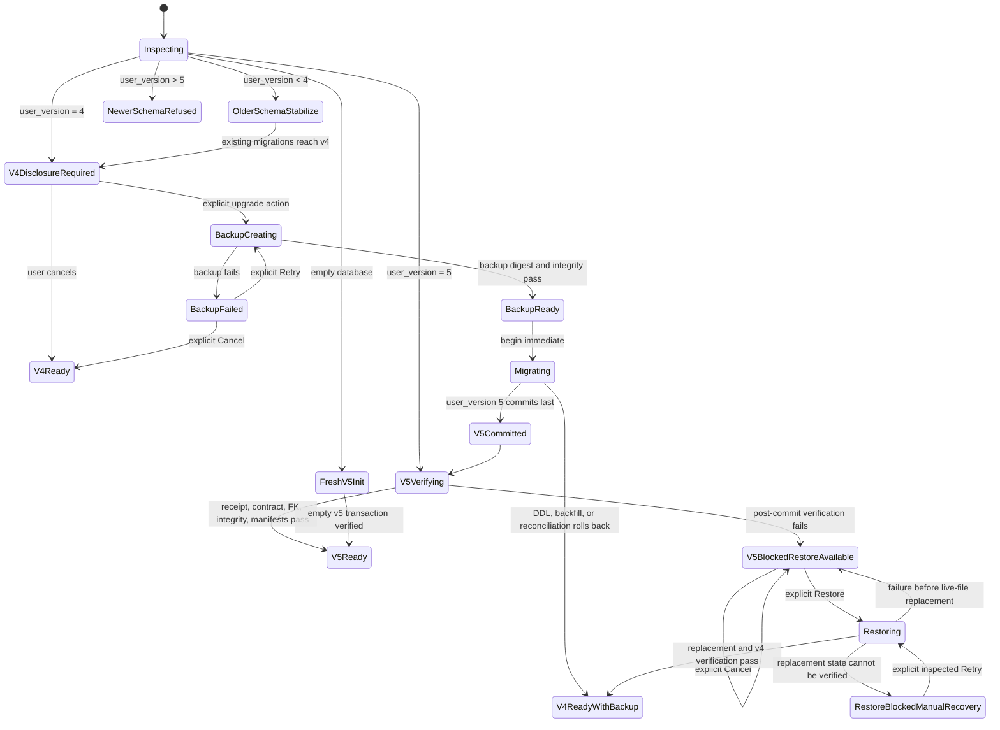

# 13 Phase 3C Schema v5 Migration And Cutover Plan

## Purpose And Authority

This document records the Founder-approved exact schema v5 migration, cutover, recovery, and implementation sequence for the Founder-approved Phase 3C lifecycle foundation.

It is a **Founder-approved authorization gate with Slice 0 authority only**. All sixteen decisions were explicitly approved on 2026/07/17. Decision 16B authorizes fixed contracts, synthetic fixtures, test-only DDL execution, invariant tests, and synchronized verified documentation only after this document is promoted to clean `develop`. It does not authorize production migration, user-database mutation, production initialization, `user_version` or application-version changes, startup behavior, backup, restore, cleanup, lifecycle UI or writes, export v2, import, provider or ContextPacket changes, Slice 1 or later, staging, commit, push, merge, or Phase 4 work.

ADR-0011 is Accepted and `architecture/12` is Founder-approved, but both explicitly withhold migration implementation authority. All five Phase 3 exit gaps remain blocking. This plan addresses the storage foundation for four gaps; explicit emotion, relationship, value-conflict, and time-range retrieval remains a separate blocker.

**We Build Mirrors, Not Oracles.** A migration may preserve history and user decisions. It may not manufacture missing history, elevate AI content, or make deleted content silently reappear.

## Inspected Production Baseline

The proposal is based on the current repository, not an assumed storage layer.

### SQLite and Rust

- `src-tauri/src/sqlite.rs` sets `SCHEMA_VERSION` to `4`.
- `initialize_sqlite_database` resolves `<app_data_dir>/life-os.db`, creates the directory, and runs `migrate_connection`.
- Schema v3 introduced `persisted_artifacts`; schema v4 added the four `historical_*` tables, two indexes, and deletion triggers.
- DDL and `PRAGMA user_version` changes run in one SQLx transaction, with an injected-failure test.
- `execute_sqlite_transaction` accepts statement arrays from TypeScript and optionally checks one Experience `updated_at` value.
- `execute_sqlite_historical_transaction` revalidates Experience timestamps, artifact timestamps and eligibility, consumed consent, successful transmission, packet digest, provider, and model before persistence.

### TypeScript storage and mutation

- `LocalEvidenceStore` exposes current-state Experience CRUD, whole-bundle artifact replacement, Phase 3B audit/artifact operations, and startup audit cleanup.
- `sqliteLocalEvidenceStore.ts` starts Rust initialization through `dbPromise`, then opens the same database through `@tauri-apps/plugin-sql`.
- `saveArtifacts` deletes all source-scoped `persisted_artifacts` and reinserts the validated current bundle. It also deletes dependent Historical Questions.
- `createArtifactMutationRunner` serializes mutations in one renderer queue, re-reads durable state, checks generation snapshots, and delegates the durable transaction to the store.
- Domain objects combine current content, review status, timestamps, and provenance in JSON payloads. Reflection prompt and user response provenance are distinct fields inside one record.
- Rejected Evidence and Pattern payloads are filtered out rather than retained.

### Startup and export

- `App` creates the store during render, then `refreshEntries` waits for initialization indirectly through `dbPromise` before startup audit cleanup and timeline reads.
- There is no explicit database-state screen, migration authorization screen, backup disclosure, or newer-schema refusal state.
- Current JSON/Markdown export is Experience-only format `0.1` and writes directly to the selected destination. It is not the founder-approved `life-os-export-v2` graph and is not atomic through a temporary file.
- Application versions in `package.json`, `src-tauri/Cargo.toml`, and `src-tauri/tauri.conf.json` are currently `0.1.0`.

## Non-Negotiable Cutover Rules

1. Schema v5 becomes authoritative only after one verified transaction commits.
2. No pre-v5 revision or rejection history is invented.
3. Every live v4 record receives exactly one honest `legacy_v4_baseline` revision.
4. Revision metadata is immutable; content is separately purgeable.
5. New review events represent explicit user actions. Imported status is visibly `legacy_v4_baseline`, not rewritten as a newly observed click.
6. v4 tables remain a current-state compatibility projection; they are not a second authority.
7. All writes after cutover go through typed Rust commands and update v5 plus the v4 projection in one transaction.
8. Older binaries must be prevented from mutating a v5 database even though the current v4 binary does not understand a maximum schema version.
9. Phase 3B packet, consent, transmission, actual-use, and deletion guarantees remain authoritative under ADR-0009.
10. No automatic down migration or schema decrement exists.

## Proposed Exact Schema v5 DDL

The SQL below is the proposed **candidate** schema contract for Slice 0 fixtures and invariant verification. Naming and constraints are part of the authorization question. It is not executed by this document, and approval of this candidate does not authorize production DDL execution.

All timestamps are UTC ISO-8601 strings produced by the application. All digests are lowercase SHA-256 hex over explicitly versioned canonical bytes. SQLite checks validate shape; Rust computes and verifies content digests.

```sql
PRAGMA foreign_keys = ON;
PRAGMA defer_foreign_keys = ON;

CREATE TABLE schema_migration_receipts (
  migration_id TEXT PRIMARY KEY NOT NULL,
  from_version INTEGER NOT NULL,
  to_version INTEGER NOT NULL,
  state TEXT NOT NULL CHECK(state = 'committed'),
  application_version TEXT NOT NULL,
  backup_id TEXT,
  source_manifest_digest TEXT NOT NULL
    CHECK(length(source_manifest_digest) = 64
      AND source_manifest_digest NOT GLOB '*[^0-9a-f]*'),
  target_manifest_digest TEXT NOT NULL
    CHECK(length(target_manifest_digest) = 64
      AND target_manifest_digest NOT GLOB '*[^0-9a-f]*'),
  started_at TEXT NOT NULL,
  committed_at TEXT NOT NULL,
  CHECK(from_version = 4 AND to_version = 5)
);

CREATE TABLE database_contract (
  singleton INTEGER PRIMARY KEY NOT NULL CHECK(singleton = 1),
  authoritative_schema INTEGER NOT NULL CHECK(authoritative_schema = 5),
  minimum_application_version TEXT NOT NULL,
  compatibility_projection TEXT NOT NULL
    CHECK(compatibility_projection IN ('enabled','disabled')),
  lifecycle_writes TEXT NOT NULL
    CHECK(lifecycle_writes IN ('disabled','enabled')),
  export_v2 TEXT NOT NULL
    CHECK(export_v2 IN ('disabled','enabled')),
  updated_at TEXT NOT NULL
);

-- This is a transaction-scoped compatibility guard, not a security boundary.
-- A typed Rust write inserts one unpredictable token, performs the v5 and v4
-- projection writes on the same connection, deletes the token, then commits.
CREATE TABLE v5_compatibility_write_guard (
  token TEXT PRIMARY KEY NOT NULL,
  created_at TEXT NOT NULL
);

CREATE TABLE provenance_records (
  id TEXT PRIMARY KEY NOT NULL,
  fingerprint TEXT NOT NULL UNIQUE
    CHECK(length(fingerprint) = 64
      AND fingerprint NOT GLOB '*[^0-9a-f]*'),
  origin TEXT NOT NULL
    CHECK(origin IN ('user','ai','local_mock','legacy_unknown')),
  provider TEXT
    CHECK(provider IS NULL OR provider IN ('openai','gemini','mock','legacy_unknown')),
  model TEXT,
  harness_version TEXT,
  prompt_version TEXT,
  generated_at TEXT,
  canonical_payload TEXT NOT NULL CHECK(json_valid(canonical_payload)),
  created_at TEXT NOT NULL
);

-- Created before source_heads intentionally. SQLite resolves the deferred
-- cyclic relationship after both tables exist and the transaction commits.
CREATE TABLE source_revisions (
  id TEXT PRIMARY KEY NOT NULL,
  source_id TEXT NOT NULL,
  revision_number INTEGER NOT NULL CHECK(revision_number >= 1),
  predecessor_revision_id TEXT,
  authorship TEXT NOT NULL
    CHECK(authorship IN ('user','legacy_unknown')),
  revision_reason TEXT NOT NULL
    CHECK(revision_reason IN ('created','corrected','legacy_v4_baseline')),
  serialization_version TEXT NOT NULL
    CHECK(serialization_version IN ('utf8-text-v1','legacy-v4-raw')),
  content_digest TEXT NOT NULL
    CHECK(length(content_digest) = 64
      AND content_digest NOT GLOB '*[^0-9a-f]*'),
  created_at TEXT NOT NULL,
  UNIQUE(source_id, revision_number),
  UNIQUE(source_id, id),
  FOREIGN KEY(source_id) REFERENCES source_heads(id)
    ON DELETE CASCADE DEFERRABLE INITIALLY DEFERRED,
  FOREIGN KEY(source_id, predecessor_revision_id)
    REFERENCES source_revisions(source_id, id)
    DEFERRABLE INITIALLY DEFERRED,
  CHECK((revision_number = 1 AND predecessor_revision_id IS NULL)
     OR (revision_number > 1 AND predecessor_revision_id IS NOT NULL))
);

CREATE TABLE source_heads (
  id TEXT PRIMARY KEY NOT NULL,
  current_revision_id TEXT,
  lifecycle_state TEXT NOT NULL
    CHECK(lifecycle_state IN ('active','deleted')),
  created_at TEXT NOT NULL,
  updated_at TEXT NOT NULL,
  FOREIGN KEY(id, current_revision_id)
    REFERENCES source_revisions(source_id, id)
    DEFERRABLE INITIALLY DEFERRED,
  CHECK((lifecycle_state = 'active' AND current_revision_id IS NOT NULL)
     OR (lifecycle_state = 'deleted' AND current_revision_id IS NULL))
);

CREATE TABLE source_revision_content (
  revision_id TEXT PRIMARY KEY NOT NULL,
  content TEXT NOT NULL,
  byte_length INTEGER NOT NULL CHECK(byte_length >= 0),
  FOREIGN KEY(revision_id) REFERENCES source_revisions(id) ON DELETE CASCADE
);

CREATE TABLE source_revision_provenance (
  source_revision_id TEXT NOT NULL,
  role TEXT NOT NULL CHECK(role = 'content'),
  provenance_id TEXT NOT NULL,
  PRIMARY KEY(source_revision_id, role),
  FOREIGN KEY(source_revision_id) REFERENCES source_revisions(id) ON DELETE CASCADE,
  FOREIGN KEY(provenance_id) REFERENCES provenance_records(id)
);

CREATE TABLE artifact_revisions (
  id TEXT PRIMARY KEY NOT NULL,
  artifact_id TEXT NOT NULL,
  source_id TEXT NOT NULL,
  revision_number INTEGER NOT NULL CHECK(revision_number >= 1),
  predecessor_revision_id TEXT,
  authorship TEXT NOT NULL
    CHECK(authorship IN ('user','ai','local_mock','legacy_unknown','mixed')),
  revision_reason TEXT NOT NULL
    CHECK(revision_reason IN (
      'created','corrected','answered','legacy_v4_baseline'
    )),
  serialization_version TEXT NOT NULL
    CHECK(serialization_version IN ('canonical-json-v1','legacy-v4-raw')),
  content_digest TEXT NOT NULL
    CHECK(length(content_digest) = 64
      AND content_digest NOT GLOB '*[^0-9a-f]*'),
  created_at TEXT NOT NULL,
  UNIQUE(artifact_id, revision_number),
  UNIQUE(artifact_id, id),
  FOREIGN KEY(artifact_id) REFERENCES artifact_heads(id)
    ON DELETE CASCADE DEFERRABLE INITIALLY DEFERRED,
  FOREIGN KEY(source_id) REFERENCES source_heads(id) ON DELETE CASCADE,
  FOREIGN KEY(artifact_id, predecessor_revision_id)
    REFERENCES artifact_revisions(artifact_id, id)
    DEFERRABLE INITIALLY DEFERRED,
  CHECK((revision_number = 1 AND predecessor_revision_id IS NULL)
     OR (revision_number > 1 AND predecessor_revision_id IS NOT NULL))
);

CREATE TABLE artifact_heads (
  id TEXT PRIMARY KEY NOT NULL,
  source_id TEXT NOT NULL,
  artifact_kind TEXT NOT NULL CHECK(artifact_kind IN (
    'evidence','reflection','pattern','recovery_turn','historical_question'
  )),
  current_revision_id TEXT,
  review_state TEXT NOT NULL CHECK(review_state IN (
    'pending','confirmed','rejected','skipped','not_applicable'
  )),
  lifecycle_state TEXT NOT NULL CHECK(lifecycle_state IN (
    'active','invalidated','content_purged','deleted'
  )),
  eligibility_state TEXT NOT NULL
    CHECK(eligibility_state IN ('eligible','ineligible')),
  eligibility_reason TEXT NOT NULL,
  created_at TEXT NOT NULL,
  updated_at TEXT NOT NULL,
  UNIQUE(id, source_id),
  FOREIGN KEY(source_id) REFERENCES source_heads(id) ON DELETE CASCADE,
  FOREIGN KEY(id, current_revision_id)
    REFERENCES artifact_revisions(artifact_id, id)
    DEFERRABLE INITIALLY DEFERRED,
  CHECK((lifecycle_state IN ('active','invalidated') AND current_revision_id IS NOT NULL)
     OR (lifecycle_state IN ('content_purged','deleted') AND current_revision_id IS NULL)),
  CHECK(lifecycle_state = 'active' OR eligibility_state = 'ineligible')
);

CREATE TABLE artifact_revision_content (
  revision_id TEXT PRIMARY KEY NOT NULL,
  payload TEXT NOT NULL CHECK(json_valid(payload)),
  byte_length INTEGER NOT NULL CHECK(byte_length >= 0),
  FOREIGN KEY(revision_id) REFERENCES artifact_revisions(id) ON DELETE CASCADE
);

CREATE TABLE artifact_revision_provenance (
  artifact_revision_id TEXT NOT NULL,
  role TEXT NOT NULL CHECK(role IN ('content','prompt','response')),
  provenance_id TEXT NOT NULL,
  PRIMARY KEY(artifact_revision_id, role),
  FOREIGN KEY(artifact_revision_id) REFERENCES artifact_revisions(id) ON DELETE CASCADE,
  FOREIGN KEY(provenance_id) REFERENCES provenance_records(id)
);

CREATE TABLE artifact_review_events (
  id TEXT PRIMARY KEY NOT NULL,
  artifact_id TEXT NOT NULL,
  subject_revision_id TEXT NOT NULL,
  decision TEXT NOT NULL CHECK(decision IN ('confirmed','rejected','skipped')),
  actor TEXT NOT NULL CHECK(actor IN ('user','legacy_import')),
  event_origin TEXT NOT NULL
    CHECK(event_origin IN ('explicit_user_action','legacy_v4_baseline')),
  occurred_at TEXT NOT NULL,
  timestamp_quality TEXT NOT NULL CHECK(timestamp_quality IN (
    'exact_action_time','record_updated_at_not_decision_time'
  )),
  UNIQUE(artifact_id, subject_revision_id),
  FOREIGN KEY(artifact_id, subject_revision_id)
    REFERENCES artifact_revisions(artifact_id, id) ON DELETE CASCADE,
  CHECK((actor = 'user'
      AND event_origin = 'explicit_user_action'
      AND timestamp_quality = 'exact_action_time')
     OR (actor = 'legacy_import'
      AND event_origin = 'legacy_v4_baseline'
      AND timestamp_quality = 'record_updated_at_not_decision_time'))
);

CREATE TABLE artifact_lifecycle_events (
  id TEXT PRIMARY KEY NOT NULL,
  artifact_id TEXT NOT NULL,
  subject_revision_id TEXT,
  related_revision_id TEXT,
  dependency_id TEXT,
  event_type TEXT NOT NULL CHECK(event_type IN (
    'baseline_imported','created','corrected','superseded',
    'invalidated','deleted','content_purged'
  )),
  actor TEXT NOT NULL CHECK(actor IN ('user','system','legacy_import')),
  reason_code TEXT NOT NULL,
  occurred_at TEXT NOT NULL,
  FOREIGN KEY(artifact_id) REFERENCES artifact_heads(id) ON DELETE CASCADE,
  FOREIGN KEY(artifact_id, subject_revision_id)
    REFERENCES artifact_revisions(artifact_id, id) ON DELETE CASCADE,
  FOREIGN KEY(artifact_id, related_revision_id)
    REFERENCES artifact_revisions(artifact_id, id) ON DELETE CASCADE,
  FOREIGN KEY(dependency_id) REFERENCES artifact_dependencies(id)
    DEFERRABLE INITIALLY DEFERRED,
  CHECK(event_type NOT IN ('corrected','superseded')
     OR (subject_revision_id IS NOT NULL AND related_revision_id IS NOT NULL)),
  CHECK(event_type <> 'content_purged' OR subject_revision_id IS NOT NULL),
  CHECK(event_type <> 'invalidated' OR dependency_id IS NOT NULL)
);

CREATE TABLE artifact_dependencies (
  id TEXT PRIMARY KEY NOT NULL,
  dependent_artifact_id TEXT NOT NULL,
  dependent_revision_id TEXT NOT NULL,
  relationship_type TEXT NOT NULL CHECK(relationship_type IN (
    'derived_from_experience','uses_evidence','answers_prompt',
    'uses_reflection_response','historical_current_experience',
    'historical_packet_item'
  )),
  source_revision_id TEXT,
  source_artifact_id TEXT,
  source_artifact_revision_id TEXT,
  created_at TEXT NOT NULL,
  FOREIGN KEY(dependent_artifact_id, dependent_revision_id)
    REFERENCES artifact_revisions(artifact_id, id) ON DELETE CASCADE,
  FOREIGN KEY(source_revision_id) REFERENCES source_revisions(id),
  FOREIGN KEY(source_artifact_id, source_artifact_revision_id)
    REFERENCES artifact_revisions(artifact_id, id),
  CHECK((source_revision_id IS NOT NULL
      AND source_artifact_id IS NULL
      AND source_artifact_revision_id IS NULL)
     OR (source_revision_id IS NULL
      AND source_artifact_id IS NOT NULL
      AND source_artifact_revision_id IS NOT NULL))
);

CREATE TABLE content_tombstones (
  id TEXT PRIMARY KEY NOT NULL,
  subject_type TEXT NOT NULL CHECK(subject_type IN (
    'source_revision','artifact_revision','artifact'
  )),
  source_id TEXT,
  source_revision_id TEXT,
  artifact_id TEXT,
  artifact_revision_id TEXT,
  content_digest TEXT
    CHECK(content_digest IS NULL OR (
      length(content_digest) = 64
      AND content_digest NOT GLOB '*[^0-9a-f]*'
    )),
  reason_code TEXT NOT NULL CHECK(reason_code IN (
    'user_purged_revision','user_deleted_artifact','rejected_content_purged'
  )),
  purged_at TEXT NOT NULL,
  CHECK((subject_type = 'source_revision'
      AND source_id IS NOT NULL AND source_revision_id IS NOT NULL
      AND artifact_id IS NULL AND artifact_revision_id IS NULL)
     OR (subject_type = 'artifact_revision'
      AND source_id IS NULL AND source_revision_id IS NULL
      AND artifact_id IS NOT NULL AND artifact_revision_id IS NOT NULL)
     OR (subject_type = 'artifact'
      AND source_id IS NULL AND source_revision_id IS NULL
      AND artifact_id IS NOT NULL AND artifact_revision_id IS NULL)),
  FOREIGN KEY(source_id, source_revision_id)
    REFERENCES source_revisions(source_id, id) ON DELETE CASCADE,
  FOREIGN KEY(artifact_id) REFERENCES artifact_heads(id) ON DELETE CASCADE,
  FOREIGN KEY(artifact_id, artifact_revision_id)
    REFERENCES artifact_revisions(artifact_id, id) ON DELETE CASCADE
);

CREATE TABLE historical_question_lifecycle_links (
  historical_artifact_id TEXT PRIMARY KEY NOT NULL,
  artifact_id TEXT NOT NULL UNIQUE,
  FOREIGN KEY(historical_artifact_id)
    REFERENCES historical_question_artifacts(id) ON DELETE CASCADE,
  FOREIGN KEY(artifact_id) REFERENCES artifact_heads(id) ON DELETE CASCADE
);

CREATE INDEX idx_source_revisions_source
  ON source_revisions(source_id, revision_number DESC);
CREATE INDEX idx_artifact_heads_source_kind
  ON artifact_heads(source_id, artifact_kind, created_at);
CREATE INDEX idx_artifact_heads_current_state
  ON artifact_heads(lifecycle_state, review_state, eligibility_state);
CREATE INDEX idx_artifact_revisions_artifact
  ON artifact_revisions(artifact_id, revision_number DESC);
CREATE INDEX idx_review_events_artifact_time
  ON artifact_review_events(artifact_id, occurred_at);
CREATE INDEX idx_lifecycle_events_artifact_time
  ON artifact_lifecycle_events(artifact_id, occurred_at);
CREATE INDEX idx_dependencies_dependent
  ON artifact_dependencies(dependent_artifact_id, dependent_revision_id);
CREATE INDEX idx_dependencies_source_revision
  ON artifact_dependencies(source_revision_id)
  WHERE source_revision_id IS NOT NULL;
CREATE INDEX idx_dependencies_source_artifact_revision
  ON artifact_dependencies(source_artifact_id, source_artifact_revision_id)
  WHERE source_artifact_revision_id IS NOT NULL;
CREATE UNIQUE INDEX uq_dependencies_source_revision
  ON artifact_dependencies(
    dependent_revision_id, relationship_type, source_revision_id
  ) WHERE source_revision_id IS NOT NULL;
CREATE UNIQUE INDEX uq_dependencies_source_artifact_revision
  ON artifact_dependencies(
    dependent_revision_id, relationship_type,
    source_artifact_id, source_artifact_revision_id
  ) WHERE source_artifact_revision_id IS NOT NULL;
CREATE INDEX idx_tombstones_artifact
  ON content_tombstones(artifact_id, purged_at)
  WHERE artifact_id IS NOT NULL;

CREATE TRIGGER source_revisions_immutable_update
BEFORE UPDATE ON source_revisions
BEGIN
  SELECT RAISE(ABORT, 'source_revision_immutable');
END;

CREATE TRIGGER artifact_revisions_immutable_update
BEFORE UPDATE ON artifact_revisions
BEGIN
  SELECT RAISE(ABORT, 'artifact_revision_immutable');
END;

CREATE TRIGGER provenance_records_immutable_update
BEFORE UPDATE ON provenance_records
BEGIN
  SELECT RAISE(ABORT, 'provenance_immutable');
END;

CREATE TRIGGER review_events_immutable_update
BEFORE UPDATE ON artifact_review_events
BEGIN
  SELECT RAISE(ABORT, 'review_event_immutable');
END;

CREATE TRIGGER lifecycle_events_immutable_update
BEFORE UPDATE ON artifact_lifecycle_events
BEGIN
  SELECT RAISE(ABORT, 'lifecycle_event_immutable');
END;

CREATE TRIGGER dependencies_immutable_update
BEFORE UPDATE ON artifact_dependencies
BEGIN
  SELECT RAISE(ABORT, 'dependency_immutable');
END;

CREATE TRIGGER source_revision_content_immutable_update
BEFORE UPDATE ON source_revision_content
BEGIN
  SELECT RAISE(ABORT, 'source_revision_content_immutable');
END;

CREATE TRIGGER artifact_revision_content_immutable_update
BEFORE UPDATE ON artifact_revision_content
BEGIN
  SELECT RAISE(ABORT, 'artifact_revision_content_immutable');
END;

CREATE TRIGGER tombstones_immutable_update
BEFORE UPDATE ON content_tombstones
BEGIN
  SELECT RAISE(ABORT, 'content_tombstone_immutable');
END;

CREATE TRIGGER migration_receipts_immutable_update
BEFORE UPDATE ON schema_migration_receipts
BEGIN
  SELECT RAISE(ABORT, 'schema_migration_receipt_immutable');
END;

CREATE TRIGGER migration_receipts_immutable_delete
BEFORE DELETE ON schema_migration_receipts
BEGIN
  SELECT RAISE(ABORT, 'schema_migration_receipt_immutable');
END;

CREATE TRIGGER source_revision_provenance_immutable_update
BEFORE UPDATE ON source_revision_provenance
BEGIN
  SELECT RAISE(ABORT, 'source_revision_provenance_immutable');
END;

CREATE TRIGGER artifact_revision_provenance_immutable_update
BEFORE UPDATE ON artifact_revision_provenance
BEGIN
  SELECT RAISE(ABORT, 'artifact_revision_provenance_immutable');
END;

CREATE TRIGGER historical_lifecycle_links_immutable_update
BEFORE UPDATE ON historical_question_lifecycle_links
BEGIN
  SELECT RAISE(ABORT, 'historical_lifecycle_link_immutable');
END;

-- database_contract is intentionally a mutable operational projection. Only a
-- typed transaction holding the compatibility token may create or change it.
CREATE TRIGGER database_contract_insert_requires_guard
BEFORE INSERT ON database_contract
WHEN NOT EXISTS (SELECT 1 FROM v5_compatibility_write_guard)
BEGIN
  SELECT RAISE(ABORT, 'database_contract_requires_lifecycle_transaction');
END;

CREATE TRIGGER database_contract_update_requires_guard
BEFORE UPDATE ON database_contract
WHEN NOT EXISTS (SELECT 1 FROM v5_compatibility_write_guard)
BEGIN
  SELECT RAISE(ABORT, 'database_contract_requires_lifecycle_transaction');
END;

CREATE TRIGGER database_contract_delete_requires_guard
BEFORE DELETE ON database_contract
WHEN NOT EXISTS (SELECT 1 FROM v5_compatibility_write_guard)
BEGIN
  SELECT RAISE(ABORT, 'database_contract_requires_lifecycle_transaction');
END;

-- Guard rows are intentionally ephemeral transaction-local capability records:
-- INSERT and DELETE are required, but rewriting a token in place is forbidden.
CREATE TRIGGER compatibility_guard_immutable_update
BEFORE UPDATE ON v5_compatibility_write_guard
BEGIN
  SELECT RAISE(ABORT, 'compatibility_guard_token_immutable');
END;

CREATE TRIGGER source_revisions_delete_requires_guard
BEFORE DELETE ON source_revisions
WHEN NOT EXISTS (SELECT 1 FROM v5_compatibility_write_guard)
BEGIN
  SELECT RAISE(ABORT, 'source_revision_delete_requires_lifecycle_transaction');
END;

CREATE TRIGGER artifact_revisions_delete_requires_guard
BEFORE DELETE ON artifact_revisions
WHEN NOT EXISTS (SELECT 1 FROM v5_compatibility_write_guard)
BEGIN
  SELECT RAISE(ABORT, 'artifact_revision_delete_requires_lifecycle_transaction');
END;

CREATE TRIGGER provenance_delete_requires_guard
BEFORE DELETE ON provenance_records
WHEN NOT EXISTS (SELECT 1 FROM v5_compatibility_write_guard)
BEGIN
  SELECT RAISE(ABORT, 'provenance_delete_requires_lifecycle_transaction');
END;

CREATE TRIGGER review_event_delete_requires_guard
BEFORE DELETE ON artifact_review_events
WHEN NOT EXISTS (SELECT 1 FROM v5_compatibility_write_guard)
BEGIN
  SELECT RAISE(ABORT, 'review_event_delete_requires_lifecycle_transaction');
END;

CREATE TRIGGER lifecycle_event_delete_requires_guard
BEFORE DELETE ON artifact_lifecycle_events
WHEN NOT EXISTS (SELECT 1 FROM v5_compatibility_write_guard)
BEGIN
  SELECT RAISE(ABORT, 'lifecycle_event_delete_requires_lifecycle_transaction');
END;

CREATE TRIGGER dependency_delete_requires_guard
BEFORE DELETE ON artifact_dependencies
WHEN NOT EXISTS (SELECT 1 FROM v5_compatibility_write_guard)
BEGIN
  SELECT RAISE(ABORT, 'dependency_delete_requires_lifecycle_transaction');
END;

CREATE TRIGGER tombstone_delete_requires_guard
BEFORE DELETE ON content_tombstones
WHEN NOT EXISTS (SELECT 1 FROM v5_compatibility_write_guard)
BEGIN
  SELECT RAISE(ABORT, 'tombstone_delete_requires_lifecycle_transaction');
END;

CREATE TRIGGER source_revision_content_delete_requires_guard
BEFORE DELETE ON source_revision_content
WHEN NOT EXISTS (SELECT 1 FROM v5_compatibility_write_guard)
BEGIN
  SELECT RAISE(ABORT, 'source_content_delete_requires_lifecycle_transaction');
END;

CREATE TRIGGER artifact_revision_content_delete_requires_guard
BEFORE DELETE ON artifact_revision_content
WHEN NOT EXISTS (SELECT 1 FROM v5_compatibility_write_guard)
BEGIN
  SELECT RAISE(ABORT, 'artifact_content_delete_requires_lifecycle_transaction');
END;

CREATE TRIGGER source_revision_provenance_delete_requires_guard
BEFORE DELETE ON source_revision_provenance
WHEN NOT EXISTS (SELECT 1 FROM v5_compatibility_write_guard)
BEGIN
  SELECT RAISE(ABORT, 'source_revision_provenance_delete_requires_lifecycle_transaction');
END;

CREATE TRIGGER artifact_revision_provenance_delete_requires_guard
BEFORE DELETE ON artifact_revision_provenance
WHEN NOT EXISTS (SELECT 1 FROM v5_compatibility_write_guard)
BEGIN
  SELECT RAISE(ABORT, 'artifact_revision_provenance_delete_requires_lifecycle_transaction');
END;

CREATE TRIGGER historical_lifecycle_link_delete_requires_guard
BEFORE DELETE ON historical_question_lifecycle_links
WHEN NOT EXISTS (SELECT 1 FROM v5_compatibility_write_guard)
BEGIN
  SELECT RAISE(ABORT, 'historical_lifecycle_link_delete_requires_lifecycle_transaction');
END;

CREATE TRIGGER source_head_insert_requires_content
BEFORE INSERT ON source_heads
WHEN NEW.current_revision_id IS NOT NULL
 AND NOT EXISTS (
   SELECT 1 FROM source_revision_content
   WHERE revision_id = NEW.current_revision_id
 )
BEGIN
  SELECT RAISE(ABORT, 'current_source_revision_content_missing');
END;

CREATE TRIGGER source_head_current_requires_content
BEFORE UPDATE ON source_heads
WHEN NEW.current_revision_id IS NOT NULL
 AND NOT EXISTS (
   SELECT 1 FROM source_revision_content
   WHERE revision_id = NEW.current_revision_id
 )
BEGIN
  SELECT RAISE(ABORT, 'current_source_revision_content_missing');
END;

CREATE TRIGGER artifact_head_insert_requires_content
BEFORE INSERT ON artifact_heads
WHEN NEW.current_revision_id IS NOT NULL
 AND NOT EXISTS (
   SELECT 1 FROM artifact_revision_content
   WHERE revision_id = NEW.current_revision_id
 )
BEGIN
  SELECT RAISE(ABORT, 'current_artifact_revision_content_missing');
END;

CREATE TRIGGER artifact_head_current_requires_content
BEFORE UPDATE ON artifact_heads
WHEN NEW.current_revision_id IS NOT NULL
 AND NOT EXISTS (
   SELECT 1 FROM artifact_revision_content
   WHERE revision_id = NEW.current_revision_id
 )
BEGIN
  SELECT RAISE(ABORT, 'current_artifact_revision_content_missing');
END;

CREATE TRIGGER current_source_content_cannot_be_purged
BEFORE DELETE ON source_revision_content
WHEN EXISTS (
  SELECT 1 FROM source_heads
  WHERE current_revision_id = OLD.revision_id
)
BEGIN
  SELECT RAISE(ABORT, 'cannot_purge_current_source_revision');
END;

CREATE TRIGGER current_artifact_content_cannot_be_purged
BEFORE DELETE ON artifact_revision_content
WHEN EXISTS (
  SELECT 1 FROM artifact_heads
  WHERE current_revision_id = OLD.revision_id
)
BEGIN
  SELECT RAISE(ABORT, 'cannot_purge_current_artifact_revision');
END;

-- Existing v4/current-state tables become guarded compatibility projections.
CREATE TRIGGER guard_experience_entries_insert
BEFORE INSERT ON experience_entries
WHEN NOT EXISTS (SELECT 1 FROM v5_compatibility_write_guard)
BEGIN
  SELECT RAISE(ABORT, 'schema_v5_requires_compatible_application');
END;
CREATE TRIGGER guard_experience_entries_update
BEFORE UPDATE ON experience_entries
WHEN NOT EXISTS (SELECT 1 FROM v5_compatibility_write_guard)
BEGIN
  SELECT RAISE(ABORT, 'schema_v5_requires_compatible_application');
END;
CREATE TRIGGER guard_experience_entries_delete
BEFORE DELETE ON experience_entries
WHEN NOT EXISTS (SELECT 1 FROM v5_compatibility_write_guard)
BEGIN
  SELECT RAISE(ABORT, 'schema_v5_requires_compatible_application');
END;

CREATE TRIGGER guard_persisted_artifacts_insert
BEFORE INSERT ON persisted_artifacts
WHEN NOT EXISTS (SELECT 1 FROM v5_compatibility_write_guard)
BEGIN
  SELECT RAISE(ABORT, 'schema_v5_requires_compatible_application');
END;
CREATE TRIGGER guard_persisted_artifacts_update
BEFORE UPDATE ON persisted_artifacts
WHEN NOT EXISTS (SELECT 1 FROM v5_compatibility_write_guard)
BEGIN
  SELECT RAISE(ABORT, 'schema_v5_requires_compatible_application');
END;
CREATE TRIGGER guard_persisted_artifacts_delete
BEFORE DELETE ON persisted_artifacts
WHEN NOT EXISTS (SELECT 1 FROM v5_compatibility_write_guard)
BEGIN
  SELECT RAISE(ABORT, 'schema_v5_requires_compatible_application');
END;

CREATE TRIGGER guard_historical_consent_events_insert
BEFORE INSERT ON historical_consent_events
WHEN NOT EXISTS (SELECT 1 FROM v5_compatibility_write_guard)
BEGIN
  SELECT RAISE(ABORT, 'schema_v5_requires_compatible_application');
END;
CREATE TRIGGER guard_historical_consent_events_update
BEFORE UPDATE ON historical_consent_events
WHEN NOT EXISTS (SELECT 1 FROM v5_compatibility_write_guard)
BEGIN
  SELECT RAISE(ABORT, 'schema_v5_requires_compatible_application');
END;
CREATE TRIGGER guard_historical_consent_events_delete
BEFORE DELETE ON historical_consent_events
WHEN NOT EXISTS (SELECT 1 FROM v5_compatibility_write_guard)
BEGIN
  SELECT RAISE(ABORT, 'schema_v5_requires_compatible_application');
END;

CREATE TRIGGER guard_historical_transmission_events_insert
BEFORE INSERT ON historical_transmission_events
WHEN NOT EXISTS (SELECT 1 FROM v5_compatibility_write_guard)
BEGIN
  SELECT RAISE(ABORT, 'schema_v5_requires_compatible_application');
END;
CREATE TRIGGER guard_historical_transmission_events_update
BEFORE UPDATE ON historical_transmission_events
WHEN NOT EXISTS (SELECT 1 FROM v5_compatibility_write_guard)
BEGIN
  SELECT RAISE(ABORT, 'schema_v5_requires_compatible_application');
END;
CREATE TRIGGER guard_historical_transmission_events_delete
BEFORE DELETE ON historical_transmission_events
WHEN NOT EXISTS (SELECT 1 FROM v5_compatibility_write_guard)
BEGIN
  SELECT RAISE(ABORT, 'schema_v5_requires_compatible_application');
END;

CREATE TRIGGER guard_historical_question_artifacts_insert
BEFORE INSERT ON historical_question_artifacts
WHEN NOT EXISTS (SELECT 1 FROM v5_compatibility_write_guard)
BEGIN
  SELECT RAISE(ABORT, 'schema_v5_requires_compatible_application');
END;
CREATE TRIGGER guard_historical_question_artifacts_update
BEFORE UPDATE ON historical_question_artifacts
WHEN NOT EXISTS (SELECT 1 FROM v5_compatibility_write_guard)
BEGIN
  SELECT RAISE(ABORT, 'schema_v5_requires_compatible_application');
END;
CREATE TRIGGER guard_historical_question_artifacts_delete
BEFORE DELETE ON historical_question_artifacts
WHEN NOT EXISTS (SELECT 1 FROM v5_compatibility_write_guard)
BEGIN
  SELECT RAISE(ABORT, 'schema_v5_requires_compatible_application');
END;

CREATE TRIGGER guard_historical_artifact_dependencies_insert
BEFORE INSERT ON historical_artifact_dependencies
WHEN NOT EXISTS (SELECT 1 FROM v5_compatibility_write_guard)
BEGIN
  SELECT RAISE(ABORT, 'schema_v5_requires_compatible_application');
END;
CREATE TRIGGER guard_historical_artifact_dependencies_update
BEFORE UPDATE ON historical_artifact_dependencies
WHEN NOT EXISTS (SELECT 1 FROM v5_compatibility_write_guard)
BEGIN
  SELECT RAISE(ABORT, 'schema_v5_requires_compatible_application');
END;
CREATE TRIGGER guard_historical_artifact_dependencies_delete
BEFORE DELETE ON historical_artifact_dependencies
WHEN NOT EXISTS (SELECT 1 FROM v5_compatibility_write_guard)
BEGIN
  SELECT RAISE(ABORT, 'schema_v5_requires_compatible_application');
END;

-- This bridge preserves ADR-0009. The guarded v5 delete command deletes the
-- historical row; the existing v4 provenance trigger removes its consent and
-- transmission, and this trigger removes the lifecycle projection.
CREATE TRIGGER delete_v5_historical_projection_before_historical_delete
BEFORE DELETE ON historical_question_artifacts
WHEN EXISTS (SELECT 1 FROM v5_compatibility_write_guard)
BEGIN
  DELETE FROM artifact_heads
  WHERE id = (
    SELECT artifact_id FROM historical_question_lifecycle_links
    WHERE historical_artifact_id = OLD.id
  );
END;
```

### DDL completeness condition

The candidate DDL contains **17 proposed tables, 12 proposed indexes, and 55 proposed triggers**. The six compatibility-projection tables have eighteen explicit guard triggers above. The implementation must use fixed SQL strings and snapshot-test every name and body; it must not generate table names from user input. The schema-object digest must also cover the pre-existing v4 triggers and the v5 Historical Question bridge trigger.

Mutation policy is explicit rather than inferred:

| Record family | UPDATE | DELETE | Rationale |
| --- | --- | --- | --- |
| `schema_migration_receipts` | always rejected | always rejected | Permanent migration audit receipt. |
| revision metadata and `provenance_records` | always rejected | guard required | Append-only; deletion exists only for an authorized parent lifecycle cascade/orphan cleanup. |
| review events, lifecycle events, dependencies, tombstones | always rejected | guard required | Immutable audit/dependency facts; only a governed parent-deletion cascade may remove them. |
| source/artifact provenance-role links | always rejected | guard required | Authorship/provenance cannot be rebound in place; guarded parent deletion may cascade. |
| Historical Question lifecycle links | always rejected | guard required | ADR-0009 link identity cannot be rebound; guarded Historical cascade deletion may remove it. |
| revision-content rows | always rejected | guard plus non-current check | Content changes require a new revision; authorized purge/delete may remove non-current content. |
| `source_heads`, `artifact_heads` | intentionally mutable | intentionally lifecycle-controlled | Current-state projections; typed transactions append immutable history before moving a pointer. |
| `database_contract` | guard required | guard required | Mutable operational feature-state projection, not an audit record. Initial insert is also guarded. |
| compatibility guard rows | always rejected | intentionally allowed | Ephemeral transaction-local capability: INSERT/DELETE are required, but the table must be empty at COMMIT and restart. |

## Canonicalization And Provenance Deduplication

### Content digests

- Experience revision content uses exact UTF-8 bytes without Unicode normalization. Line endings are preserved because they are user content.
- New artifact payloads use `canonical-json-v1`: recursively sorted object keys, original array order, no insignificant whitespace, UTF-8 encoding, no locale-sensitive formatting, and no Unicode normalization of string values.
- Backfilled artifact payloads use `legacy-v4-raw`: the exact existing `payload` bytes and their SHA-256. Migration must not parse and reserialize them merely to make them look canonical.
- Packet digests remain defined by ADR-0009 and are never recomputed under the artifact canonicalizer.

### Provenance fingerprints

`provenance_records.fingerprint` is SHA-256 over a domain-separated canonical object:

```text
life-os/provenance-v1\0
{origin,sourceEntryId,sourceArtifactIds(sorted),provider,model,
 harnessVersion,promptVersion,generatedAt}
```

Null and missing optional values normalize to explicit JSON `null`. Exact equal provenance objects deduplicate through the unique fingerprint. Evidence/Pattern content provenance, Reflection/Recovery prompt provenance, and Reflection/Recovery response provenance remain separate links by role. Deduplication never merges content, review events, user and AI authorship, or different source IDs.

## Honest `legacy_v4_baseline` Backfill

The migration reads a stable snapshot inside the same `BEGIN IMMEDIATE` transaction that writes v5.

### Experience backfill

For every `experience_entries` row:

1. insert revision number `1` metadata with reason `legacy_v4_baseline` while deferred foreign keys permit the not-yet-created head;
2. set authorship to `user` because Experience content is user-authored;
3. insert the exact current `content` bytes, byte length, and digest;
4. only after content exists, insert `source_heads` with its current pointer;
5. set `created_at` to the existing `created_at` and head `updated_at` to existing `updated_at`;
6. record no invented earlier revision;
7. validate the cyclic foreign keys and current-content invariant before transaction end.

The deterministic baseline revision ID is `v5sr_` plus SHA-256 of the domain-separated tuple `(source id, updated_at, content digest)`. A collision with a non-identical row aborts migration.

### Persisted artifact backfill

For every contract-valid `persisted_artifacts` row:

1. validate `artifact_kind` and JSON shape without changing bytes;
2. insert revision number `1` metadata under deferred foreign keys;
3. preserve exact raw payload bytes as `legacy-v4-raw` by inserting revision content before any current head pointer;
4. derive authorship from the existing provenance fields; missing provenance becomes `legacy_unknown` visibly;
5. insert `artifact_heads` only after its current revision content exists;
6. create provenance records and immutable role links for content, prompt, and response exactly where present;
7. reconstruct only dependencies explicitly named by existing source IDs;
8. import current review state from existing status without claiming a known click time;
9. validate the cyclic foreign keys and current-content invariant before transaction end.

The v4 contract excludes rejected Evidence and Pattern rows. If one is found, migration aborts with `unexpected_rejected_v4_payload`; it does not retain, purge, or normalize that content silently.

For a current `confirmed` Evidence or Pattern, create one review event with actor `legacy_import`, origin `legacy_v4_baseline`, occurrence equal to existing `updated_at`, and timestamp quality `record_updated_at_not_decision_time`. For an existing skipped Reflection or Context Recovery record, do the same with decision `skipped`. Candidate, suggested, and answered states do not gain an invented confirmation event. Rejected records cannot be recovered because prior migrations and validation deliberately removed them.

The deterministic artifact revision ID is `v5ar_` plus SHA-256 of `(artifact id, kind, updated_at, raw payload digest)`. The baseline lifecycle event is `baseline_imported`, not `created` by the migration.

### Historical Question backfill

For every `historical_question_artifacts` row:

- insert the baseline revision metadata, then its content containing only the existing generated-artifact `payload`, and only then insert the `historical_question` artifact head/current pointer;
- do not copy `packet_snapshot` into generic revision content;
- link the v5 artifact through `historical_question_lifecycle_links`;
- map `current_experience_id` to `historical_current_experience`;
- map each `historical_artifact_dependencies` row to the matching current baseline source or artifact revision;
- preserve the existing packet snapshot, consent, transmission, digest, provider/model, and source-revision strings in the ADR-0009 tables unchanged;
- abort if a surviving Historical Question dependency cannot map exactly. Do not drop or guess it.

## Count And Digest Reconciliation

Rust computes both manifests inside the migration transaction with ordered queries. SQLite `group_concat` is not used because limits and ordering could make it nondeterministic.

### Source manifest

For each v4 table, hash length-prefixed fields in primary-key order. The pre-migration manifest includes:

- `experience_entries`: count and digest of ID, exact content bytes, created/updated timestamps;
- `persisted_artifacts`: count by kind and digest of ID, source ID, kind, exact payload bytes, timestamps;
- all four `historical_*` tables: counts and exact row digests, including packet snapshots.

### Target reconciliation

Before `user_version` changes:

- live source-head count equals Experience count;
- source baseline-revision and content-row counts equal Experience count;
- non-historical artifact-head, baseline-revision, and content-row counts equal persisted-artifact count;
- Historical Question head/link counts equal historical-question count;
- every v4 payload/content digest equals the corresponding v5 baseline content digest;
- every current pointer resolves to its baseline revision and content;
- review-event counts equal only the importable confirmed/skipped statuses actually present; any rejected v4 payload aborts as contract drift;
- dependency counts and relationship types reconcile with source arrays and historical dependency rows;
- consent/transmission/question/packet bytes are unchanged;
- `PRAGMA foreign_key_check` returns no rows;
- `PRAGMA integrity_check` returns `ok`.

The target manifest and source manifest are stored in the committed receipt. Any mismatch raises `schema_v5_reconciliation_failed`, rolls back all DDL/backfill, and leaves `user_version = 4`.

## Migration State Machine



### State interpretation

- `V4Ready` remains usable with existing schema v4 behavior if the user cancels. No v5 feature appears.
- `BackupFailed` means migration never started because no verified backup exists. The application waits for explicit Retry or Cancel; it never retries silently.
- `V4ReadyWithBackup` means the source database is still v4; retry always requires a new current backup and fresh disclosure.
- `V5BlockedRestoreAvailable` refuses timeline reads and all writes. It offers inspection of error class, backup path, and explicit restore.
- Cancelling restoration leaves the verified failed-v5 database and backup untouched in `V5BlockedRestoreAvailable`. A pre-replacement restore failure does the same. If interruption leaves the live-file identity unverifiable, `RestoreBlockedManualRecovery` refuses reads and writes, preserves both recovery candidates, discloses their paths, and requires an explicitly initiated inspected retry; it never selects a file or retries silently.
- `NewerSchemaRefused` is read/write refusal. The application must not run migrations against a version it does not understand.

## Transaction Boundaries

### T0 — Read-only inspection

Open one Rust connection with foreign keys enabled. Read `user_version`, `database_contract`, migration receipt, schema objects, application version, and database path. Do not start renderer storage or cleanup.

### B1 — Backup outside the migration transaction

After explicit user action and before DDL, create and verify a consistent backup. No application write is allowed between backup manifest capture and `BEGIN IMMEDIATE`.

### M1 — One atomic migration transaction

1. `BEGIN IMMEDIATE` and re-read `user_version = 4`.
2. Recompute the v4 source manifest and require it to match the backup manifest.
3. Execute all v5 DDL.
4. Insert one migration-scoped compatibility token.
5. Backfill each source and artifact in strict order: revision metadata under deferred foreign keys, revision content, then head/current pointer. Append provenance links, events, dependencies, and Historical Question links only after their referenced rows exist.
6. Compute reconciliation and target manifest.
7. Insert `database_contract` with lifecycle writes and export v2 disabled.
8. Insert the committed migration receipt.
9. Install all compatibility-projection guards last, revalidate the token-protected projection, then delete the token.
10. Require an empty guard table, run `foreign_key_check` and `integrity_check`, and explicitly query that every non-null current pointer has content.
11. Set `PRAGMA user_version = 5` as the last SQL mutation.
12. Commit; deferred cyclic foreign keys are validated at transaction end.

Any injected or natural error before commit rolls back the entire transaction, including tables, triggers, receipt, and version change.

### P1 — Post-commit read-only verification

Close and reopen the connection. Require version 5, exact receipt, contract row, expected schema-object digest, empty write guard, foreign-key integrity, database integrity, and matching manifests. Only then report `V5Ready`.

### W1 — Every post-cutover runtime write

Each typed Rust mutation uses one connection and one `BEGIN IMMEDIATE` transaction:

1. revalidate expected current revision IDs and lifecycle/review states;
2. insert one random guard token;
3. append v5 revisions/events/dependencies or apply an authorized purge;
4. update v5 current projections;
5. update v4 compatibility projection;
6. apply ADR-0009 Historical Question invalidation/deletion in the same transaction;
7. revalidate invariants;
8. delete the guard token;
9. commit.

No generic TypeScript-supplied SQL statement API may perform v5 mutations. A stale or mismatched command writes nothing.

### D1 — Artifact rejection, correction, and deletion

Content purge is never a detached cleanup statement. The same transaction writes the review/lifecycle event and tombstone, clears the applicable current pointer, deletes content rows, updates the head, invalidates ordinary dependents, cascade-deletes ADR-0009 Historical Questions and packets, updates the compatibility projection, and commits or rolls back as one unit.

## Backup, Retention, Restore, And Disclosure

### Proposed creation

Use SQLite `VACUUM INTO` from the Rust startup gate before the migration transaction. No renderer/plugin SQL connection or cleanup job is active. The destination must not exist. Open the backup read-only and require `user_version = 4`, matching source manifest, matching byte digest recorded after close, `foreign_key_check` empty, and `integrity_check = ok`.

Proposed location:

```text
<app_data_dir>/backups/schema-v5/
  life-os-before-v5-<UTC basic timestamp>-<first 12 sha256>.db
  life-os-before-v5-<UTC basic timestamp>-<first 12 sha256>.manifest.json
```

The manifest contains path-relative filename, backup ID, database SHA-256, source-manifest digest, schema version, application version, created time, expiry time, and verification result. It contains no Experience text, artifact text, packet content, credential, or provider error.

### Proposed retention

- Keep one verified pre-v5 backup for at most 30 days after successful cutover.
- Allow immediate user deletion after `V5Ready` with a clear loss-of-restore warning.
- On each verified v5 startup, remove expired backup and manifest together.
- If deletion fails, disclose the exact local path and retry on next startup; do not claim cleanup succeeded.
- Never include this backup in `life-os-export-v2`.
- Never upload, sync, or transmit it.

The backup contains sensitive pre-purge copies. Its existence, location, expiry, size, and delete-now control must remain visible until it is removed.

### Proposed restoration

Restoration is never automatic. After explicit user confirmation:

1. close renderer/plugin and Rust database connections;
2. verify backup digest, manifest, version, and integrity again;
3. move the failed v5 database to a same-volume temporary recovery name;
4. atomically copy/rename the verified v4 backup into `life-os.db`;
5. remove stale `-wal` and `-shm` only after confirming no connection is open;
6. open the restored DB read-only and verify the original v4 manifest;
7. delete the failed-v5 temporary file immediately after successful restore; retry and disclose if deletion fails;
8. return to `V4ReadyWithBackup`; retry requires a new disclosure and new backup.

Local restore cannot undo any provider receipt. It does not restore data created only after v5 cutover; the UI must state the backup timestamp and expected rollback window.

## Minimum Compatible Application And Older-Binary Refusal

The proposed minimum v5 application version is `0.2.0`, synchronized across `package.json`, `src-tauri/Cargo.toml`, and `src-tauri/tauri.conf.json` in the implementation slice.

The v5 binary must refuse startup if:

- `user_version > 5`;
- `user_version = 5` and application version is below `database_contract.minimum_application_version`;
- the v5 receipt, contract, object digest, or invariants are missing or inconsistent.

An already-distributed v4 binary cannot be made to show a new friendly startup screen. Therefore the database itself must block its writes through compatibility guard triggers. It may still open and read compatibility rows before its first write fails with `schema_v5_requires_compatible_application`. This limitation must be disclosed; the product must not claim that every older binary can be prevented from opening the file.

## v4 Compatibility Projection And Authoritative Cutover

After `V5Ready`:

- `source_heads` plus current source revision/content are authoritative for Experiences;
- `artifact_heads` plus current artifact revision/content and events are authoritative for artifacts;
- v4 `experience_entries` and `persisted_artifacts` are current-state projections only;
- v4 `historical_*` tables remain the authoritative ADR-0009 packet/consent/transmission subsystem, with a v5 lifecycle projection linked for inspection/export;
- all projection writes occur through typed guarded Rust transactions;
- no reconciliation uses “last write wins”; any drift is a blocking integrity error;
- removal of the v4 projection requires a later destructive-migration founder gate.

For existing UI behavior before lifecycle activation, the v5 repository hydrates the same domain objects from v5 current rows. It may compare their canonical projection against v4 rows in debug/tests, but production reads do not merge the two authorities.

## Phase 3B ADR-0009 Compatibility

The migration and runtime path must preserve all existing Phase 3B guarantees:

1. Existing packet snapshots, consent/transmission records, IDs, digests, provider/model, outcome, and expiry remain byte-for-byte unchanged in migration.
2. Historical persistence revalidation changes from v4 timestamps to exact v5 source/artifact revision IDs while still checking the existing packet revision strings during compatibility.
3. The transaction still verifies consumed consent, successful transmission, digest, provider/model, exact source eligibility, and dependency validity before artifact persistence.
4. New Historical Question persistence atomically creates the existing ADR-0009 rows plus the v5 lifecycle head/revision/link/dependencies.
5. Included-source correction, rejection, deletion, or eligibility loss cascade-deletes generated questions and successful packet snapshots under Decision 11A.
6. The existing consent/transmission deletion trigger remains. No additional transport tombstone is introduced.
7. The Historical Context Packet and single-Experience `ContextPacket` schemas are unchanged by the v5 migration slice.
8. Provider transport authority does not expand.

## Storage-Interface Change Plan

### Startup boundary

Add a Rust-owned inspection API before constructing `LocalEvidenceStore`:

```ts
type DatabaseStartupState =
  | { state: "v4_upgrade_required"; disclosure: MigrationDisclosure }
  | { state: "migrating" }
  | { state: "ready"; schemaVersion: 5; minimumAppVersion: string }
  | { state: "blocked"; reason: DatabaseBlockReason; restore?: BackupSummary };
```

`App` must render a calm local-database gate before timeline refresh. Startup audit cleanup cannot race or precede migration verification.

### Typed mutation boundary

Retire production use of renderer-supplied generic `SqlStatement[]` for lifecycle writes. Add typed Rust commands and matching store methods for:

- create/correct/delete Experience with expected source revision;
- create candidate artifact revision;
- confirm, reject, correct, invalidate, delete, and purge artifact revision;
- commit an AI-generated artifact batch with expected source/artifact revisions;
- persist/delete Historical Questions with ADR-0009 revalidation;
- inspect revisions, review/lifecycle events, dependencies, provenance, and tombstones;
- acquire a consistent export-v2 read snapshot.

The existing `PersistedArtifactBundle` remains a read projection during transition. `saveArtifacts(bundle)` must not remain the v5 write primitive because delete-all/reinsert cannot express append-only history. `createArtifactMutationRunner` may continue renderer serialization for UX, but the Rust transaction and expected revision IDs are the authority.

### In-memory parity

The in-memory store must implement the same command outcomes, revision IDs, review semantics, dependency invalidation, and stale responses for tests. It must not become a weaker lifecycle contract.

## Cleanup Activation Sequence

1. **Migration-only state:** v5 schema, baseline history, guards, compatibility writes, and read inspection exist; `lifecycle_writes = disabled`, `export_v2 = disabled`.
2. **Storage verification:** migration/restart/restore/Phase 3B regression tests pass; no content cleanup beyond expired backup handling runs.
3. **Lifecycle command state:** after separate authorization, enable typed correction/rejection/deletion commands. Each cleanup is synchronous inside its user mutation transaction.
4. **Inspector state:** provenance/dependency UI becomes available only when all displayed states are derived from v5.
5. **Export state:** enable `life-os-export-v2` only after the v5 graph, tombstones, Phase 3B packet eligibility, atomic file write, and secret exclusions pass automated and founder-manual verification.
6. **Background/retention jobs:** no general lifecycle cleanup job is authorized by schema migration. Any future job requires separate retention, failure, retry, and disclosure approval.

Backup expiry cleanup is an operational migration obligation, not permission to purge user artifacts.

## Export-v2 Activation Timing

The existing Experience export v0.1 remains available while `export_v2 = disabled`, labelled accurately as Experience-only. It must not be renamed “complete export.”

`life-os-export-v2` activates only after:

- v5 is authoritative and verified;
- all retained revisions/events/dependencies/provenance/tombstones have read APIs;
- Phase 3B packets are included only while ADR-0009 permits retention;
- purged content is represented only by content-free markers;
- snapshot acquisition is one consistent read transaction;
- file creation uses temporary write, flush, digest validation, and same-volume atomic rename;
- English, Traditional Chinese, and Japanese disclosure and founder verification pass.

Import remains unauthorized.

## Non-Destructive Feature Disable

Feature disable changes `database_contract.lifecycle_writes` or `export_v2` from enabled to disabled through a typed guarded transaction. It does not:

- decrement `user_version`;
- drop v5 tables, triggers, events, revisions, tombstones, or backup metadata;
- rewrite v5 state into v4 as a new authority;
- re-enable old-binary writes;
- alter ADR-0009 consent or transport authority;
- delete user content.

Reads and provenance inspection remain available. Unsupported mutations fail closed with localized guidance. Recovery is a forward fix. Destructive recovery requires a new founder decision.

## Validation Evidence And Reproducibility Boundary

Three evidence levels must not be conflated:

1. **Corrective-pass syntax probe (completed once, non-authoritative):** the embedded candidate DDL was extracted from this document and executed against a synthetic in-memory SQLite v4 fixture. This catches immediate SQL syntax, constraint, trigger, and ordering defects, but it is not stored as a repository test and is not production migration evidence.
2. **Slice 0 contract tests (implemented in the current unpromoted working tree):** Pilot 4 preserves repository-owned v2/v3/v4 fixtures, the fixed DDL and schema-object digests, and eight test-only Rust integration cases. Local canonical verification and the focused integration suite pass, and local/remote Rust test selection is aligned in the diff. This evidence remains awaiting Founder diff review and promotion. It does not authorize production DDL execution.
3. **Production migration evidence (not authorized):** only later temporary-file and real-application-path tests can prove backup, failure injection, startup refusal, backfill reconciliation, restart recovery, and user-database safety. Neither this document nor the one-time probe supplies that evidence.

The one-time corrective-pass probe on 2026/07/16 produced:

| Probe | Result |
| --- | --- |
| Proposed objects | 17 tables, 12 indexes, 55 triggers |
| `PRAGMA foreign_key_check` | no rows |
| `PRAGMA integrity_check` | `ok` |
| Cyclic baseline insertion | source and artifact both committed when ordered revision metadata -> content -> head/current pointer |
| Missing current content on INSERT | source and artifact head inserts both aborted with the applicable `current_*_revision_content_missing` error |
| Missing current content on UPDATE | source and artifact head updates both aborted with the applicable `current_*_revision_content_missing` error |
| Immutable migration receipt | UPDATE and DELETE both aborted with `schema_migration_receipt_immutable` |
| Immutable provenance and Historical links | source-role, artifact-role, and Historical lifecycle link UPDATEs aborted as immutable; unguarded DELETEs aborted as lifecycle-transaction violations |
| Guard token | unguarded v4 projection and `database_contract` writes failed; guarded v4 write and guarded ADR-0009 Historical cascade deletion succeeded; token UPDATE failed; explicit token removal re-closed writes; COMMIT and ROLLBACK both left zero tokens |

This evidence is deliberately narrow. It does not authorize Slice 1 or later, mutate a user database, change `user_version`, or prove production backup/restore behavior.

## Proposed Implementation Slices

No slice is authorized by this plan alone.

### Slice 0 — Fixed contracts and fixtures

- Freeze expanded DDL, schema-object digest, canonicalization, manifests, deterministic IDs, error classes, and synthetic v2/v3/v4 fixtures.
- No production database mutation.

### Slice 1 — Startup inspection and typed v4 parity

- Add maximum-version refusal, explicit startup state, application-version synchronization, and typed Rust commands that preserve current v4 behavior.
- Remove renderer generic-SQL use from production mutation paths before guards exist.
- Schema remains v4.

### Slice 2 — Backup and restoration harness

- Implement `VACUUM INTO`, manifest/digest verification, disclosure model, explicit restore, and failure injection against temporary fixtures.
- Do not migrate the user's production database yet.

### Slice 3 — v5 migration and guarded cutover

- Implement exact DDL, honest backfill, reconciliation, receipt, compatibility guards, restart recovery, and post-commit verification.
- Keep lifecycle writes and export v2 disabled.

### Slice 4 — v5 current-state write parity

- Make all existing Experience, artifact-generation, Reflection, Pattern, and Phase 3B operations atomically write v5 authority and v4 projection.
- Preserve current UI behavior; do not add post-review lifecycle UI yet.

### Slice 5 — Lifecycle vertical slices

- Add Evidence first, then Pattern and Reflection parity, with explicit review/reconfirmation/rejection/purge/deletion and dependency invalidation.
- Each slice has its own founder-manual gate.

### Slice 6 — Inspector and export v2

- Add user-facing provenance/dependency inspection and complete export only after storage lifecycle verification.

## Automated Test Matrix

| Area | Required cases |
| --- | --- |
| Entry gate | Clean v4 opens disclosure; v5 verifies; version greater than 5 refuses; inconsistent v5 refuses. |
| Fresh install | Empty database initializes directly to valid v5 without pretending a v4 backup exists. |
| Older schemas | v2/v3 first stabilize to v4; no combined silent v5 migration. |
| Backup | `VACUUM INTO` destination uniqueness, manifest, DB digest, source manifest, integrity, cancellation, disk-full, permission denial. |
| Atomic migration | Failure after each DDL/backfill/reconciliation/trigger/version step rolls back to exact v4. |
| Restart | Crash before backup, after backup, during transaction, after commit before verify, and after verify reaches one defined state. |
| DDL | Exactly 17 proposed tables, 12 proposed indexes, and 55 proposed triggers; all columns, checks, FKs, trigger bodies, and all eighteen v4 guard triggers match a fixed schema digest. |
| Honest baseline | Exactly one baseline revision per live v4 record; no prior revision or rejection fabricated. |
| Legacy review | Imported confirmation/skip uses `legacy_import` and uncertain timestamp quality; no explicit-user claim. |
| Authorship | User, AI, local mock, mixed Reflection, and missing legacy provenance remain distinct. |
| Provenance dedupe | Exact provenance deduplicates; any source/provider/model/version difference does not. |
| Content separation | Source and artifact head INSERT without current content both fail; UPDATE to a revision without content both fail; ordered revision -> content -> head insertion succeeds; metadata survives authorized purge; content row disappears; current content cannot be purged. |
| Immutable records | Receipt UPDATE/DELETE always fail; revision/provenance/event/dependency/tombstone/link UPDATE fails; unauthorized DELETE fails; only the documented guarded cascade paths succeed. |
| Dependencies | Exact source/artifact revisions resolve; orphan, wrong kind, or cross-source mismatch aborts. |
| Reconciliation | Counts and ordered digests match; altered payload, timestamp, packet, or dependency aborts. |
| Compatibility projection | Every typed write updates v5 and v4 atomically; injected projection failure rolls back both. |
| Older binary guard | Unguarded insert/update/delete on all six v4 tables fails; guarded v5 transaction succeeds and leaves guard empty. |
| Stale writes | Expected revision mismatch writes no revision, event, tombstone, dependency, projection, or Historical Question deletion. |
| Phase 3B | Existing rows remain byte-identical; governed generation revalidates v5 revisions and actual-use provenance; source mutation preserves Decision 11A cascade. |
| Restore | Digest mismatch refuses; verified restore returns exact v4 manifest; post-cutover data-loss window is disclosed. |
| Backup expiry | Delete-now, 30-day expiry, deletion failure disclosure/retry, and no backup in export. |
| Feature disable | No schema decrement or data deletion; reads remain; unsupported writes fail closed. |
| Export timing | Experience-only export remains accurately labelled; export v2 cannot run while contract flag is disabled. |
| Secrets | Database receipts, backup manifest, logs, errors, and exports contain no credentials or raw provider error body. |
| Multilingual parity | English, Traditional Chinese, and Japanese startup, backup, refusal, restore, expiry, and disable states have equivalent authority. |

## Founder-Manual Verification Matrix

Every row must be repeated in English, Traditional Chinese, and Japanese. Copy may be calm and concise, but meaning and available actions must match.

| Case | English required meaning | Traditional Chinese required meaning | Japanese required meaning | Required control/result |
| --- | --- | --- | --- | --- |
| Upgrade disclosure | “Upgrade local database”; exact local-only purpose, backup location, size, 30-day maximum, and no Phase 4 activation. | 「升級本機資料庫」；說明僅限本機、備份位置/大小、最長 30 天，且不啟用 Phase 4。 | 「ローカルデータベースをアップグレード」；ローカル限定、バックアップ場所/容量、最長30日、Phase 4を有効化しない。 | Explicit Upgrade and Cancel; opening the screen is not approval. |
| Cancel | Existing v4 remains usable and nothing migrated. | 保持 v4 可用，沒有執行 migration。 | v4 のまま利用でき、移行は実行されない。 | No backup required, no version change, no partial tables. |
| Backup ready | Show exact path, created time, expiry, verified state, and delete-after-cutover option. | 顯示完整路徑、建立/到期時間、驗證狀態及升級後刪除選項。 | 完全なパス、作成/期限、検証状態、移行後の削除選択を表示。 | Continue only after verified backup. |
| Backup failure | No migration occurred; show calm local error and retry/cancel. | 明確表示尚未 migration，提供重試/取消。 | 移行未実行を明示し、再試行/キャンセルを提供。 | No Continue action. |
| Successful cutover | Schema v5 verified; prior records preserved as baseline; lifecycle/export v2 still disabled. | v5 已驗證；舊資料以 baseline 保存；lifecycle/export v2 仍未啟用。 | v5 検証済み、旧データはbaselineとして保持、lifecycle/export v2は未有効。 | Timeline opens only after post-commit verification. |
| Interrupted migration | Explain detected state and whether safe retry or restore is available. | 說明偵測狀態，以及可安全重試或還原。 | 検出状態と安全な再試行/復元可否を説明。 | No silent retry loop; no timeline writes. |
| Restore | Show backup timestamp and that post-backup local changes will be lost; provider receipt is unaffected. | 顯示備份時間及之後本機變更會遺失；provider 已接收資料不受還原影響。 | バックアップ時刻以降のローカル変更が失われ、provider受信は戻せないことを表示。 | Separate explicit Restore confirmation. |
| Older application | This database requires Life OS 0.2.0 or later; do not continue writing. | 此資料庫需要 Life OS 0.2.0 以上版本，不得繼續寫入。 | このDBにはLife OS 0.2.0以降が必要で、書き込みを続行しない。 | New binary refuses incompatible state; guarded DB blocks old writes. |
| Backup expiry/delete | Backup is a sensitive local copy; show delete-now, expiry, and failure path. | 備份是敏感本機副本；顯示立即刪除、到期時間及失敗路徑。 | バックアップは機密ローカルコピー。今すぐ削除、期限、失敗時の場所を表示。 | Deletion success is verified; failure remains visible. |
| Feature disabled | Data and history remain; mutation/export v2 is temporarily unavailable; no downgrade occurred. | 資料與歷史仍在；mutation/export v2 暫停；沒有降版。 | データと履歴は保持、mutation/export v2は一時停止、ダウングレードなし。 | Read/inspect remains, unsupported writes fail closed. |

Founder verification must also inspect one real migrated Experience, one confirmed Evidence, one answered Reflection with prompt/response authorship, one Pattern, one Context Recovery turn, and one Historical Question actual-use chain. It must confirm that `legacy_v4_baseline` does not claim a known historical click time.

## Risks And Alternatives

### Alternative A — Automatic startup migration without disclosure

Smaller UX, but rejected as the recommendation because backup creation, sensitive duplicate retention, and older-binary incompatibility are material user-control changes.

### Alternative B — Shadow v5 database and atomic whole-file swap

Provides strong pre-cutover isolation but duplicates the complete sensitive database, complicates WAL/plugin connections, and makes post-cutover projection compatibility harder. It remains a fallback if transactional DDL/backfill cannot meet measured performance.

### Alternative C — v5 only, no v4 compatibility projection

Simpler authority model, but requires an immediate broad read/write rewrite and removes the safe staged cutover accepted in Decision 4B.

### Alternative D — Leave v4 writes unguarded

Rejected. The existing v4 binary treats any `user_version >= 4` as acceptable and could otherwise mutate only the projection, creating silent authority drift.

### Alternative E — Keep generic renderer SQL statements

Rejected for v5 lifecycle writes. Arbitrary statement arrays cannot reliably enforce typed commands, append-only events, guard lifecycle, exact revisions, and projection parity.

### Material residual risks

- A pre-v5 backup is a sensitive duplicate until deleted.
- `VACUUM INTO` requires free disk roughly equal to the database size plus safety margin.
- Existing old binaries cannot be retrofitted with a friendly refusal screen; only database write guards can fail them closed.
- v4 raw JSON may contain legacy shapes that require visible `legacy_unknown`, not normalization by guess.
- Large databases may make one backfill transaction slow; performance thresholds must be measured with synthetic fixtures before production authorization.
- Restoration loses local changes created after the backup timestamp.
- Guard-trigger or projection drift is a blocking integrity failure, not a condition to auto-repair silently.
- The one-time in-memory probe alone is not reproducible CI evidence. The current unpromoted Slice 0 fixtures and tests add that reproducibility, but neither a passing test suite nor later promotion can make the candidate production-authorized SQL without the separate post-Slice-0 Founder checkpoint.
- The compatibility token is not an authentication boundary. Safety still depends on typed Rust commands, one-connection transaction ownership, exact invariant revalidation, and the token being empty at commit and restart.

## Founder Authorization Decisions

All sixteen decisions were explicitly approved by the founder on 2026/07/17. The accepted package is `1A, 2A, 3A, 4A, 5A, 6A, 7A, 8A, 9A, 10A, 11A, 12A, 13A, 14A, 15A, 16B`. Approval of a policy below is not production implementation authority. Decision 16B authorizes Slice 0 only after promotion to clean `develop` and requires another Founder checkpoint before production migration code.

### 1. Exact schema contract

- **1A:** approve the corrected normalized v5 tables, constraints, indexes, tombstones, lifecycle links, and mutation guards as the **candidate contract for Slice 0 fixtures and reproducible invariant verification only**. This is not final production-DDL authority.
- **1B:** require a different candidate table/constraint package before Slice 0.
- **Recommendation:** **1A**. A separate post-Slice-0 Founder checkpoint must review the reproducible contract evidence before any production DDL execution can be authorized.
- **Founder answer (2026/07/17):** **1A approved.** The corrected schema is the candidate contract for Slice 0 fixtures and invariant verification only; production DDL and migration implementation remain unauthorized.

### 2. Migration initiation

- **2A:** explicit local disclosure plus an Upgrade action; Cancel leaves v4 usable.
- **2B:** automatic startup migration.
- **Recommendation:** **2A**.
- **Founder answer (2026/07/17):** **2A approved.** Any future migration requires explicit disclosure and an Upgrade action; Cancel keeps v4 usable. Migration implementation remains unauthorized.

### 3. Revision canonicalization

- **3A:** exact UTF-8 for Experience, canonical-json-v1 for new artifacts, and byte-exact legacy-v4-raw backfill.
- **3B:** parse and reserialize all legacy payloads during migration.
- **Recommendation:** **3A**.
- **Founder answer (2026/07/17):** **3A approved.** Experience uses exact UTF-8, new artifacts use `canonical-json-v1`, existing v4 payloads use byte-exact `legacy-v4-raw`, and ADR-0009 packet digests remain unchanged.

### 4. Honest legacy review state

- **4A:** import existing confirmed/skipped status with `legacy_import` and uncertain timestamp quality; invent nothing else.
- **4B:** treat existing `updated_at` as a proven explicit decision time.
- **Recommendation:** **4A**.
- **Founder answer (2026/07/17):** **4A approved.** Existing confirmed/skipped state may be imported only as `legacy_import` with uncertain timestamp quality; `updated_at` is not represented as an explicit review-action time and no history is invented.

### 5. Provenance deduplication

- **5A:** deduplicate only exact domain-separated canonical provenance fingerprints while preserving role links and authorship.
- **5B:** do not deduplicate provenance.
- **5C:** deduplicate loosely by provider/model.
- **Recommendation:** **5A**; **5C** is prohibited.
- **Founder answer (2026/07/17):** **5A approved.** Provenance deduplicates only on an exact domain-separated canonical fingerprint while preserving exact-revision role links and authorship; loose provider/model merging is prohibited.

### 6. v4 compatibility projection

- **6A:** v5 becomes authoritative after verified commit; v4 stays a guarded transactionally maintained current projection.
- **6B:** delete or stop maintaining v4 immediately.
- **Recommendation:** **6A**, matching Decision 4B.
- **Founder answer (2026/07/17):** **6A approved.** v5 may become authoritative only after verified migration commit; v4 remains a guarded, transactionally maintained compatibility projection and any mismatch rolls back the whole transaction.

### 7. Older-binary protection and minimum version

- **7A:** set minimum compatible application version to `0.2.0`, synchronize all version files, refuse newer/inconsistent schemas, and install DB write guards.
- **7B:** rely only on documentation telling users not to open an old binary.
- **Recommendation:** **7A**, with explicit disclosure that an old binary may open/read before its guarded write fails.
- **Founder answer (2026/07/17):** **7A approved as the compatibility direction.** Minimum compatible version `0.2.0`, synchronized version files, fail-closed unknown/inconsistent schemas, and old-binary database write guards are approved as contract requirements; version changes and production implementation remain unauthorized.

### 8. Atomic migration and rollback

- **8A:** one `BEGIN IMMEDIATE` DDL/backfill/reconciliation transaction, `user_version = 5` last, injected failure at every boundary, no down migration.
- **8B:** multi-start incremental migration with partial tables.
- **Recommendation:** **8A**.
- **Founder answer (2026/07/17):** **8A approved.** A future migration uses one `BEGIN IMMEDIATE` transaction, sets `user_version = 5` last, and fully rolls back every natural or injected failure to v4 without partial migration or automatic down-migration.

### 9. Backup method and location

- **9A:** verified SQLite `VACUUM INTO` under `<app_data_dir>/backups/schema-v5/` with a content-free manifest.
- **9B:** raw filesystem copy of the live DB/WAL files.
- **9C:** no backup.
- **Recommendation:** **9A**.
- **Founder answer (2026/07/17):** **9A approved.** A future migration requires a verified local `VACUUM INTO` backup and content-free manifest under `<app_data_dir>/backups/schema-v5/`; failed backup verification blocks migration. Backup, restore, and migration implementation remain unauthorized.

### 10. Backup retention

- **10A:** visible local backup, user delete-now control, automatic maximum 30-day expiry with failure disclosure/retry.
- **10B:** retain indefinitely.
- **10C:** delete immediately after commit before founder verification.
- **Recommendation:** **10A**.
- **Founder answer (2026/07/17):** **10A approved.** The pre-v5 backup is visible, offers delete-now, expires after at most 30 days, and discloses/retries deletion failure on a later startup; it is never retained indefinitely, exported, synchronized, or transmitted. Cleanup implementation remains unauthorized.

### 11. Restoration authority

- **11A:** explicit verified restore only, with timestamp/data-loss/provider-receipt disclosure and no automatic restore.
- **11B:** automatically restore on any post-commit verification failure.
- **Recommendation:** **11A**.
- **Founder answer (2026/07/17):** **11A approved.** Restore requires explicit user action after timestamp, data-loss-window, and provider-receipt disclosure; automatic restore, silent retry, and silent database selection are prohibited. Restore implementation remains unauthorized.

### 12. Cleanup activation

- **12A:** migration backfills only; lifecycle writes/export v2 start disabled and activate in later verified slices; backup-expiry cleanup also requires separate implementation authority.
- **12B:** enable all correction/deletion/export behavior immediately with migration.
- **Recommendation:** **12A**.
- **Founder answer (2026/07/17):** **12A approved.** Initial migration may backfill the lifecycle foundation only; lifecycle writes and export v2 remain disabled, existing content is not cleaned up during migration, and backup-expiry cleanup requires separate implementation authority.

### 13. Phase 3B compatibility

- **13A:** keep ADR-0009 tables and packet semantics unchanged, add linked v5 lifecycle projection, and preserve Decision 11A cascade deletion.
- **13B:** move packet snapshots into generic revision content or retain invalidated Historical Questions.
- **Recommendation:** **13A**; **13B** would weaken accepted boundaries.
- **Founder answer (2026/07/17):** **13A approved.** ADR-0009 tables, packet semantics, actual-use provenance, and Decision 11A cascade deletion remain intact; packet snapshots and existing Phase 3B records are not rewritten or converted to retained-invalidated behavior.

### 14. Export-v2 timing

- **14A:** keep Experience-only export accurately labelled until v5 graph/atomic export/manual verification pass; import remains unauthorized.
- **14B:** label the current export complete immediately after schema migration.
- **Recommendation:** **14A**.
- **Founder answer (2026/07/17):** **14A approved.** Experience-only export remains accurately labelled; export v2 stays disabled until its complete graph, atomic export, automated tests, and three-language Founder verification pass. Import remains unauthorized.

### 15. Feature-disable behavior

- **15A:** non-destructive flags, readable history, fail-closed unsupported writes, forward fix only.
- **15B:** down-migrate or delete v5 data when disabled.
- **Recommendation:** **15A**, matching Decision 15B in `architecture/12`.
- **Founder answer (2026/07/17):** **15A approved.** Feature disable is non-destructive: no `user_version` decrease, down-migration, lifecycle-data deletion, or restored v4 authority; unsupported writes fail closed and recovery is a forward fix.

### 16. Implementation authorization package

- **16A:** authorize Slices 0-4 only after this plan becomes Founder-approved; keep lifecycle UI, inspector, export v2, import, provider expansion, and Phase 4 unauthorized.
- **16B:** authorize Slice 0 only and require another checkpoint before any production migration code. Slice 0 may add fixed fixtures and contract tests, but may not mutate a user database or activate startup, backup, restore, cleanup, UI, export v2, provider transmission, or Phase 4 behavior.
- **16C:** authorize all slices at once.
- **Recommendation:** **16B** for the lowest-risk next step. Slice 0 can freeze and test the candidate SQL and contracts without touching a production database; production DDL requires a separate Founder checkpoint after that evidence.
- **Founder answer (2026/07/17):** **16B approved.** Only Slice 0 fixed contracts, synthetic fixtures, test-only DDL execution, and invariant verification are authorized after promotion to clean `develop`. Production migration, user-database mutation, startup, backup, restore, cleanup, UI, export v2, Slice 1 or later, and Phase 4 remain unauthorized. Slice 0 completion requires another Founder checkpoint.

## Founder Acceptance And Remaining Gate

On 2026/07/17, the founder accepted this architecture, approved Decisions `1A, 2A, 3A, 4A, 5A, 6A, 7A, 8A, 9A, 10A, 11A, 12A, 13A, 14A, 15A, 16B`, and approved the document as `Founder-approved`.

The founder authorized **Slice 0 only**, after this document is promoted to clean `develop`: fixed contracts, synthetic fixtures, test-only DDL execution, invariant verification, and documentation synchronized with reproducible evidence. Slice 0 must stop with evidence for Founder review.

This acceptance does **not** authorize production migration, user-database mutation, production initialization, `user_version` or application-version changes, startup behavior, backup creation, restoration, retention cleanup, lifecycle UI or production writes, export v2, import, provider or ContextPacket changes, Slice 1 or later, or Phase 4. Production DDL execution requires a separate post-Slice-0 Founder checkpoint. Silence or successful Slice 0 tests do not grant that authority.
