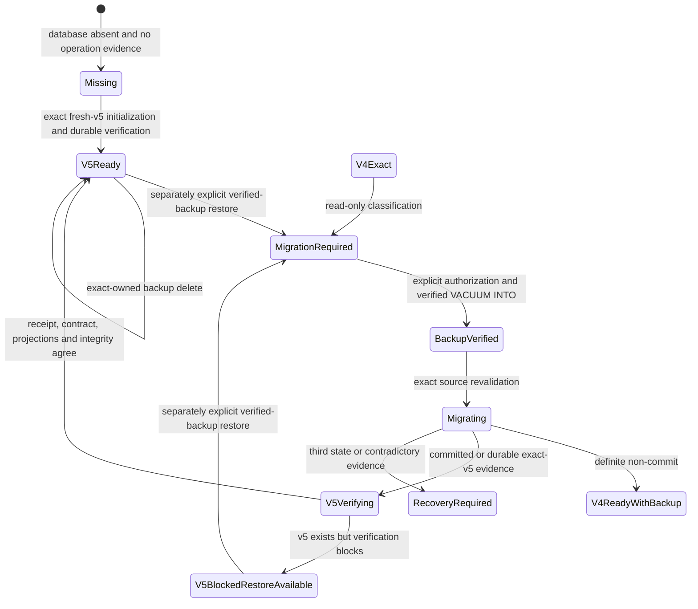

# 17 Desktop Schema-v5 Founder Dogfood Activation Candidate R1

## Status and authority

This Book One boundary records the **implemented but not yet Founder-manually
accepted or promoted** Desktop Schema-v5 Founder Dogfood Activation Candidate
R1. It is production-reachable only when both immutable build gates are true:

- Tauri application identity is exactly `com.lifeos.founderdogfood`;
- the binary is compiled with `founder-schema-v5` and the frontend is compiled
  with `VITE_LIFE_OS_FOUNDER_SCHEMA_V5=1`.

The ordinary `com.lifeos.app` build retains `SCHEMA_VERSION = 4`, does not
register candidate commands, and cannot select this behavior through renderer
input or a persisted preference.

The following states remain distinct:

| State | Current |
| --- | --- |
| Founder-authorized candidate implementation | yes |
| Private/disposable automated evidence | implemented; verification pending final report |
| Isolated Founder package production path | implemented |
| Founder-manually verified | no |
| Promoted | no |
| Ordinary desktop production-enabled | no |
| Real-user migrated | no |
| Deployed or released | no |

## Product boundary

The candidate preserves **We Build Mirrors, Not Oracles**. It changes local
database representation and routing, not AI authority, Product Harness output,
historical consent, provider behavior, ContextPacket content, or Phase 4.

It accepts only the Founder package's Tauri-derived app-data root and fixed
`life-os.db` child. No renderer command accepts SQL, a database path, an
activation flag, an operation directory, a backup name, or a schema version.

## State machine

Every restart reconstructs state from the database, fixed path, sidecars, one
exact-owned operation directory, state evidence, backup identity, receipt,
database contract, schema-object manifest, projections, foreign keys, and
integrity. Missing, multiple, malformed, stale, contradictory, or outcome-
unknown evidence fails closed. There is no automatic retry, replay, repair,
rollback, restore, cleanup, or candidate selection.

## Fresh v5 and exact-v4 migration

Fresh initialization builds an empty exact-v4 bootstrap only in an owned,
absent staging pathname, applies the accepted fixed v5 DDL and receipt contract,
enables lifecycle writes, closes and verifies the file, and publishes it only
to an absent Founder database path. No schema-v4 database is exposed as the
live fresh profile.

Migration accepts exact v4 only. It refuses v2, v3, v5 without matching durable
evidence, versions newer than v5, malformed databases, unsafe paths, aliases,
links/reparse points, sidecars, unknown activity, inadequate disk evidence,
permission failures, collisions, or changed source identity. `user_version =
5` remains the last migration mutation.

Opening the app or disclosure is not authorization. Cancel writes nothing.
Authorization creates and verifies exactly one owned `VACUUM INTO` backup before
the DDL transaction.

Founder manual Step 7B exposed one fail-closed Windows path-identity defect:
the durable operation correctly stored the canonical live path, while the
migration request reused the non-canonical Tauri app-data spelling. The request
therefore stopped after `BackupVerified`, before DDL or receipt creation, and
the live schema-v4 database remained byte-identical. Corrective cycle 1 now
passes the operation's exact canonical live identity into the migration core.
Focused tests cover both first authorization from exact v4 and a new explicit
authorization that resumes from an already verified backup. This is not an
automatic retry, repair, replay, or migration authorization.

Founder manual Step 7B-R5 then exposed a second fail-closed coverage gap after
the v5 transaction committed. The fixed synthetic v4 contract fixture and the
promoted schema-v4 runtime create the same eleven legacy SQLite objects, but
SQLite retains the fixture's multiline SQL and the runtime's compact SQL as
different `sqlite_master.sql` bytes. Because the full schema-object manifest
also covers those legacy objects, the fixture-derived exact digest could not
recognize the promoted runtime representation. The live disposable v5 database
retained its two Experiences, four artifacts, receipt, valid foreign keys, and
`integrity_check = ok`; the exact owned v4 backup remained verified and the
operation correctly recorded `V5BlockedRestoreAvailable` without retry.

Corrective cycle 2 preserves the unchanged fixed v5 DDL digest and accepts only
two explicit exact full-schema manifests: the existing contract-fixture form
and the promoted-runtime-v4 form. A third name/body combination still fails
closed. A production-initialized v4 regression now executes the entire owned
backup, migration, and read-only durable verification path. The blocked state
also exposes only a separately confirmed restore of the exact verified v4
backup after operation and backup revalidation; it exposes no retry, repair,
delete, cleanup, or migration-resume control. The captured Founder v5 and v4
files remain untouched until the corrected package is rebuilt and the Founder
chooses the next manual action.

## Runtime routing

After exact-v5 cutover, typed Rust commands verify the activated database
contract before reads or writes. The private runtime routes currently reachable:

- Experience create, exact-revision update, delete, and duplicate-skipping import;
- Evidence candidate batch creation, correction, confirmation, and rejection;
- Reflection suggestion batch, answer, response correction, and skip;
- single-Experience Pattern candidate creation, confirmation, and rejection;
- Context Recovery suggestion, answer, and skip;
- ADR-0009 consent, transmission, Historical Question creation/read/delete,
  exact dependencies, and unsuccessful-audit cleanup.

The accepted private v5 writers remain authoritative. Guarded schema-v4 tables
are compatibility projections. Cross-kind bundle replacement, unsupported
lifecycle actions, stale Experience revisions, stale generation snapshots,
projection drift, and postcondition mismatch fail closed.

## Backup and restore

The exact-owned migration backup has a disclosed 30-day retention deadline and
an explicit delete-now control. Deletion is never claimed unless the owned file,
state, and operation directory are removed as expected. Failure stays visible.

Restore is a separate explicit action. It warns that all disposable local
changes after migration are lost, revalidates ownership and exact backup bytes,
requires quiescence and no sidecars, and uses the conservative Windows
replacement boundary. On Windows that boundary uses same-volume
`MoveFileExW(MOVEFILE_REPLACE_EXISTING | MOVEFILE_WRITE_THROUGH)` after the
closed staging file is flushed and revalidated; it does not claim that Windows
supports a separate parent-directory `FlushFileBuffers` operation. A reported
failure remains outcome-unknown unless exact durable evidence proves otherwise.
Successful restore consumes the migration operation
evidence and reclassifies the database as exact v4. This is not destructive
down migration and cannot undo provider receipt or retention.

## Threat model

| Threat | Boundary |
| --- | --- |
| Ordinary profile selected accidentally | fixed identity plus Cargo/frontend build gates |
| Renderer path or SQL injection | no command accepts path or SQL |
| Time-of-check/time-of-use source change | immediate identity, sidecar, source-manifest and revision revalidation |
| Concurrent database activity | process operation lock plus exclusive SQLite proof; unknown fails closed |
| Ambiguous commit or replacement | exact durable pre/post classification; third state is recovery-required |
| Backup collision or alias | create-new operation ownership and canonical path/link checks |
| Projection as second authority | v5 writer first, guarded v4 projection in one transaction, post-write reconciliation |
| Secret or content leakage in package manifest | six content-free artifact fields only; app data remains ignored |

This candidate does not prove protection against a malicious same-user process,
power-loss durability beyond the documented Windows write-through move and
post-operation evidence, real-user migration safety, or general production
rollout readiness.

## Exact manifest reuse across activation and runtime writes

Founder packaged review proved that a production-initialized schema-v4 source
preserves compact legacy `sqlite_master.sql`, while the contract fixture
preserves equivalent multiline SQL. Migration, restart verification, and every
typed runtime writer therefore share one predicate that accepts exactly those
two fixed full-schema manifest digests and no third representation. The fixed
schema-v5 DDL digest and contract-fixture digest remain unchanged.

The first cycle-2 packaged runtime Experience create correctly failed before
`BEGIN IMMEDIATE` because the Experience verifier had not yet reused that
shared predicate. Corrective cycle 3 removes the duplicate single-digest check
and adds a production-initialized-v4 migration followed by a typed Experience
write and read-only reconciliation. This correction changes no schema object,
DDL, projection rule, provider, consent, or ordinary-profile behavior.

## Context Recovery runtime follow-up

The bounded Candidate R1 sprint was archived truthfully as incomplete after
using all three permitted correction cycles. During the remaining Founder
manual journey, Evidence creation/correction/confirmation and Reflection
creation/answer/correction passed on the disposable fresh-v5 profile. Context
Recovery suggestion also passed, but saving the first response appeared inert.

After normal application close, read-only evidence showed one unchanged
suggested/pending `recovery_turn`, no partial response revision, no SQLite
sidecars, valid foreign keys, and integrity `ok`. Source inspection identified
an exact facade defect: the runtime requested artifact kind
`context_recovery`, while the accepted writer, normalized head, and guarded-v4
projection all use `recovery_turn`.

Founder Decision
`FOUNDER-SCHEMA-V5-CANDIDATE-R1-CONTEXT-RECOVERY-FOLLOWUP-004` authorizes one
separate minimal correction. The runtime now queries `recovery_turn`. It also
validates the user response provenance supplied by the product boundary and
canonicalizes only its absent optional user-provider fields to the exact null
representation already emitted by the promoted writer before strict
postcondition comparison. Contradictory provenance fails before the writer and
leaves the suggestion unchanged. A real-facade disposable regression covers
suggestion followed by first answer and exact durable reconciliation.

The visible Context Recovery region now carries a session-only localized alert
when its explicit Save or Skip mutation fails. The existing general diagnostic
error remains available. No automatic retry, optimistic durable claim, schema
change, new action, historical eligibility, provider behavior, or profile
mutation was added.

The corrected unsigned review package was built without installing or launching
it. Its content-free manifest records application version `0.2.0`, repository
HEAD `9a226f7081aabc071571f4a745e1343dbdb7d927`, target
`x86_64-pc-windows-msvc`, size `5681429` bytes, and SHA-256
`1585ae219ee041d36dcca9827117ea1226c8444f96d422297ebfd81f1007a285`.
The package remains isolated Founder-only evidence; creation does not authorize
installation, profile mutation, distribution, deployment, or release.

## Verification and Founder gate

Automated evidence uses synthetic/disposable fixtures. Manual evidence must use
only the isolated Founder profile and the unsigned candidate package. Until the
Founder completes the manual migration/restart/recovery matrix and separately
authorizes promotion, this document must not be described as promoted,
ordinary-profile enabled, real-user verified, deployed, or released.

Android Build Feasibility M0 remains parked behind the desktop sequencing gates
recorded by the Founder. This document grants no Android authority.
