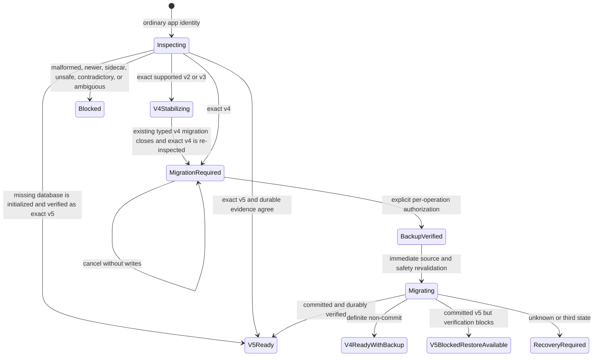

# 18 Desktop Schema-v5 Ordinary Production Activation R1

## Status and authority

This document records the implemented but unpromoted ordinary desktop
schema-v5 activation R1. The Founder authorized implementation, disposable
package review, and then one bounded Phase B attempt against the real ordinary
profile. That attempt stopped before backup creation or migration and left the
database in exact schema v4. The Founder then authorized only a separate
disposable persistent-WAL correction cycle. Nothing was distributed, deployed,
or released.

The states remain separate:

| State | Current at Founder diff gate |
| --- | --- |
| Ordinary activation implementation | implemented |
| Automated verification | passed canonical verification |
| Disposable ordinary-identity package | built, hash-verified, installed, reviewed, and later uninstalled without data deletion |
| Disposable Founder manual review | passed Manual Phase A through Step 20B, including two bounded correction retests |
| Real ordinary-profile migration | authorized once; stopped fail closed before backup or migration; no retry authorized |
| Persistent-WAL correction | verifier and runtime corrections passed automation and repeat disposable migration/runtime review |
| Promoted | no |
| Distributed, deployed, or released | no |

## Build and version boundary

- Application version is `0.3.0` in npm, Cargo, Tauri, and migration receipts.
- Default desktop builds compile `desktop-schema-v5` and use immutable Tauri
  identity `com.lifeos.app`.
- The isolated Candidate uses `founder-schema-v5`, no default features, and
  identity `com.lifeos.founderdogfood`.
- The legacy no-default-feature binary retains
  `sqlite.rs::SCHEMA_VERSION = 4` and refuses schema v5 before writing.
- The schema-v5-capable desktop supports exact valid v5 while continuing to
  recognize exact v4 as migration-required. The accepted database contract
  minimum application version remains `0.2.0`; new receipts record `0.3.0`,
  and promoted `0.2.0` Candidate receipts remain verifiable.

No renderer value, persisted preference, path argument, SQL text, operation
identifier, or schema version can activate this boundary.

## Startup state machine

Opening the app or disclosure is not authorization. Existing v2/v3 databases
use only the promoted v4 stabilizer, close, and then enter a separate disclosed
v4-to-v5 action. There is no combined silent migration. A missing database can
be initialized directly to exact v5 only in a schema-v5-capable ordinary build.

## Shared migration and recovery core

R1 registers the already promoted Candidate adapter for either one compiled
identity policy. The command names remain compatibility aliases; there is no
second DDL, migration state machine, backup/restore implementation, typed
writer, or ADR-0009 persistence implementation.

The shared core preserves:

- exact-owned operation directories and create-new state/backup paths;
- quiescence and WAL/SHM/journal refusal without checkpoint or cleanup;
- canonical-root, alias, reparse, hard-link, volume, permission, and disk
  checks;
- one verified `VACUUM INTO` backup before DDL;
- fixed accepted v5 DDL, honest `legacy_v4_baseline`, and `user_version = 5`
  as the last migration mutation;
- immutable receipt, exact two-manifest verification, foreign keys, integrity,
  current-content and guarded-projection reconciliation;
- conservative restart classification with no automatic retry, replay,
  repair, rollback, restore, cleanup, or candidate selection;
- separately explicit exact-owned backup deletion and restore.

For a sidecar-free database whose persistent SQLite header remains in WAL mode,
exact source inspection now uses an immutable read-only connection and closes
it explicitly. The verified `VACUUM INTO` backup likewise reads the source
through an immutable connection while writing only the exact-owned backup
destination. Any WAL, SHM, or rollback-journal file already present before
inspection still fails closed. This does not checkpoint, clean up, repair, or
reinterpret uncheckpointed state.

The same immutable, sidecar-prechecked connection is now used for stable
runtime reads after activation. Every bounded schema-v5 writer explicitly
closes its writable connection before durable verification. This prevents the
application's own successful read or write from leaving an empty WAL/SHM pair
that would then be truthfully refused by the next fail-closed verification.
Connection-close failure remains recovery-required; pre-existing sidecars are
still neither selected nor cleaned up.

Restore replaces the current v5 database with the verified pre-migration v4
backup and therefore loses later local changes. Local restore cannot revoke
provider receipt or retention. The UI discloses both facts in English,
Traditional Chinese, and Japanese.

## Typed runtime routing

After exact v5 verification, one TypeScript store invokes the promoted typed
Rust boundaries for every currently reachable Experience, Evidence,
Reflection, Pattern, Context Recovery, ADR-0009 Historical Question, and
unsuccessful-audit cleanup action. Exact revisions, dependencies, provenance,
projection parity, transaction boundaries, invalidation/deletion consequences,
and postcondition reconciliation are unchanged. Arbitrary renderer SQL and
generic mutation statement arrays are not reintroduced.

This work adds no unsupported lifecycle UI, full graph export/import, provider
behavior, ContextPacket content, consent policy, Phase 4 conclusion, identity
inference, telemetry, cloud sync, updater, or Android surface.

## Readiness inspector

Inspector R1 remains explicit-open, session-only, and read-only. Its result now
reports the compiled capability truthfully: supported maximum 5 and exact-v5
classification in desktop schema-v5 builds, or maximum 4 in the legacy
no-default-feature build. It still offers only Check and Close and grants no
migration, backup, restore, repair, cleanup, or retry authority.

## Threat model

| Threat | Required response |
| --- | --- |
| Wrong Tauri identity or feature pair | refuse before path resolution |
| Real-profile access during automation | prohibited; fixtures and app-like temp roots only |
| Silent startup migration | exact v4 returns migration-required |
| Sidecar or unknown process activity | fail closed without checkpoint or deletion |
| Path traversal, alias, link, reparse point, or hard-link alias | fail closed |
| Changed source, manifest, revision, or operation evidence | fail closed before write |
| Backup collision, partial output, or ambiguous ownership | preserve evidence; no candidate guessing |
| Generic COMMIT error | outcome unknown unless exact durable evidence proves pre/post state |
| New binary cannot verify promoted Candidate receipt | accept only semver-bounded 0.2.0 through current with every other predicate exact |
| Old v4 binary sees v5 | refuse before writing |
| Local restore mistaken for provider erasure | disclose that provider receipt/retention is unaffected |
| Review installer used as release | unmistakable disposable-only title; ignored artifact; no auto-install or launch |

## Verification and manual gate

Automation uses synthetic/disposable databases and app-like roots. Canonical
verification, Clippy, package-contract checks, ignored package creation, and
the exact changed-path allowlist must pass before Founder review.

Manual Phase A must use a disposable Windows account, VM, or Sandbox and is
performed one bounded step at a time. Phase A success does not authorize the
Founder's real `%APPDATA%\com.lifeos.app` profile. Phase B requires the separate
exact Founder question recorded by the sprint mission. No real-profile restore
or delete-now test is authorized.

### Manual Phase A disclosure correction

On 2026/08/23, the disposable-account Step 6A review showed that the ordinary
pre-migration panel disclosed explicit authorization, local scope, verified
backup retention, provider-retention limits, and write-free cancellation, but
did not yet state three accepted facts: the bounded schema-v5 purpose, the
backup's equal local-data sensitivity, and older schema-v4 write refusal after
migration. The Founder did not authorize or cancel migration. Step 6A-D1 then
proved the exact schema-v4 database hash remained unchanged, with no operation
directory, SQLite sidecar, or running Life OS process.

The Founder resolved `ORDINARY-V5-DISCLOSURE-CORRECTION-001` Option A. The
ordinary-only disclosure now explains that schema v5 preserves append-only
revisions, lifecycle facts, provenance, and exact dependencies without adding
AI truth or authority; that the verified backup contains equally sensitive
local personal data; and that older schema-v4 builds refuse writes rather than
downgrading the database. This correction changes no migration, backup,
restore, schema, provider, ContextPacket, consent, or runtime behavior. Manual
Phase A resumed at Step 6A after a newly hashed ignored review package was
built and verified. The corrected Traditional Chinese disclosure passed live
review; English and Japanese parity remained covered by focused and canonical
tests and the later three-language product walkthrough.

### Manual Phase A Reflection duplicate-submit correction

On 2026/08/23, disposable-account Step 8D-2 showed that the first explicit
Reflection answer save committed successfully, but the Save Answer control
remained actionable long enough for a second activation. The queued duplicate
then observed the durable answered revision and the schema-v5 writer correctly
refused an unchanged correction as `reflection_response_unchanged`; presenting
that refusal as a storage error was misleading because the first save had
succeeded.

The bounded correction adds an exact per-Experience/per-prompt in-flight guard,
immediate pending disable state, and durable-response equality handling. A
duplicate activation cannot create a successor revision, while a genuinely
changed later response continues through the existing append-only correction
path. This changes no Rust writer, schema, migration, backup, restore, provider,
ContextPacket, consent, or Phase 4 behavior. Founder Steps 8D-2R-1 through
8D-2R-4 passed on the rebuilt ignored package: unchanged content rendered the
save control disabled, a genuine edit followed by rapid double activation
created one durable correction without an error, and restart reconstructed the
single corrected answer with no dirty-draft Pattern block.

### Disposable Manual Phase A completion

Founder-led Manual Phase A completed on 2026/08/23 in the disposable
`LifeOSReviewR1` Windows account. This is independent evidence and does not
rewrite the earlier workflow archive whose `manual_ui.status` truthfully
remains `not_run` at its archival time.

The review established:

- installer hash, ordinary `com.lifeos.app` identity, version `0.3.0`, and the
  unmistakable disposable-only review title;
- a corrected schema-v4 ordinary baseline with one Experience, one confirmed
  Evidence, and one saved Reflection;
- equivalent bounded migration purpose, backup sensitivity, old-version
  refusal, cancellation, and provider-retention disclosure;
- cancellation with the exact v4 hash unchanged, no operation directory, no
  SQLite sidecar, and no running process;
- explicit migration producing durable `user_version = 5`, one exact-owned
  verified schema-v4 backup, no sidecars, restart reconstruction, and typed
  Experience, Evidence, and Reflection writes;
- the corrected Reflection duplicate-submit path, Context Recovery answer and
  skip, Experience correction invalidation without rebinding, and disposable
  parent deletion;
- ADR-0009 creation, revalidation, actual-use provenance, and cascade behavior
  through canonical disposable automated evidence without a live provider
  call;
- direct launch of the exact legacy-v4 executable refusing schema v5 before
  write, with the immediately pre-launch database hash byte-identical after
  close;
- separately explicit restore to logical exact schema v4, removal of
  post-migration records, preservation of the original Experience/Evidence/
  Reflection set, consumption of exact operation evidence, and no automatic
  re-migration;
- fresh-v5 initialization in a separately isolated disposable active profile,
  a typed Experience create, no operation directory, and continued hash
  preservation of the held restored-v4 profile;
- English, Traditional Chinese, and Japanese product parity, keyboard-visible
  timeline focus, narrow-window reflow, and no Android, updater, telemetry,
  cloud-sync, deployment, or release surface; and
- uninstall removing the review executable while retaining the disposable
  fresh-v5 database because the Founder explicitly left application-data
  deletion unselected.

Two deviations did not weaken the evidence. The first old-version attempt
opened the separately installed schema-v5 review shortcut; executable-path
inspection identified the mistake, after which the exact legacy-v4 binary
passed refusal and byte-unchanged verification. A Python read-only inspection
command produced no output, so no pass was inferred from it; the restored
logical dataset was instead inspected through the exact legacy-v4 UI while
foreign-key and integrity behavior remained covered by canonical disposable
tests. The restored file was not expected to equal the pre-migration source
byte-for-byte because the verified backup is created with `VACUUM INTO`; exact
backup digest and logical database contracts, not original SQLite page layout,
govern restore acceptance.

During the English walkthrough the Founder explicitly activated Save with a
retained disposable draft, creating a second identical fresh-v5 Experience.
This was recorded as a real disposable create action, not attributed to locale
switching, and does not alter migration or runtime conclusions.

Manual Phase A success did not itself authorize access to or migration of the
Founder's real ordinary profile. The later Phase B authorization and its
bounded fail-closed result are recorded below. Promotion, distribution,
deployment, release, Phase 4, provider/ContextPacket/consent changes, and
Android remain separate explicit gates.

### Phase B persistent-WAL fail-closed evidence and correction

On 2026/08/23, after separate explicit Founder authorization, one Phase B
action was attempted against the real ordinary profile. The exact installer
and disclosure were verified first. The action stopped without claiming
success. Read-only, content-free evidence after normal application close
classified the database as the exact pre-state: schema v4 and byte-identical
to the pre-action file. One exact-owned operation remained in `prepared`, its
staging file was zero bytes, no backup existed, and WAL/SHM sidecars were
present. No personal row or content was inspected, no cleanup or checkpoint
was run, and no retry followed.

Disposable reproduction established that the source database used persistent
WAL header bytes while having no sidecar before inspection. A normal SQLite
read-only verifier open could create WAL/SHM sidecars; the final sidecar guard
then correctly refused the operation. This was a verifier side effect, not a
schema or data defect.

The Founder resolved `ORDINARY-V5-PHASEB-WAL-VERIFIER-CORRECTION-001` with
Option A. The bounded correction makes exact stable-source verification and
backup reads immutable and explicitly closed, while retaining the pre-open
sidecar refusal. Production-shaped disposable tests prove that a checkpointed,
sidecar-free persistent-WAL exact-v4 fixture reaches verified backup and exact
v5 without creating source sidecars; an uncheckpointed fixture with WAL/SHM
and a malformed source both fail closed before any operation is created.

The first packaged disposable review confirmed the verifier correction and
completed the explicit persistent-WAL migration. It then exposed a separate
post-commit runtime defect: normal runtime reads opened the WAL-mode v5
database without immutable mode, and writable command connections were dropped
rather than explicitly closed. The next verification therefore observed an
application-created empty WAL plus SHM and returned `sqlite_sidecar_present`.
After normal close, content-free evidence showed exact schema v5, one retained
exact-owned operation, one verified schema-v4 backup, a zero-byte staging file,
an empty WAL, and one SHM file. The app did not retry, repair, restore,
checkpoint, or clean up that disposable state.

Revision cycle 2 routes stable runtime reads through the same immutable
sidecar-prechecked boundary and explicitly closes every currently reachable
typed schema-v5 writer before verification. The migrated persistent-WAL runtime
regressions now cover Experience, Evidence, and Context Recovery through the
real typed facade; the complete writer suites cover Reflection, Pattern,
Historical Question, lifecycle, rollback, and ambiguous-commit semantics.

The Founder completed the successor disposable review on 2026/08/23 in the
isolated `LifeOSReviewR1` account. The failed disposable v5 profile was first
preserved without retry, repair, restore, checkpoint, or cleanup. A fresh copy
of the untouched exact-v4 fixture was changed only at SQLite header offsets 18
and 19 to recreate persistent WAL mode while leaving all sidecars absent. The
hash-verified successor package then showed the ordinary migration disclosure,
accepted one explicit migration action, reconstructed the existing Experience,
Evidence, and Reflection state, and closed durably as `v5_ready` with
`lifecycle_writes_enabled`, one verified schema-v4 backup, a zero-byte staging
file, and no WAL, SHM, or rollback-journal sidecar. Restart reconstructed the
same record without a storage error. One new typed Experience write succeeded,
remained present after a second normal close and restart, and both closes left
the database sidecar-free. The final disposable timeline contained two records.
No third implementation correction was required; workflow cycle 3 only
synchronized the completed Founder evidence and refreshed canonical verification.

Neither correction cycle nor the completed disposable review retried the real profile. Its prepared operation,
zero-byte staging file, WAL/SHM evidence, database, and personal data remain
untouched. A new ignored unsigned installer may be used only for the separate
disposable Founder review. Any real-profile cleanup, checkpoint, retry,
restore, backup creation, or second migration action requires another explicit
Founder gate.

## Rollback

Before promotion, code rollback is repository-only and no database action is
automatic. After a v5 migration, an older binary remains read-only/refused;
there is no destructive schema decrement. The only local data rollback is the
separately explicit verified-backup restore. A shipped rollback would require
a forward fix or read-only compatible build, not a down migration.
